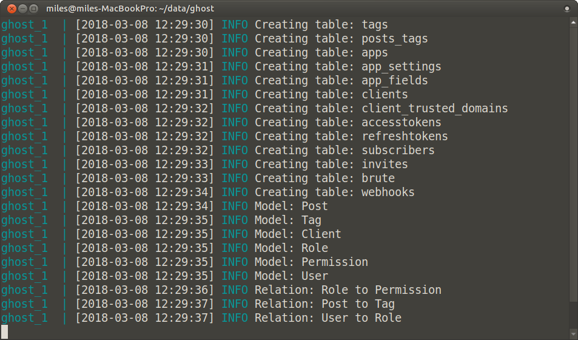

```{r setup, include=FALSE}
knitr::opts_chunk$set(echo = FALSE,
                      out.width = "100%")
```

> Note: This blog is no longer built with Ghost, I've gone static with Distill. These instructions should still serve you well.

Ghost is the blogging platform that powers this blog. You can pay for a hosted instance on [https://ghost.org/](https://ghost.org/), but as open source software, you can also self-host. The installation documentation for Ghost is comprehensive, but beyond my skill as a system administrator to complete. Luckily Docker allows hackers like me (and you!) to piggy back off the system admin skills of those far more knowledgeable. 

This is the post I wish I had found when I spent a day hunting for the magic Docker image that would get me up and running with a self-hosted Ghost instance.

## Prerequisites
This is the stuff you need to have and be somewhat familiar with to self host Ghost the way I will describe.

1. A domain for your blog. I use [DNSimple](https://dnsimple.com/) to purchase and manage mine.
2. A Virtual Private Cloud (VPC) provider. I recommend an instance with at least 2GB RAM, 1 VCPU, with a public static IP address. I use [Vultr](https://www.vultr.com/). 
3. Comfort with administering a VPC instance over an ssh connection: Create folders, edit a file, run a couple of commands.
4. Some conceptual familiarity with Docker. We'll use very simple `docker-compose` commands. So you'll need `docker-compose` and `docker.io` installed on your VPC instance.

## Docker Composition
Using the `docker-compose` framework we build a network/cluster of container hosts that together form a complete solution.

The composition has these parts:
1. [Ghost](https://hub.docker.com/_/ghost/), our blog platform.
2. **Optionally** [RStudio Server](https://hub.docker.com/r/rocker/tidyverse/). My blog relates to R, this comes in really handy for me. You can remove it if you want to.
3. [An nginx reverse proxy server](https://github.com/jwilder/nginx-proxy) that automatically configures itself to manage ssl handshakes, upgrade http to https, and route connections to hosts we specify in the composition.
4. [An SSL certificate service](https://github.com/JrCs/docker-letsencrypt-nginx-proxy-companion) that automatically obtains ssl certificates for https from [Let's Encrypt](https://letsencrypt.org/) for hosts we specify in the composition. These are automatically renewed.

## docker-compose.yml
This is the configuration file that defines the composition above. I'm going to give you the whole thing here and then commentate the various sections in the rest of this post.

```yml
version: '2'

services:

  ghost:
    image: ghost:1.21.3-alpine
    restart: always
    environment:
      NODE_ENV: production
      url: https://milesmcbain.xyz
      mail__transport: SMTP
      mail__options__service: Mailgun
      mail__options__auth__user: <My Mailgun User>
      mail__options__auth__pass: <My Mailgun Password>
      VIRTUAL_HOST: milesmcbain.xyz
      LETSENCRYPT_HOST: milesmcbain.xyz
      LETSENCRYPT_EMAIL: <My Email>
    volumes:
      - ~/data/ghost:/var/lib/ghost/content

  rstudio:
    image: rocker/tidyverse
    restart: always
    ports:
      - "8787:8787"
    environment:
      USER: <My RStudio User>
      PASSWORD: <My RStudio Password>
      ROOT: "TRUE"
      VIRTUAL_HOST: <My RStudio Domain>
      LETSENCRYPT_HOST: <My RStudio Domain>
      LETSENCRYPT_EMAIL: <My Email>
    volumes:
      - ~/repos:/home/milesmcbain/repos

  nginx-proxy:
    image: jwilder/nginx-proxy
    ports:
      - "80:80"
      - "443:443"
    volumes:
      - "/etc/nginx/vhost.d"
      - "/usr/share/nginx/html"
      - "/var/run/docker.sock:/tmp/docker.sock:ro"
      - "/etc/nginx/certs"

  letsencrypt-nginx-proxy-companion:
    image: jrcs/letsencrypt-nginx-proxy-companion
    volumes:
      - "/var/run/docker.sock:/var/run/docker.sock:ro"
    volumes_from:
      - "nginx-proxy
```

## ghost:
The `image:` version tag can be updated to the latest version on the docker repository.

`NODE_ENV:` 'production' is [strongly recommended by Ghost developers for a live blog](https://docs.ghost.org/docs/config#section-about-environments).

[Ghost configuration options](https://docs.ghost.org/docs/config#section-running-ghost-with-config-env-variables) listed in the *Installation and Setup Guide* are configured as `environment:` variables. Instead of JSON style nesting ,`{}`, nested options are delimited using `__`.

The combination of `VIRTUAL_HOST`, and `LETSENCRYPT_HOST` instructs the `nginx-proxy` and `letsencrypt-nginx-proxy-companion` to redirect http traffic for `http://milesmcbain.xyz` to `https://milesmcbain.xyz` and then on to the Ghost instance. This is important because configuring a https `url:` ensures Ghost will only accept https connections. I recommend this because administering a Ghost blog involves logging into to a web interface.

SSL certificates required for https are automatically obtained and renewed from Let's Encrypt using the `LETSENCRYPT_HOST` and `LETSENCRYPT_EMAIL` as parameters. That email address will be emailed if the certificate for the host is due to expire. I have not seen one of these yet, since the automation is working.

`mail__` configuration is optional. Setup with [Mailgun](https://www.mailgun.com) is fairly painless, It's [described in the *Ghost Installation and Setup Guide*](https://docs.ghost.org/docs/mail-config). There are two main mail usecases: Emailing subscribers about new posts (if you use a subscribe button) and allowing blog contributors to recover from forgotten passwords. If you're a solo blogger like me and not using email subscriptions you probably don't need it. 

`volumes:` is important. It defines folders on your VPC host that are mapped to the instance. You **absolutely** need a folder on your VPC host to keep your blog content. Otherwise it will not persist when the Docker container is stopped and restarted. E.g. for VPC provider maintenance or a Ghost version upgrade.  `~/data/ghost:/var/lib/ghost/content` maps the folder `/miles/data/ghost` on my VPC file system to `/var/lib/ghost/content` in the Ghost container. `miles` is my user I created to administer the blog on the VPC. The `data/ghost` is in my home directory.

## rstudio:
The config in `ports:` maps port 8787 on my VPC to port 8787 in the `rocker/tidyverse` Docker container where RStudio is listening. Remember to open port 8787 on your VPC using your VPC management console.

`USER`, `PASSWORD` and `ROOT` relate to the an RStudio user that can log into the server. `ROOT` adds the user to sudoers - this is useful if you want to install additional R packages and their Linux dependencies.

I have set up this container with it's own subdomain that I configured with my DNS provider. Let's say it is `rstudio.milesmcbain.xyz` - so http traffic to that will be forwarded to https and then to the RStudio login page, so that login can be done securely.

In `volumes:` an area of my VPC file system is mapped to the `rocker/tidyverse` container so my RStudio project repositories will persist.

## nginx-proxy: and letsencrypt-nginx-proxy-companion:
The configuration here is the boilerplate for a minimum viable setup. The mapped `volumes:` are especially critical and should not be tinkered with. Both of these containers support additional configuration options that are discussed on their Github repo README pages linked above.

Possibly of interest is SSL certificate key size and auto-renewal interval configured in `letsencrypt-nginx-proxy-companion`. The defaults are sensible though.

## Starting your Ghost blog
So if you're still with me, you must be getting pretty keen to fire up your new blog! To do so:

1. In an ssh session to your VPC host: Copy [or fork and clone](https://github.com/MilesMcBain/ghost_https_R_blog) the `docker-compose.yml` file into a folder in your VPC host user's home directory, e.g. `/<your user>/compose/docker-compose.yml`
2. Go to the folder and make necessary edits to the file (e.g. using vim or nano), replacing my domains, `<My Email>`, `<My RStudio User>` etc. with your personal config.
3. Save and exit `docker-compose.yml` and run the command `docker-compose up`, from the same folder as `docker-compose.yml`. You may need to prefix with `sudo`.
4. Sit back and enjoy the show in your terminal.  For a little while Docker will be downloading image data, after which it will start the composition and you will get a very detailed log showing what each container in the composition is doing:

```{r, fig.cap = "A test I ran on my laptop"}

```

5. After the log has settled down, verify your blog is working by navigating to `https://<your domain>`. You should see a stock Ghost theme with example posts and text.  
6. Back in your terminal session, Hit `ctrl + c` to interrupt the Docker containers, this will trigger Docker shutdown. Follow with the command: `docker-compose down` to remove temporary data.
7. Run: `docker-compose up -d`, to start your blog again, this time as a background process. You will get some simple messages about containers starting, and not the detailed log. Now you can close the terminal, exit ssh etc, and your blog will remain live.
8. Navigate to `https://<Your Domain>/ghost` to set up your admin user and log in to the blogging platform. 
9. Have fun tweaking your blog, downloading themes, and writing posts!

### Notes
* In step 4, keep an eye out for issues in the log, particularly with ssl certificate registration. You need to have a domain that can be resolved via DNS to be issued with a certificate.

## Additional Reading
Things not already linked that I found useful along the way to figuring this out:

* [Digital Ocean Documentation](https://www.digitalocean.com/help/getting-started/setting-up-your-server/) on setting up a VPC server. Useful for any VPC provider. In particular: [How to Set Up SSH Keys](https://www.digitalocean.com/community/tutorials/how-to-set-up-ssh-keys--2)
* [Deploy Ghost blog using Docker and Caddy](https://medium.com/@razagill/deploy-ghost-blog-using-docker-and-caddy-461b9b2ff095)
* [simple-lets-encrypt-docker-compose-sample](https://github.com/dmitrym0/simple-lets-encrypt-docker-compose-sample)

--------

*If you have any suggested improvements, need a hand, or just want to show off your blog to me, feel free to @ me on Twitter or leave a comment below.*
