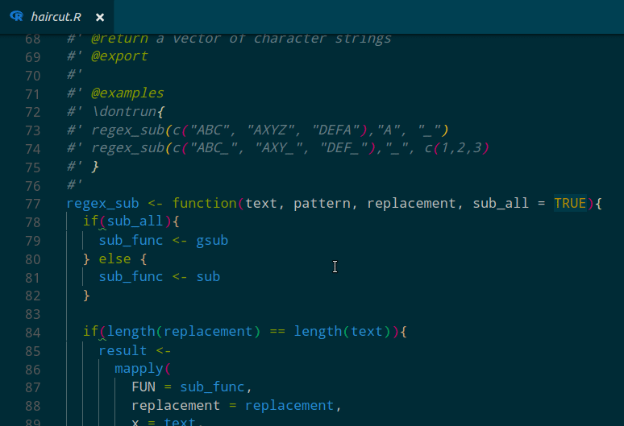
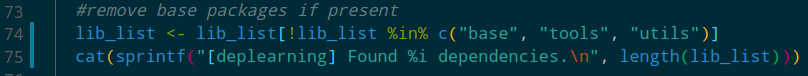

```{r setup, include=FALSE}
knitr::opts_chunk$set(echo = FALSE,
                      out.width = "100%")
```

Mid 2017 I got hooked on [VSCode](https://code.visualstudio.com/). The [extension ecosystem](https://marketplace.visualstudio.com/) is nothing short of a candy shop for editor nerds. I've gone from using VSCode for WebVR development - Can you say [Chrome debugger](https://marketplace.visualstudio.com/items?itemName=msjsdiag.debugger-for-chrome)?! - to recently wondering if I could build an `#rstats` data science stack from all these juicy extensions.

It turns out I was wondering at the perfect time. [Yuki Ueda](https://github.com/Ikuyadeu) is improving the VSCode R extension weekly, and [Randy Lai](https://github.com/randy3k) has just taken the whole thing to the next level with an implementation of an R language server - More about that in a minute. Both of these are under heavy active development.

## A RRogues Gallery
Here I'll walk you through the pieces of my current setup. Most of these are VSCode extensions, some are other bits of software.

### [R Extension for VSCode](https://marketplace.visualstudio.com/items?itemName=Ikuyadeu.r)
There's a good set of features here already. The main niceties I enjoy are highlighters for Roxygen and .Rmd. You also have help with managing your R console. Linting is included, if that's your cup of tea.

### [R LSP Client](https://marketplace.visualstudio.com/items?itemName=Ikuyadeu.r-lsp)
This is a key piece of the setup, but doesn't do a lot on it's own. It's the VSCode client for the R language server, see next item.

### [R Language Server](https://github.com/REditorSupport/languageserver)
This is where the fun starts. It's actually an R package! A server written in R that implements the [language server protocol](https://langserver.org/) (LSP) for R. The LSP is designed to be editor agnostic, so this can work with VSCode alternatives like Atom, Sublime etc.

At time of writing this thing is still in early dev, but it already has some amazing tricks. Some of this stuff is beating out RStudio in UX. 

How about hover help?

```{r, fig.cap = "Scrollable help file on hover"}

```
Completions and parameter hints?

```{r, fig.cap = "Autocompletion and function parameter hints"}
knitr::include_graphics("R-Hints.gif")
```

Style hints?

```{r, fig.cap = "lintr style hints"}
knitr::include_graphics("lint-hints.gif")
```

### [rtichoke (Formerly Rice)](https://github.com/randy3k/rtichoke)
rtichoke is an alternative R console cut from the same cloth as iPython. In fact it is written in Python, but if you can get past that you'll find it has some really sweet features. Syntax highlighting with a variety of colour options, multi-line editing, vim/emacs keyboard shortcuts, and an oh so addictive enter-bash mode [as seen here](https://twitter.com/RobertMitchellV/status/964196023886217216).

My favourite thing is the fast and robust completion mechanism. It just feels tighter than RStudio. It doesn't glitch out. Try it and see what I mean. This goes some way towards compensating for the VSCode editor's completions being unaware of your R session - something I thought I could not live without until I found rtichoke.


Be sure to check out the options listed in the README. I've found the following useful to add to my `.Rprofile`:
```r
options(
    rtichoke.auto_indentation = FALSE, 
    # Makes alignment looks natural when sent to rtichoke by VSCode
    rtichoke.complete_while_typing = FALSE
    # Stops a brief stutter compiling a large parameter completion list for S3 methods like `plot()`
)
```


### [Rainbow Brackets](https://marketplace.visualstudio.com/items?itemName=2gua.rainbow-brackets)
I remember first seeing this feature back in MS Excel in '97, when I thought I was ever so clever hacking my calculus assignment. I now suck at calc, so the joke's on me. But the joy of this not entirely nostalgia driven. I feel like I am genuinely less anxious reading heavily nested code in rainbow flavour.

```{r, fig.cap = "Lookin' sharp!"}

```

### [Rainbow CSV](https://marketplace.visualstudio.com/items?itemName=mechatroner.rainbow-csv)
At the risk of overdoing it... I never want to see another CSV that isn't rainbow! Note the column identifier on hover!

```{r}
knitr::include_graphics("rainbow_csv.png")
```


### [Material Icon Theme](https://marketplace.visualstudio.com/items?itemName=PKief.material-icon-theme)
R logos, Travis icons, colour codes etc for your file tree. They look smart and improve scanability.

### [Vim Extension](https://marketplace.visualstudio.com/items?itemName=vscodevim.vim)
Much more than your average Vim emulator. It integrates with Neovim and even emulates a few popular plugins. I find it close to the real deal without the typical Vim config overhead. Makes RStudio's Vim emulation look lame by comparison.

### Making up the Difference
I have a [repo of misc functions](https://github.com/MilesMcBain/mmmisc), some of which fill in things I miss from RStudio. For example: [`rend()`](https://github.com/MilesMcBain/mmmisc/blob/master/R/utils.R#L284) is my answer to the 'Knit' button. I may spin these out into a package of their own in the future.

## Conclusion
I am optimistic about VSCode's future `#rstats` prospects given how quickly the language server has come along. There's also some keenness building to try rolling my own VSCode extension or contributing those above. One thing I miss from RStudio are `tidyverse`-aware completions, e.g. completing the column names of a piped dataset in `dplyr` functions. Seems like a good opportunity to make a contribution.

Thus completes my post on my VSCode setup. If you're loving VSCode as well, feel free to @ me on Twitter with your favourite extensions!
