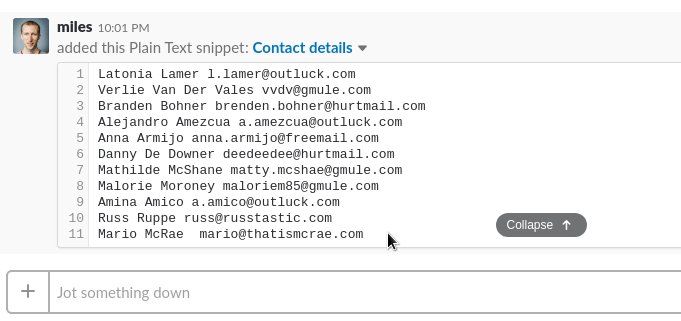
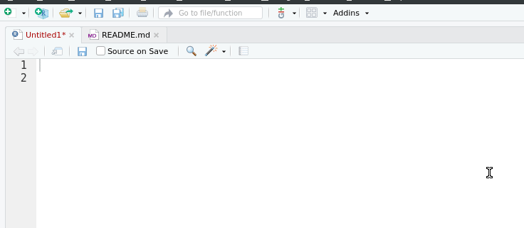
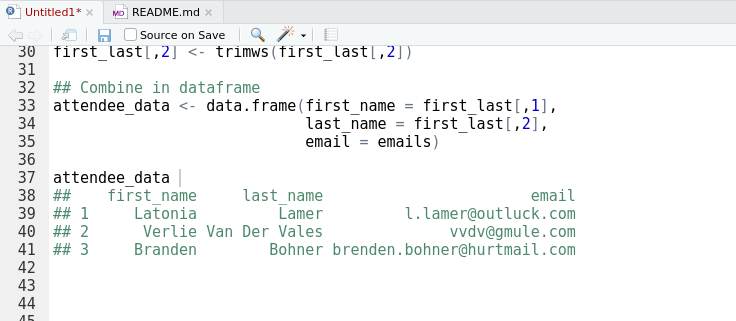
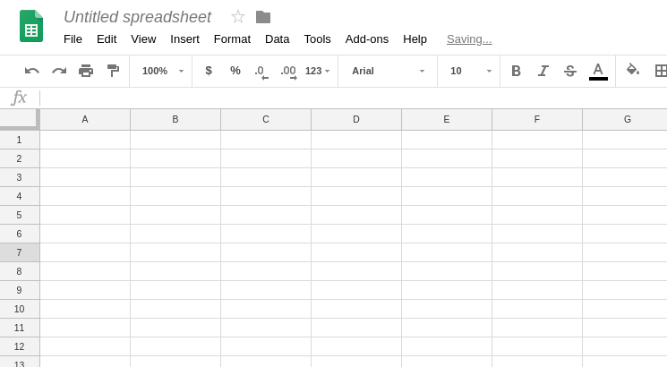

```{r setup, include=FALSE}
knitr::opts_chunk$set(echo = FALSE,
                      out.width = "100%")
```

```{r}

```

It is a universal law that if you volunteer to help organise something, you will at some stage be issued with a flat text file of contact details to be input into a table. This post is about how you can crush that file into a fine, fine powder, using the power of R.

My last encounter was two weeks ago, with 40 or so records arriving by Slack message, and needing to be input into a Google Sheet. Here is a dramatic recreation:

```
Latonia Lamer l.lamer@outluck.com
Verlie Van Der Vales vvdv@gmule.com
Branden Bohner brenden.bohner@hurtmail.com
Alejandro Amezcua a.amezcua@outluck.com
Anna Armijo anna.armijo@freemail.com
Danny De Downer deedeedee@hurtmail.com
Mathilde McShane matty.mcshae@gmule.com
Malorie Moroney maloriem85@gmule.com
Amina Amico a.amico@outluck.com
Russ Ruppe russ@russtastic.com
Mario McRae  mario@thatismcrae.com
```

*Note: Randomly generated details.*

It is amazing how perfectly annoying this task is. I am sure it is POSSIBLE to write an R script that reads from the Slack message into R, munges it, and writes it directly to the spreadsheet, but you'd never recover the time you invested to write it. Next time the data will be attached to an email, or Trello card, and needing to go to Office365, or GitHub, or whatever, and you're back at square one. 

So what to do? It's a small enough task that manual entry is an option. Suck it up and bash it out?

```{r, fig.cap = "Never!"}

```

Here is a fast, but completely unashamedly non-reproducible way to get this done:

## 1 Copy

```{r, fig.cap = "whistling is heard"}

```


## 2 Paste

```{r, fig.cap = "Pasting with 'datapasta'"}

```

## 3 Munge

Now things get interesting. We have a text munging problem. And rather than make that eye-roll joke about we need Regular Expressions (Regex) therefore we have 2 problems (Haw haw), this is a great opportunity for some practical advice about munging text. 

There is no text munging problem that cannot be solved by a series of *extract*, *substitute*, or *split* steps. Regex just help us describe what needs to be extracted, substituted, or where to split the string. Discovering the order to apply these steps is the puzzle, and once you realise that's all there is to it, it can actually be kind of fun, just like  *group_by*, *mutate*, *filter*, *summarise* et. al.

The challenging part of these data are the 'special people' with multiple last names i.e. 'Verlie Van Der Vales' and 'Danny De Downer'. If not for them we could use a simple 'split on space' strategy. (Here's looking at you [Steph De Silva](https://twitter.com/StephdeSilva)).

So after naming the vector, we apply these steps:
```
flat_name_email <-  
  c("Latonia Lamer l.lamer@outluck.com",
    "Verlie Van Der Vales vvdv@gmule.com",
    "Branden Bohner brenden.bohner@hurtmail.com",
    "Alejandro Amezcua a.amezcua@outluck.com",
    "Anna Armijo anna.armijo@freemail.com",
    "Danny De Downer deedeedee@hurtmail.com",
    "Mathilde McShane matty.mcshae@gmule.com",
    "Malorie Moroney maloriem85@gmule.com",
    "Amina Amico a.amico@outluck.com",
    "Russ Ruppe russ@russtastic.com",
    "Mario McRae  mario@thatismcrae.com")

## Splitting/extract/substitute with stringr
library(stringr)

## Extract emails
emails <- str_extract(flat_name_email, 
                      "[A-Za-z0-9.]+@[A-Za-z0-9.]+")

## Substitute emails with "", leaving full name.
names <- str_replace_all(flat_name_email, 
                         "[A-Za-z0-9.]+@[A-Za-z0-9.]+", "")

## Split on the first space, so we have first name 
## and last names in separate vectors. 
## Simplify returns an array - helpful!
first_last <- str_split(names, " ", n = 2, simplify = TRUE)

## Look at names: trailing whitespace issue
first_last

##
##      [,1]        [,2]            
## [1,] "Latonia"   "Lamer "        
## [2,] "Verlie"    "Van Der Vales "
## [3,] "Branden"   "Bohner "    
### ...

## Trim trailing spaces (a substitute step " " for "")
first_last[,2] <- trimws(first_last[,2])

## Combine in dataframe
attendee_data <- data.frame(first_name = first_last[,1],
                            last_name = first_last[,2],
                            email = emails)
  
attendee_data
##    first_name     last_name                       email
## 1     Latonia         Lamer         l.lamer@outluck.com
## 2      Verlie Van Der Vales              vvdv@gmule.com
## 3     Branden        Bohner brenden.bohner@hurtmail.com
## ...
```

To understand this code completely you only need to understand one Regex that describes an email: `[A-Za-z0-9.]+@[A-Za-z0-9.]+`. 

In English this says: 
* `[A-Za-z0-9.]` A Character that is an upper or lower case letter, number, or a dot. `+` one or more times.
* `@` followed by an @
* `[A-Za-z0-9.]` followed by a character that is an upper or lower case letter, number, or a dot. `+` one or more times.

Notice how only by extracting and substituting away the emails, were we free to apply a simple strategy of 'splitting on the first space' to solve the remainder of the problem.

Other things to note:
* It is possible to write this in similar #tidyverse style code using only `tidyr::extract`, and `tidyr::separate`. That would have made for more difficult commentary, and so is left as an exercise to the reader.
* It is possible to solve the whole problem in one monstrous abomination of a Regex, but you wouldn't bother.^[For the Stack Overflow crowd: `first_last_email <- str_match(flat_name_email, "(^[A-Za-z]+)\\s+((?:[A-Za-z]+\\s+)+)([A-Za-z0-9.]+@[A-Za-z0-9.]+$)")`] 
    
## 4 Copy


```{r, fig.cap = "Matthew Lincoln's 'clipr' is the unsung hero of many #rstats packages including 'reprex' and 'datapasta'"}

```

## 5 Paste

```{r, fig.cap = "whistling resumes"}

```

## Conclusion

How nice is it to be able to harness the scything power of R without having to deal with yet another data import/export problem? Does anyone else ever wonder about a world where programs are not so precious about their data, and we could just tell a computer: "Pipe data from my last Slack message into RStudio please." and it JUST DOES IT. I'm all for data security, but within my own system I don't need a disparate set of fortresses accessible to each other only by cumbersome protocol. I want my apps to form a team that cooperates freely under the banner of me getting shit done.

-----

*Header image credit:*
*By Jot Powers, 1/2006, CC BY-SA 2.5,* *https://commons.wikimedia.org/w/index.php?curid=558469*

