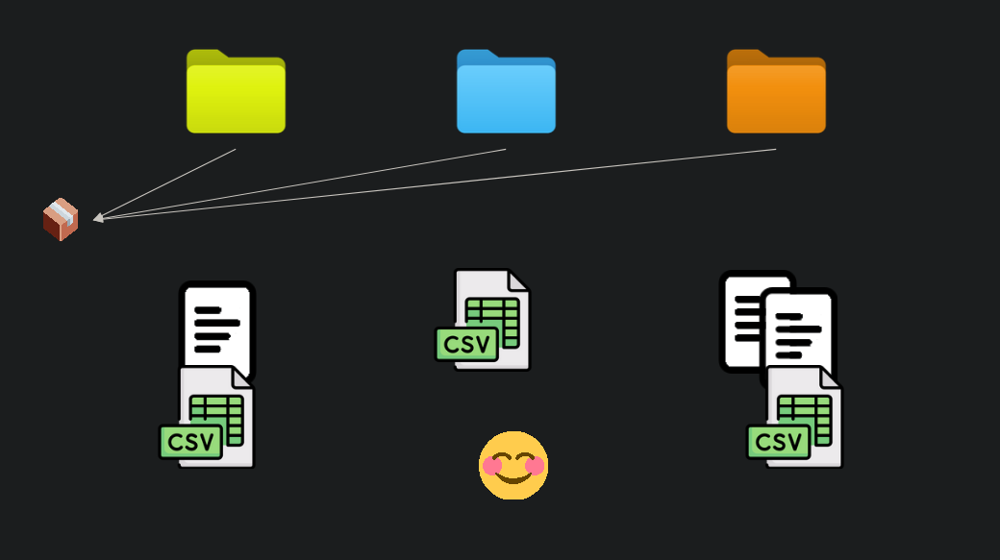
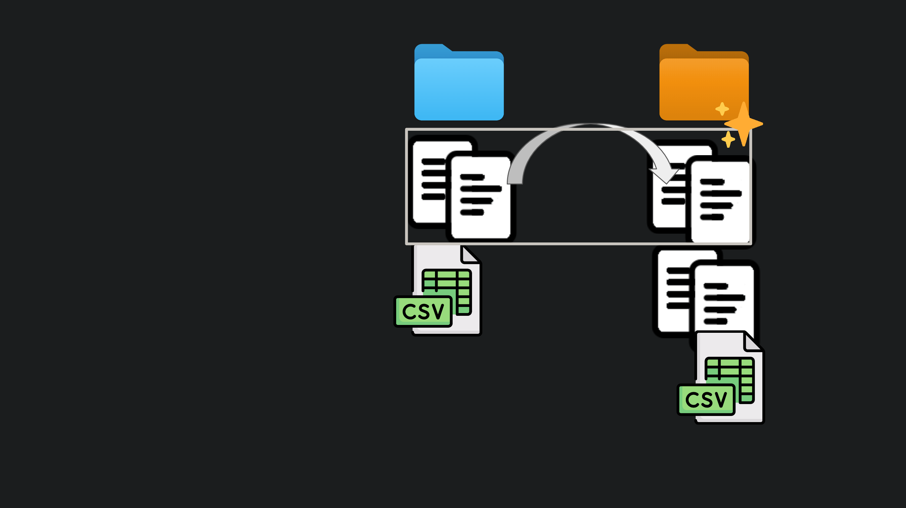
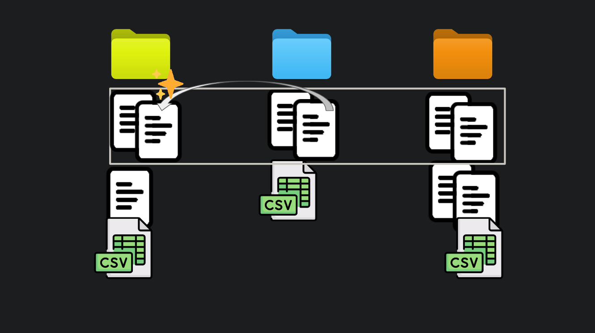
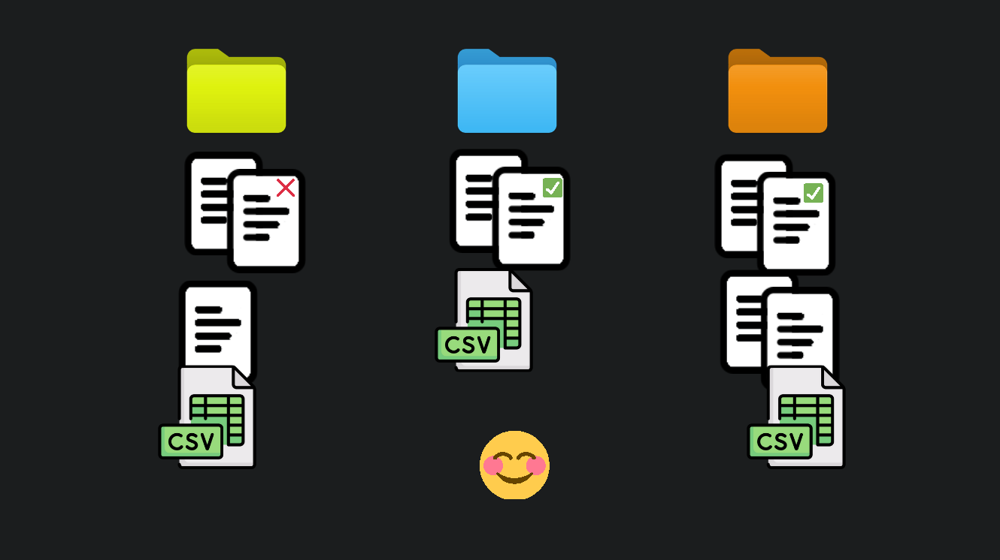
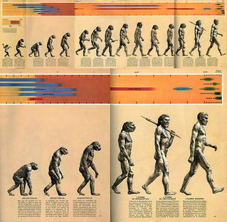

```{r, fig.cap = "Three projects share a common code library dependency. Re-use solved?", echo = FALSE}

```

```{r setup, include=FALSE}
knitr::opts_chunk$set(echo = FALSE)
```

Every data analysis / data scientist role I've worked in has had a strong theme
of redoing variations  of the same analysis. I expect this is something of an
industry-wide trend. If you're in marketing you're ranking prospects, and A/B
testing their responses. If you're in emergency services planning you're
re-running the same kinds of simulations targeting the same kinds of KPIs
(response times). If you're in banking you're predicting churn, arrears etc.
The details change, but you see the same problem structure repeated over and
over.
 
Even when I was supporting researchers I saw often saw them cut and paste
methods from older works and 'adapt them' to whatever the current question was,
using their favoured hammer to hit every nail.
 
It's _The Data Analyst's Curse_: You're keen to prove you can use
these much-hyped skills to add value. But as soon as you do, you're stuck. Your
value-add becomes business as usual (BAU). And good luck to you if you think
you're going to shirk BAU to investigate more interesting data - that would
be a value-subtract. And those make the well dressed people with
soft-keyboard-covered-iPads under their arms very unhappy.

Given your curse, your sanity now depends on re-using as much work as possible
across these achingly-samey-but-subtlety-different projects. You and your team
need to set yourselves up so you can re-cover old ground quickly, hopefully
ensuring that you have plenty of time to build on capabilities you've already
proven, rather than just executing and re-executing the same capability until
you all get bored and quit.^[The sort of mind that will tolerate the guts of computers, and the various ways they can torture data, does so out of a kind of insatiable curiosity. That curiosity can be harnessed to great productive effect. But remove the opportunity to be curious, and curiosity will vest elsewhere, and morale will suffer.]

So now lets look at the ways you can reuse your data analysis work. And I'm
making two pretty big assumptions in this discussion:

  1. Your work is written in code e.g. R, Python, Julia, Rust etc. 
    -  If you're using PowerBI, or god forbid Excel, you're largely limited to
      the first two less than ideal approaches I am about to discuss.
   2. You use a technology like [Quarto](https://quarto.org/), or [Rmarkdown](https://rmarkdown.rstudio.com/), or [Shiny](https://shiny.posit.co/), such that
      any document-like products are generated from code.
	 - If you don't do this there's a host of added pitfalls on top of what
	   we'll discuss here, more than can sensibly be covered in one blog
	   post.
	
# Copying and pasting from stuff you did earlier

It's in the name. Instead of redoing an analysis you know how to do from
scratch you open up the project from last time and go ctrl-c ctrl-v wild. At
first this may feel pretty good. Almost like cheating. If you're clever you
won't tell your boss or clients how much time you just saved. And not because
you're dishonest. No it's because what the ol' copypasta is actually doing is
slowly accumulating a mountain of 'technical-debt' or
'old-weird-stuff-we-don't-really-understand-anymore-but-keeps-coming-along-for-the-ride-and-now-we-can't-touch-it-without-ruining-everything'.

Eventually the interest on that technical debt, paid in terms of 'time spent
stuffing around trying to add an incremental improvement', eats all the
productivity gains you got from the copy-paste in the first place. ^[The interest on technical debt is debited at the least opportune time.]

There are several ways this can happen. Here's a scenario.

The client really liked the dynamics evident in the event stream plot on
project BLUE. So for project ORANGE it's only natural to pull that plot and
it's data processing dependencies in via copy-paste.

```{r, fig.cap = "A copy of a data analysis directory is made."}

```

But hang on your colleague Russell is a fan of the work too. He wants to show
it to a new client on project GREEN. No worries mate, it's in
`/projects/GREEN/GREEN_final_complete2/code/script04.R`. What? No it worked on
my machine, I swear. Oh wait. Try the dev version of ggplot2.

```{r, fig.cap = "A copy of a copy is made."}

```

Oh no. Murphy's law. You found a bug in that beautiful plot you were so proud
of. There were some pesky duplicates in the data. So you fixed it on project
ORANGE. Better fix it on project BLUE too. And lookout you forgot to tell
Russell on project GREEN! 

```{r, fig.cap = "A bug is found and two of the three copies are updated."}

```

What kind of damage can we expect from this?

```{r, fig.cap = "One of the copies still carries the bug."}

```

Copy-pasted code is like a virus. With each reproduction it can acquire
mutations that make it more or less fit to be copied in the future. Maybe
Russell added a sweet forecast with uncertainty gradients to the plot. He
didn't bother to fix the duplicate issue because it was minor in his case. Now
when someone wants a forecast, it is Russell's variant of your buggy code that
will reproduce. After it acquires enough mutations you could very well
accidentally copy a version containing your original bug into your own project,
and you'll be confused as to how this bug you fixed 18 months ago has risen
from the grave. 

The erosion of trust, the stress, the time wasted, the fumbling
for the right version in this every growing pile is the interest bill for your
technical debt.^[Perhaps you can see why if you don't use something like Quarto
to generate your documents, you increase the surface area for 'copy-paste gone
wrong' type mistakes to occur on greatly, since you need to execute
synchronised copy-pastes in source code and document files.]

# The one template to rule them all

The cure for the copy-paste virus and all it's ills is centralisation. For each
project you build on a centralised base that contains the definitive versions
of all the commonly used functionality that makes up your data analysis
capability. Creating a shared project template is a realisation of this idea.
The crudest example of a viable template might be a giant monolith of a Quarto
file that contains all your project code and text, with placeholder text or
`#TODO` comments that indicate where the data analyst needs to insert stuff
that is specific to their current project.

## The return of copy-paste

In theory, as the team builds on their data analysis capability, the shared
template can be updated so all future projects will benefit from enhancements
or fixes that are made. I say 'in theory' because the first pitfall of this
approach is that in order to build on the template you have to take a copy of
it. So changes you make to your copy don't automatically get reflected in the
centralised version. Your colleagues aren't even aware your changes exist.
There may be some kind of agreement in place that 'we'll all push our changes
back to the central template as we go', but since this task is not necessary
for the delivery of the work, it relies on human discipline, or rigid adherence
to process, which inevitably fails under pressure.

So despite the best of intentions your team can end up with diverging templates
in play, and the temptation is to reuse a version with the features you need
rather then the shared version, and THUNK you've backslid to 'copying and
pasting from stuff you did earlier'.

But that'll never happen to your team right? You're not that lazy. Well let me
tell you about a different kind of trap templates hold for clever industrious
types.

## Power overwhelming

When you're maintaining a template it seems like the productive thing to do
should be to push as much as possible into it, to minimise the work needed for
each data analysis job. Perhaps you have an ideal where you press a button, the
machinery cranks away, and spits out all the metrics, tables, and plots you
need. Leaving you just bit of interpretation and a few points of commentary to
do.

The challenge you'll face in getting there is that there are always niggling
little details of each new data set, and new context that require some special
handling. To try to solve for this you can make the template configurable. You
might even employ meta-programming techniques to conditionally change the way
your outputs look.

So because the word 'configure' was spoken, someone will suggest using YAML or
JSON to store it. Guaranteed. Because that's just what you do config right?
Resist this. I urge you. Does YAML look that much better to your eyes than a
literal R list or Python dictionary? Code can be refactored, code can be
auto-completed, code can be analysed, checked, styled etc. But text? May you be
so lucky.

Once you're talking template config you're on a narrow and dangerous path. You
feed the beast and it grows bigger and hungrier. Despite your best efforts the
template will never be flexible enough to satisfy your ideal. You'll find
yourself saying 'if we just allow X to be configurable...' and field upon field
will be added. Perhaps you'll find away to allow configured objects to be
referenced so they can be reused. Or maybe you'll sprinkle a bit of flow
control on it - 'if this not that' etc. 

Or maybe to speed up the now arduous config process you'll template the config
for the template, yeah that should probably do it. No? Okay fuck it. Maybe
you'll allow the user to supply custom code expressions enclosed in `"` (of
course) to be inserted at critical junctures in the project. You may think I am
exaggerating but these are horrors I have seen with my own eyes. Some created
by my own hand.

And maybe if you're fortunate, when you're bloodied and panting, having just
screamed "ARE YOU NOT ENTERTAINED?" into your screen like a lunatic, you will
have a moment of clarity, and you will realise that you were never configuring
anything. You were slowly imbuing your configuration with the powers of code to
create yourself a new high level, fully functional, but horribly specified
language with which to describe your solution to the data analysis problem. It
was programming all along. 

If you are at this point now do not despair. Many have been here before you. I
know this phenomenon as *[The Inner Platform
Effect](https://en.wikipedia.org/wiki/Inner-platform_effect)* and I learned
about it the hard way in my first job. I also like to remix [Greenspun's tenth rule of programming](https://en.wikipedia.org/wiki/Greenspun%27s_tenth_rule)
for this occasion:

    Any sufficiently complicated plain text configuration scheme contains an ad
    hoc, informally-specified, bug-ridden, slow implementation of half of
    Common Lisp.

Templates are, at best, a partial solution to data analysis reuse. In a similar
way to the copy-paste strategy, they can feel very productive initially, but if
you let them become too complex, increasing amounts of resources will go to
keeping the template machinery working, sucking time away from developing your
team's data analysis capabilities. 

# The one package to rule them all

Instead of expressing a high level project solution in template configuration,
there's a much better time to be had creating a library of powerful domain
specific functions (or objects if that's your thing) that can be composed and
invoked to perform major parts of the data analysis. The flexibility to handle
all the little individual circumstantial curios comes from parameters which can
change the behaviour of functions, or from composing the functions in different
ways, perhaps adding, removing, or swapping them to account for different
situations. 

With powerful functions you still maximise the ratio of work done to keystrokes
pressed. You do so by doing more work with each line of code you type, as
opposed to building a machine powered by config that outputs prefabricated
analysis. And code, unlike configuration, has all the degrees of freedom you
could possibly need from the outset.

So assuming you can create this suite of functions designed to work together
that the whole team will share and contribute to, it's fairly natural to put
them into a software package or library. One reason for this is that the
combination of package name and version give you what you need create
reproducible work. The package can be updated, but so long as you know the
version number your project depends on, you can install that version from the
source code repository, and your code won't break due to changes made by
others.

Why is this important? Well I think one of the main reasons templates backslide
into copy-pasting your own bespoke versions of said templates is because it can
feel like 'there's not enough time' to understand what (if any) changes have
been made to the centralised version by others, and how to incorporate them
with your own. A package acts as a kind of 'forcing function' for better
practices that make this easier.

An example practice is automated testing. This is a practice typically
associated with packages, but not configurable templates. A test suite can give
your team the confidence to merge multiple streams of changes together, since a
passing test suite becomes strong evidence that the changes mesh together
nicely!

You may be wondering about the overhead of building and maintaining software
packages. People who haven't done much of it usually do. The trick is that
there are software packages that contain sets of powerful functions dedicated
to creating and maintaining software packages. In R these are {devtools},
{testthat}, {usethis} et. al. With these I can create a fully compliant and
installable R package, backed by a git repository, in less than 10 minutes. In
most decent programming languages I have used this is also the case. Nothing
exceptional going on here.

That fact that the pattern of breaking a problem domain into powerful functions
that are packaged into modular units can be recursively applied to solve the
problem of creating packages of functions should be some evidence that this is
a scalable technique for managing complexity. And it has been complexity, in
various guises, that has wrought havoc on the reuse techniques mentioned up
until this point.

## Caution: Oversized

I'm going to warn you about a pitfall here, but unfortunately it probably won't
save you. Every workplace I have seen turn toward software packaging as a tool
for data analysis reuse has fallen into this pit. Perhaps we are all destined
to.

I surmise it's to do the fact that initially creating a software package can be
daunting. There's a bit to get your head around. Conventions to learn.  So
since it seems like it's going to be a slog, maybe teams imagine that this is a
task they're going to undertake once. If they work for ACME company then
they're making a single package: {aceme}, {acmefun}, {acemetools}, {acmeutils}
or some such generic concept like that.

The problem with this idea is that eventually complexity overcomes here as
well. One reason is that it's generally considered bad juju to remove functions
from a package. You typically do a thing called 'deprecation' where you make
calling the function throw threatening warnings to stop using it. And you leave
those warnings in place for a long while before you hit delete, so that all the
package's users have a chance to update their project sources. 

So if it's easy to add, but hard to remove, package bloat is a risk. In a
bloated package it gets hard to find things. Reading the documentation becomes
a chore. In their bloat-induced-ignorance people may add functionality to it
that is a rehash of stuff that already exists in a different form, further
exacerbating this problem.

I also believe monolithic packages encourage bad software design. Assumptions
about the internal implementations of functions or the internal data structure
of their outputs may bleed out into other areas of the package, causing them to
become coupled by those assumptions. In a sprawling code base these kinds of
couplings are not always clear, so in practice this means you run into
unexpected challenges when rewriting things to work better, since you
unwittingly violate assumptions made elsewhere, making more work for yourself.

By contrast, in a modular system of tightly focused software packages, it is
more obvious that knowledge relating to implementation details should not
influence code across package boundaries. To do so would imply the two packages
have to be updated in a synchronised fashion, and that sounds like an awkward
bad time, because it is.

## Related: One function to rule them all

I've seen a similar (anti)pattern to 'one-package' play out with functions.
This seems to catch out people who are transitioning out of a script-based
workflow with lots of duplicated code, into a style based on functional
composition. 

Massive functions get written with perhaps a dozen arguments, containing
hundreds of lines of code, that are really not much more than `wrangle_data.script` rebadged as:

```{r, eval = FALSE, echo = TRUE}
wrangle_data(
  x, 
  y, 
  z, 
  cubits, 
  flotsits, 
  n_widgets, 
  calibration_factor,
  tolerance, 
  initial_state, 
  start_date, 
  end_date, 
  output_path
  )
```

Sure we're using functions, but we're actually attempting to template the
entire solution using the function's arguments. Many of the pitfalls of
templates apply ^[If a function starts taking YAML configuration files as arguments you are on borrowed time.]. 

Such a function is pretty much un-testable due to the combinatoric explosion of
possible sets of inputs. And you can bet that the internals are not written in
high level domain-specific code. When I look at that function signature I hear
the screams of matrices being ground to a fine powder of bits through the conical
burrs of nested for loops, and laboured index arithmetic.

Functions with these properties are hard to update with confidence, so they
tend to set like concrete. Discrete sections of code that might be more widely
applicable are locked up inside, unless... you could copy-paste them out? ;)

As per concrete pretty much the only way to fix these functions is to break
them up do over (with modular re-usable pieces!).

# Your personal 'verse of packages

We're getting to it now! When we were discussing the 'one-package' pattern we
talked about how the pattern of breaking down data analysis code into reusable
functions stored in packages is a recursively applicable method for managing
complexity in reusable code - that is we can use the same idea to break down
both analysis projects and monolithic packages into a modular 'universe' of
packages that are interoperable. 

A healthy universe will likely contain packages spread out along the 'ladder of
abstraction' - that is we'll have a mix of user-facing tools (high level), and
lower level packages that contain common code that powers those tools (low
level).

Examples are probably useful here. In my current job we have a small package
called `{checkurself}` that facilitates creating and running list of quality
checks on a dataset. This package can be used directly, but it shows up as a
dependency in a higher level package called `{tdctargets}` which contains
macros^[ Okay in R, they're 'target factories' that depend on R's special flavour of meta-programming.]
for pipeline construction. There are macros that
define certain kinds of pipeline targets (inputs / outputs) that are quality
checked, with the quality check results automatically becoming a separate
pipeline target. You can roll with a default quality check, or you can use
`{checkurself}` directly to plug in your own.

Other examples of lower level packages in your universe might be things that
wrap up API endpoints or SQL queries to provide easy access to commonly used source data.
These might show up as dependencies for higher level packages that make
frequently used visualisations of those data.

In my last job we were endlessly plotting fire stations on maps. So it made
sense build out tooling to the point where you could just do something like:

```{r, eval = FALSE}
qfesdata::get_station_locations() |>
  ggplot() +
  snapbox::layer_mapbox(geometry = st_bbox(area_of_interest)) +
  qfesvis::layer_stations() +
  # some kind of analysis layer
```

`{qfesdata}`, `{snapbox}`, and `{qfesvis}` were the in-house built packages
that wrapped up a surprisingly large amount stuff: database queries, API calls,
geospatial data transformation, plotting aesthetic mappings etc. Making
beautiful maps went from hours down to minutes. 

We also retained the flexibility to build off in new directions on top of what
we had, without the weight of copying hundreds of lines of code around.

On the subject of identifying niches for internal packages, I really enjoyed
[Emily Reiderer's essay](https://www.emilyriederer.com/post/team-of-packages/)
on the topic, which introduces the idea that internally developed packages are
kind of like extra expert team members.

## You can give your software a graceful death

With the package universe, the problem of 'easy to add difficult to remove'
that drives individual package bloat is a bit less severe. If a package becomes
superseded or irrelevant, you can just stop taking a dependency on it, and
forget about it. Unlike deprecated functions that have to live on guarded by
warnings, you're not going to be constantly reminded of a superseded package.
You won't have to navigate around its source and documentation when they show
up in your searches.^[In reality you probably are because you'll have that one colleague that will cling to it.]

## Snap back to reality

I've presented a shared universe of domain specific software packages as an
idealised solution to data analysis code reuse. There are several problems with
this idea in practice.

The first is how and when do you actually build out the universe? Typically you
can't design this type of thing up front. You might know from experience that
you're certain to need a few pieces, but there will always be niche domain
specific tasks that you do not recognise as common components of the workflow
until you've actually performed the same flavour of data analysis a few times.

The implication here is that you're going to need to adopt a 'crafts-person'
style approach, where your tools are continually honed, and their effectiveness
at producing superior results continuously examined. This should lead to
feedback that improves the tooling, creating the headroom on top of 'business
as usual' that you can use to improve the tooling in the future. It's a
virtuous cycle.

It's probable you're going to have to start this virtuous cycle from less than
virtuous, or 'humble', beginnings. And you should be fine with that. The
important thing is to keep applying the pattern of breaking down the work into
powerful domain specific modular tools. I always idealise this process like a
ratchet. Ideally the when the team 'clicks forward' we lock in capability in a
way that can't be wound back.

To lock in capability the tooling has to be well designed and built. So
practices like 'dogfooding'^[that is 'eating your own dogfood' or using your own tools to understand their strengths and weaknesses], seeking peer feedback
early, formal code review, and software testing become highly relevant to
making this happen.

The second problem is that it's all well and good to have this universe of
powerful tools at your disposal, but starting a known type of data analysis
from scratch every time, typing out the same boilerplate code to load your tools,
and ingest the data can feel like a bit of a chore.

This is where a little templating can go a long way. My advice is to avoid
building the complete machine (no config!), and rather conceive a lightweight
project skeleton, that includes boiler plate code, and implies the overall
project structure^[It's a little appreciated fact that deciding how to structure things is actually the 'deciding how to name things' problem raised to a power],
but leaves the user to flesh out the (hopefully) interesting parts.

# Conclusion

I presented four patterns for reusing data analysis code:

1. Copy-paste from stuff you did earlier
2. A Centralised template
3. A shared software package
4. A shared universe of software packages

Another way of viewing this sequence is as a kind of march of progress like this:

```{r, fig.cap = "'The March of Progress' of humanity's ancient ape-like ancestors into modern humans. From 'Early Man' (1965)."}

```

Every data analysis team I have worked on has gone through this march, although
some were already more advanced when I joined. I am not sure if it's possible
to skip evolutions. It it may only be possible to 'speed run' our teams through
them.

Things being increasingly 'centralised' or 'shared' was a common thread, but I
have completely neglected cultural challenges that can arise with doing this.
Suffice to say for now: establishing and maintaining trust and shared values
among the team is a necessary condition for effective reuse of shared
resources, and progressing through the stages. 

Perhaps you have seen teams even further along this march than I have. I'd be
eager to hear what lies beyond!

---

_Presented with thanks to [Nick Tierney](https://www.njtierney.com/) for reviewing this post. It runs with some ideas from [a talk I gave in 2022](https://github.com/MilesMcBain/really_useful_engines)._
