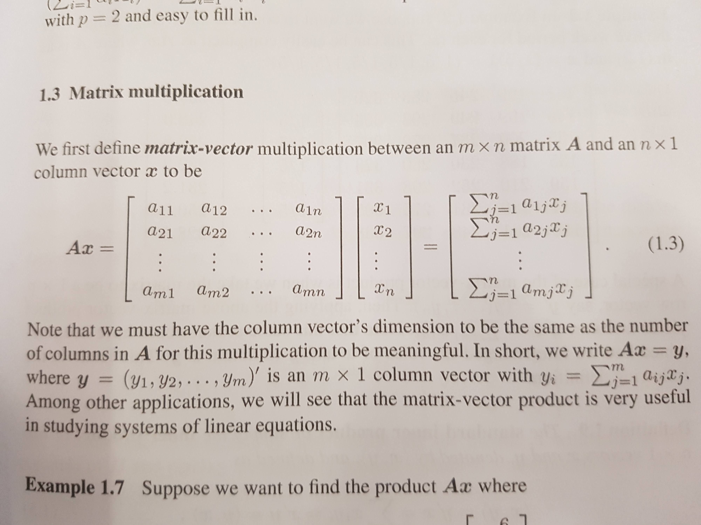

```{r setup, include=FALSE}
knitr::opts_chunk$set(echo = FALSE,
                      out.width = "100%")
```

```{r}

```
A curious thing happened last week. Two #rstats community personalities whom I very much admire appeared to independently take my name in vain:

> About to write a for loop in #rstats. Sorry @MilesMcBain, but it feels right.
> [@rdpeng](https://twitter.com/rdpeng/status/1091427686591930369)

> I've said FOR LOOP three times already today, and yet @MilesMcBain hasn't jumped through my monitor to set my desk on fire....
> [@coolbutuseless](https://twitter.com/coolbutuseless/status/1090797550905376768)

The background to this is a longish story, but the summary is that some years ago now I swore off `for` loops completely in an effort to get better at functional programming, and learn `purrr` and the `apply` family.

Initially it was just going to be for one project, but once I got a streak going it got kind of addictive - and I did get pretty good at doing things the `purrr` way. Every so often I felt so pleased with myself that I would try to swagger about on #rstats Twitter posting my number:

> I was just reminded I've gone 782 days with no loops written in #rstats. Why do we need to teach these to beginners again?
> [@milesmcbain](https://twitter.com/MilesMcBain/status/966849825634369536) 

Cringe.

So I mean sure, being a spectre people feel the need to banish is partly hilarious. But it also makes me feel some guilt. I detest code shaming. And I wonder if there are people less experienced than Mike and Roger out there who have been made to feel genuinely bad about writing `for` loops due to my tweets on the subject over the years.

The aim of this post is to attempt to clarify my position and fill out some nuance that is not possible in the Twitter format.

## Cognitively loaded cupcakes

I'm hardly an original thinker on this subject. The presentation that really flipped me from ambivalence to wanting to move away from loops was this [2016 talk by Hadley Wickham](https://youtu.be/hRNUgwAFZtQ?t=770)^[You can't see the slides for this section in the video, but I eventually saw them at rstudio::conf 2019. You can find them [here](https://blog.rstudio.com/2019/02/06/rstudio-conf-2019-workshops/) in the 'Building Tidy Tools' archive, '05-fp.pdf']. There's a section about `for` loops as cupcake recipes that highlights how much baggage `for` loops force you to carry, felt especially once you have internalised the concept of iteration. He goes on to show how this heaviness or noisiness can obscure what the important points of difference are between your looping constructs.

I pretty much buy all of this. Maybe I have a small brain, but the cognitive load issue resonated with me. There's a literate programming angle there too. Not to mention the joy of freedom from the insanity of mindlessly typing out the same `result <- vector(length(thing))` `i in length()/seq_along()` boiler plate code Every. Single. Time.

## It's a trap

In R `for` loops are particularly challenging to get right. For starters there's no one way to determine the number of iterations that will always work. Consider this mess:

* `1:number` is common and seems to work fine but then you get burned by `1:0 == c(1, 0)`
* `length(thing)` is okay but then you get burned by `length(NA) == 1` and if `thing` unexpectedly has dimensions is will just silently use the wrong one - like number of columns in the dataframe.
* `seq_along()` is pretty robust but has the same issue with `NA`.
* `nrow()` is good but for multi-dimensional only.

But wait there's more! To use loops efficiently in R you need to have awareness of how your data structures will behave in memory when acted on by your loop:

* You need to declare some storage for the loop results before the loop body otherwise you will fall into the [growing a data structure R anti-pattern](https://privefl.github.io/blog/why-loops-are-slow-in-r/).
* You do not want to use for loops to modify dataframe rows. It will be horrifically slow - this is the [row-wise modification of data in a loop R anti-pattern](https://milesmcbain.xyz/rstats-anti-pattern-row-wise/)

So here we see something that many people consider should be one of the first things taught in a programming curriculum is a dead set minefield in R. R developers before us have been kind enough to write us some functions to concrete over much of this danger. It makes sense to me to use them.

## The tragedy of decompilation

A strong theme of some of the programming reading I have been doing recently is the importance of strategies to manage the complexity of your code for finishing projects and maintaining them^[_Practical Common Lisp_, _The Structure and Interpretation of Computer Programs_]. The major tool you have to do this is the ability to create abstractions. I've found trying to get better at this to be extremely challenging, but the creative process feels like it could be one of the most enjoyable aspects of programming for me.

When you create an abstraction you build up an object or function in code that maps closely to some part of your mental model of your problem. If you do it well enough, you can express your coded solution simply, and 'in your own words', and have it solved. That is MAGIC. Think about the most popular R packages. By and large their popularity is due to the quality of the abstractions that they provide.

A loop is not an abstraction. It is a low level construct that maps relatively closely to how computers work, not necessarily to how humans think. To use a loop you have to take your high-level formulation of a solution and 'build down' or 'decompile' to the level of primitive computing operations like `for` and `if else`. Sometimes this is unavoidable, but the danger in leaving your solution expressed in these terms is that the high level mental constructs you formed your solution with are not present in the code.

This means that when someone else, or you in the future, reads the solution, decompilation artifacts can be mistaken as important to the algorithm. An example decompilation artifact is the sequentiality constraint inherent in a loop - is this important or could the iteration happen in parallel? It's not clear without tracing through all the looped steps carefully.

### Example: The great linear algebra farce

I am anticipating skepticism on this last point because loops have a way of getting into our heads. So I've picked a related example outside computer science to try to drive this home. I am guessing there are a great many of you out there like me, who received explicit direct instruction in linear algebra topics in high school mathematics. You may have learned a textbook definition of matrix-vector multiplication like this:

```{r, fig.cap = "Textbook definition of matrix-vector multiplication"}

```

Not fully comprehending what this is saying, you were then probably trained to perform a mechanical iterative process involving multiplying then adding lines of corresponding numbers in sequence. And this mechanistic low-level view may still be how you understand matrix-vector multiplication today. The mechanical process would have certainly come in handy in solving those exam questions. But there's also a very good chance, that you - like me, were deprived of any appreciation of the higher level thinking that gave rise to the matrix abstraction and was decompiled into the mechanical process involving primitive arithmetic.^[A mechanical process that feels awfully like two nested for loops.]. 

The higher level thinking is that the matrix represents a transformation function that stretches and rotates the vector in space. I didn't encounter this view of things until I took introductory computer graphics at university. And even then I didn't fully appreciate the power of matrices as geometric abstractions until I watched [3Blue1Brown's amazing youtube series: The Essence of Linear Algebra](https://www.youtube.com/playlist?list=PLZHQObOWTQDPD3MizzM2xVFitgF8hE_ab). Once you understand this, you can calculate the multiplication by hand in slightly different and more memorable way that follows from geometric interpretation. 

My understanding is that we owe much to MIT Professor Gilbert Strang for revolutionising the way modern linear algebra is taught - with a renewed emphasis on the geometry that matrices and vectors abstract. [His lecture videos](https://ocw.mit.edu/courses/mathematics/18-06-linear-algebra-spring-2010/video-lectures/) are similarly thrilling to 3Blue1Brown's although a bit more of a time investment.

I really do feel it is a farce that a generation of students got handed a boring mechanical process instead of an exciting and powerful abstraction. And this is exactly the kind of tragedy you too can create if you decompile your insights into mechanistic loops and leave them there for others to ponder.

## What is it good for?

Still with me? You're Awesome. Let's talk. 

What I hope you're getting is that I see many pitfalls you can avoid by not using `for` loops. However they're not without their uses.

Firstly, I'll say that quite often Data Science feels like a street fight. It's a battle between you and your data that with luck and grit you may just win by the skin of your teeth before deadline. And in these survival situations it's important that you win. So if you feel you have to write a disposable loop in the moment to make that happen, and see another week - more power to you. I've been there. You won't get any judgement from me.

Secondly, to quote Jenny Bryan: 

> Of course someone has to write loops. It doesn’t have to be you.

Except that maybe this time it is you. You've got some new low level manipulation of data you want to create a function for. Fair enough. It might be polite to place it where other people aren't forced to look at it. `rcpp` functions are great for this.

## Conclusion

I think another popular way to have this conversation is: "You shouldn't `for` loops because vectorisation" - I find this problematic because if you try to drill into what the process of vectorisation actually is, it involves calling and or writing loops - just in a lower level language than R.^[Again I have to credit Hadley Wickham for this idea. It's based on something [he tweeted at me](https://twitter.com/hadleywickham/status/1078805925505495040)]

So I think a better conversation is to be had about the benefits of avoiding `for` loops at the 'top level' of your expressions that solve your problem. That's where your abstractions belong. And the supporting argument here is much more about communication than anything else - although technical pitfalls are there for new R programmers.

PS - If anyone is curious my streak without `for` loops lasted 1068 days. And it ended VOLUNTARILY. ;)

-----

_Header Image Credit:
Four Horsemen of Apocalypse, by Viktor Vasnetsov. Painted in 1887.
Public Domain_
