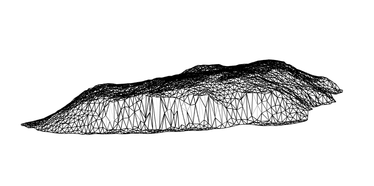

```{r setup, include=FALSE}
knitr::opts_chunk$set(echo = FALSE,
                      out.width = "100%")
```

```{r}
knitr::include_graphics("1200px-Uluru1_2003-11-21.jpg")
```

# Introduction

In this post I describe using R to make a 3D mesh of [Uluru](https://en.wikipedia.org/wiki/Uluru) from publicly available spatial data. In a future post I will detail how to place 3D meshes of this form in a WebVR scene. The types of data you can use, transformations you need to perform, and issues that require consideration are discussed. 

This is intended to be a example you can adapt for you own purposes. All code and data in this post is available in [this GitHub repository](https://github.com/MilesMcBain/r2vr1_uluru_mesh).   

The end goal of this post is a triangulated mesh of x,y,z vertices:

```{r, fig.cap = "A preview of an Uluru mesh created with rgl"}

```

Each triangular section forms a 'face' that can be shaded with interesting colours or textures, perhaps derived from data. In the world of 3D graphics meshes are built from either quadrilaterals or triangles, but since I am targeting WebVR in particular, the choice is made for me: The underlying three.js framework only [uses triangles](https://github.com/mrdoob/three.js/issues/11655). 

# Data

Typically you will have some combination of shapefiles and raster data available. Shapefiles can describe 2D outlines of features as well as their 3D topology via stacked outlines - aka contours. Raster data are often a more useful for adding the third spatial dimension, since they are a common format for Digital Elevation Models (DEMs). I've found these tend to provide elevation information at finer resolution.

For this example I'll use:
* Shapefiles containing contours for Uluru, provided by Geoscience Australia, from [data.gov.au](https://data.gov.au/fr/dataset/uluru-ayers-rock-1-250-000-gis-dataset)
* A DEM raster image, exported from Geoscience Australia's [Elevation Information System (ELVIS)](http://www.ga.gov.au/elvis/).

The `sf` and `raster` packages provide the ability to read and manipulate these spatial data. For an introduction to `sf` I highly recommend the [blog of Jesse Sadler](https://www.jessesadler.com/post/gis-with-r-intro/). 

## Shapes

The contour shapefiles are distributed as part of a GIS dataset containing a dizzying array of features of the Uluru-Kata Tjuta National Park. 

Contours can give us elevation, but in this example I am just using them to get an outline. For reasons that will soon become clear, in this case this turns out to be a slightly flawed approach, however I am confident it is worthwhile examining the method for its applicability to meshing complex arbitrary shapes.

I start by loading the shapefiles into R using the `sf` package, filtering the contour data down to Uluru using a bounding box, before finally finding the outer-most contour. This gives me a 2D outline I can project into 3D.

```r
library(sf)
library(raster)
library(tidyverse)

# Contours from all over Uluru-Kata Tjuta National Park                    
uluru_kata_shape <- 
read_sf("./data/GEODATA_TOPO250K_TILE_DATA/G5208/Shapefiles/Elevation/g5208_contours.shx")

# Make a bounding box to focus in on Uluru
# mymaps.google.com is a handy tool for determining bounding boxes.
uluru_bbox_poly <- 
  st_bbox(c(ymin = -25.39521, 
            ymax = -25.2922, 
            xmax = 131.09814, 
            xmin = 130.97454), 
            crs = st_crs("+proj=longlat +ellps=WGS84")) %>%
    st_as_sfc() 
    # An sf bbox is not geometry... this converts it :S

# Filter map countours to those comprising Uluru
uluru_contours <- 
    filter(uluru_kata_shape, 
           as.vector(
             st_contains(uluru_bbox_poly, 
                        uluru_kata_shape$geometry, 
                        sparse = FALSE)
           ))

# Find the outer contour by finding the one with the highest longitude
uluru_outline <- 
  uluru_contours %>%
  mutate(max_y = map_dbl(geometry,
                         ~max(as.matrix(.)[,1]) )) %>% 
  arrange(desc(max_y)) %>% 
  filter(row_number() == 1)

  plot(uluru_contours["FEATTYPE"], 
    main = "Uluru Elevation Contours")
  plot(uluru_outline["FEATTYPE"], 
    main = "Outline Contour")
```

```{r, fig.cap = "Plot otuputs of contours and outline"}

```

We're nearly done here, but for one small issue. Looking closely at `uluru_outline` I found:

```
r$> uluru_outline$geometry

Geometry set for 1 feature
geometry type:  MULTILINESTRING
dimension:      XY
bbox:           xmin: 131.0233 ymin: -25.353 xmax: 131.0512 ymax: -25.33646
epsg (SRID):    NA
proj4string:    +proj=longlat +ellps=GRS80 +no_defs
MULTILINESTRING ((131.0233 -25.34388, 131.0233 ...
```

We have a `MULTILINESTRING` geometry which as the name suggests is a collection of lines, rather than a shape. There's not a sensible way to interpret a set of lines as the basis for a triangular mesh - unless those lines form a closed ring, in which case they can be recast as a polygon.

The raw data show the points on the lines do indeed start and end in the same position, forming a closed ring:

```
r$> as.matrix(uluru_outline$geometry[[1]])

           [,1]      [,2]
  [1,] 131.0233 -25.34388
  [2,] 131.0233 -25.34345
  [3,] 131.0234 -25.34324
  ...
  [97,] 131.0242 -25.34556
  [98,] 131.0241 -25.34524
  [99,] 131.0233 -25.34388
```

So you'd think there would be a nice simple way to cast from `MULTLINESTRING` to `POLYGON`, but unfortunately at the time of writing this is the best I could do:

```r
uluru_outline_poly <- 
  uluru_outline %>%
  st_geometry() %>%
  pluck(1) %>%
  as.matrix() %>%
  list() %>%
  list() %>%
  st_multipolygon() %>%
  st_sfc()

# When we create a new geometry we need to set CRS. 
st_crs(uluru_outline_poly) <- st_crs(uluru_contours)
```

Notice I chose `MULTIPOLYGON` over `POLYGON`. This simple convenience, because I have a triangulation function I will apply later that expects a `MULTIPOLYGON` argument. The result:

```
r$> uluru_outline_poly

Geometry set for 1 feature
geometry type:  MULTIPOLYGON
dimension:      XY
bbox:           xmin: 131.0233 ymin: -25.353 xmax: 131.0512 ym
ax: -25.33646
epsg (SRID):    NA
proj4string:    +proj=longlat +ellps=GRS80 +no_defs
MULTIPOLYGON (((131.0233 -25.34388, 131.0233 -2...
```

## Rasters

The method `raster::raster()` reliably reads raster data in a variety of formats. NetCDF, GeoTIFF, plain images, etc are all handled without fuss. After reading an elevation raster in, I decided it would be a good idea to check the Uluru shape overlaid it sensibly using a plot. 

Before I can make the plot in the code below, I have to convert (reproject) the shape to the same coordinate reference system (CRS) as the raster. A shape is usually much less data than a raster, and can be reprojected losslessly whereas a raster relies on interpolation methods. For these reasons reprojecting the shape is preferable to the raster. 

```r
nt_raster <- raster("./data/ELVIS_CLIP.tif")

# sanity check - do these overlap?
# convert uluru_outline_poly to raster CRS

uluru_outline_poly <-
  st_transform(uluru_outline_poly, crs(nt_raster)@projargs)

# plot and overlap
plot(nt_raster, main="Uluru outline over elevation raster")
lines(as(uluru_outline_poly, 'Spatial'))
```

```{r, fig.cap = "My outline fit is far from perfect!"}
knitr::include_graphics("uluru_raster_overlap-1.png")
```

In this case the fit doesn't look perfect and we'll see the result of that below. Perhaps I've made some critical mistake, but my current thinking is this is part of life when combining independent spatial data sets. A position in space cannot be measured without error! Perhaps a GIS pro would undertake some kind of alignment/registration step at this point. I'd love to hear about an automated way to do this in R.

# Triangulating A Shape
Once you have an outline of a shape, and some elevation data, the next step is to triangulate the shape - cover it with small triangles. The vertices of the triangles will have coordinates in 2 dimensions, a third elevation dimension can then be added to create the mesh.

There are a variety of fast algorithms available for triangulating polygons but not all are suitable for creating meshes. Keeping in mind our end goal of shading the mesh using data - we need an algorithm that can deliver a set of triangles of a similar size and shape.

Perhaps the most famous algorithm is [Delaunay triangulation](https://en.wikipedia.org/wiki/Delaunay_triangulation) which maximises the minimum interior angle of all triangles. This is great because it avoids degenerate 'slivers' with tiny width. But in its simplest form Delaunay doesn't care about creating triangles of a regular size. Most critically, it also doesn't fully respect the polygon outline since it works over the convex hull of points. You can experiment with plain Delaunay in `sf` since it is available using `st_triangulate()`.

Instead I'll use the Constrained Delaunay Triangulation algorithm provided in the [`RTriangle`](https://github.com/davidcsterratt/RTriangle) package. Using this approach I can specify additional constraints including: 
* Line segments that must be included as part of the border, interior detail, and interior holes.
* The maximum size of triangles.

I have [written a convenient wrapper](https://github.com/MilesMcBain/r2vr1_uluru_mesh/blob/master/helpers/sf_to_trimesh.R), `sf_to_trimesh()` for RTriangle that works with `sf` geometry containing a single `MULTIPOLYGON`. If you have an `sf` geometry containing many polygons you can merge them into a multipolygon, using `st_union()` or `st_combine()` - see [this example](https://github.com/MilesMcBain/r2vr1_uluru_mesh/blob/master/examples/meshing_polygons_nc.R).

Something to take into consideration at this point is the CRS of your shape. If it is in latitude and longitude, your flat mesh will be expressed in lat-lon as well. Usually elevation data will be expressed in meters so the difference of scale is problematic. I already converted the CRS of the `uluru_outline_poly` to the CRS of the raster to check for overlay fit above.

`sf_to_trimesh` can be supplied with a number of triangles, `n_tris`. This is the number of triangles that you wish to fit inside the bounding box of the shape - not the shape itself. It exists to help you determine a reasonable density of triangles. With respect to triangle density - go for thousands! The resolution needs to be fine-grained enough for the elevation features to be discernible and shading applied later on to reflect the data source.

```r
uluru_trimesh <- sf_to_tri_mesh(uluru_outline_poly, 2500)
plot(uluru_trimesh)
```

```{r, fig.cap = "A flat triangular mesh appears"}
knitr::include_graphics("uluru_tri_2500.png")
```

Looking deeper into the data returned by the triangulation we have:

```
r$> str(uluru_trimesh)

List of 12
 $ P : num [1:1199, 1:2] -398761 -398762 -398747 -398653 -398605 ...
 $ PB: int [1:1199, 1] 1 1 1 1 1 1 1 1 1 1 ...
 $ PA: num[1:1199, 0 ]
 $ T : int [1:2275, 1:3] 672 526 145 135 468 283 688 83 318 1153 ...
 $ S : int [1:121, 1:2] 1 2 4 4 5 6 8 9 9 10 ...
 $ SB: int [1:121, 1] 1 1 1 1 1 1 1 1 1 1 ...
 $ E : int [1:3473, 1:2] 672 653 656 526 445 64 145 285 284 135 ...
 $ EB: int [1:3473, 1] 0 0 0 0 0 0 0 0 0 0 ...
 $ VP: num [1:2275, 1:2] -397618 -397377 -398090 -398248 -398054 ...
 $ VE: int [1:3473, 1:2] 1 1 1 2 2 2 3 3 3 4 ...
 $ VN: num [1:2275, 
```

Our main interest is in `P`: a 2 column matrix of unique vertices, and `T`: a 3 column matrix of vertex indices in `P`. Each row in `T` represents a triangle by 3 vertex indices. This is an important concept when moving to VR, so I'll try to make it concrete for you with some code that obtains the 3 vertices of the first triangle in `T`:

```
r$> first_tri_vertex_indices <- uluru_trimesh$T[1,]

r$> first_tri_vertex_indices

[1] 672 653 656

r$> first_tri_vertices <- 
  uluru_trimesh$P[first_tri_vertex_indices,]

r$> first_tri_vertices

          [,1]      [,2]
[1,] -397651.6 -43319.01
[2,] -397589.4 -43325.02
[3,] -397623.9 -43263.00
```

This kind of idea is quite prevalent in 3D graphics. Textures and colours are described in similar ways, i.e. with indices into unique data arrays. More information on the other data can be found in the the `RTriangle` documentation.

# Adding Raster Elevation

The vertices in `P` can be promoted to 3 dimensions by adding a third column to the matrix that represents the elevation. To do this the elevation is extracted from the raster for each vertex:

```r
uluru_elev <- 
  raster::extract(nt_raster, uluru_trimesh$P[,1:2])
uluru_trimesh$P <- 
  cbind(uluru_trimesh$P, uluru_elev)
```

I used `rgl` to preview my handiwork by passing `P` and `T` reshaped slightly to suit `rgl`:

```
library(rgl)
rgl.clear()
bg3d("white")
  wire3d(
    tmesh3d(
     vertices = t(asHomogeneous(uluru_trimesh$P)), 
     indices = array(t(uluru_trimesh$T))
    )
  )
rglwidget()
```

```{r, fig.cap = "Backside of the mesh from the introduction"}

```

When run locally, you'll get live 3D render of the mesh you can rotate and zoom. Unfortunately the backside of the mesh is not nearly as tidy as the front. It seems as though it doesn't drop down to the same level. This **should** be a certainty, given the outline contour was originally intended to represent structure on the same elevation. The sub-perfect alignment of the data sets really shows here. 

Depending on usecase this could be a problem. I give an alternative for cases like this below.

# Triangulating A Raster

The workflow I've explored was predicated on the need to create a mesh from a specific outline shape. But in some cases there is no specific shape:
* You have a large geography you want to place someone in, inside VR - A VR 'tile'. 
* You had a specific shape and it didn't work out 😉 . 

A simple approach to using elevation raster data with no specific shape is:

1. Create a spatial bounding box around the area to be meshed
2. Triangulate the bounding box
3. Add elevation to the triangles.

```r
source("./helpers/bbox_to_multipoly.R")
uluru_contours_bbox <- 
  st_bbox(uluru_outline_poly)
uluru_extent <- 
  bbox_to_multipoly(uluru_contours_bbox, 
                    st_crs(uluru_outline_poly))
ul_extent_trimesh <- 
  sf_to_trimesh(uluru_extent, 2500)
ul_extent_elev <- 
  raster::extract(nt_raster, ul_extent_trimesh$P[,1:2])
ul_extent_trimesh$P <- 
  cbind(ul_extent_trimesh$P, ul_extent_elev)

rgl.clear()
bg3d("white")
  wire3d(
    tmesh3d(vertices = t(asHomogeneous(ul_extent_trimesh$P)), 
            indices = array(t(ul_extent_trimesh$T))
    )
  )
rglwidget()  
```

```{r, fig.cap = "An Alternative Mesh of Uluru"}
knitr::include_graphics("triangulated_bbox.png")
```

In this view the Uluru is less recognisable. Applying materials and shading could make it much more life-like.

# Alternatives (watch this space)

Senior wizards in the R Spatial community are currently working toward a generalised form for high dimensional spatial data for use with plugable tools ala the tidy `tibble` and the `tidyverse`. There are a couple of projects of interest that can  simplify the kind of work demonstrated here.

[`silicate`](https://github.com/hypertidy/silicate) provides the underlying data model with lots of useful converters from `sf` and other spatial forms.

[`anglr`](https://github.com/hypertidy/anglr) builds on top of `silicate` to provide a streamlined workflow for creating 3D visualisations using `rgl`. It's worth checking out the README example.

My initial forays into this space used these tools, but at the moment they are not stable enough to be included in a guide like this. Definitely worth keeping an eye on.

# Up Next

In my next post in this series I'll take you through what it takes to push meshes of this type into VR. Hint: Not much. The mesh form returned by `sf_to_trimesh()` is quite close to what is needed there. 

---------

*Work described here is part of a project funded by ACEMS in partnership with CSIRO Data 61, at Queensland University of Technology. Specialist support has been provided in-kind by the Australian Antarctic Division.*

```{r}

```


*Header image credit: By Maurus Blank - Own work, Public Domain, https://commons.wikimedia.org/w/index.php?curid=1177350* 
