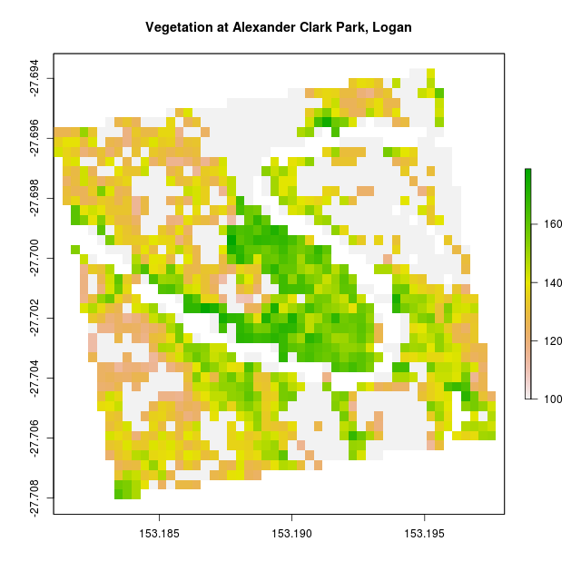
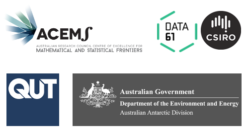

```{r setup, include=FALSE}
knitr::opts_chunk$set(echo = FALSE,
                      out.width = "100%")
```

This post marks the start of series in which I will describe methods I have developed to make GIS data explorable in Virtual Reality. The overarching strategy is to use R's spatial ecosystem to generate the 3D data, and then render it in online VR environments created with [A-Frame WebVR](https://aframe.io/docs/0.8.0/introduction/). To make sense of the posts you'll need an intermediate understanding of R, and basic familiarity with HTML for the A-Frame bits.

The ideas expressed here are currently being wrapped up into a yet to be named R package. These posts are as much about getting the details straight in my own head, as they are to provide some documentation to my new collaborators. 

The posts will break down along these lines:

1. [Making Meshes from Polygons and Rasters](https://milesmcbain.xyz/r2v1-meshing-uluru-from-polygons-and-rasters/)
2. [Rendering Meshes in WebVR](https://milesmcbain.xyz/r2vr2-rendering-meshes-in-webvr/)
3. [Shading Meshes using GIS layers](https://milesmcbain.xyz/r2vr3-shading-meshes-in-webvr/)
4. Annotating Meshes with WebVR elements
5. Serving Multi-User WebVR Scenes 

Please consider these as all as RFCs. I am new to spatial, 3D graphics, and web programming. I would love feedback from my betters in these fields. In that regard I would like to thank [Michael Sumner](https://github.com/mdsumner) (Master Spatial Artificer) for his ideas and enthusiasm so far. 

Finally, an illustrative example. Given some raster data like this:

```{r, fig.cap = "A vegetation index raster"}

```

We can arrive at this:

```{r, fig.cap = "Elevation, vegetation, and water in WebVR"}
knitr::include_graphics("acp_3d-1png")
```

And that's just for starters! We should be able to have some fun with this. Thanks for following along.

---------
*Work described here is part of a project funded by ACEMS in partnership with CSIRO Data 61, at Queensland University of Technology. Specialist support has been provided in-kind by the Australian Antarctic Division.*

```{r}

```
