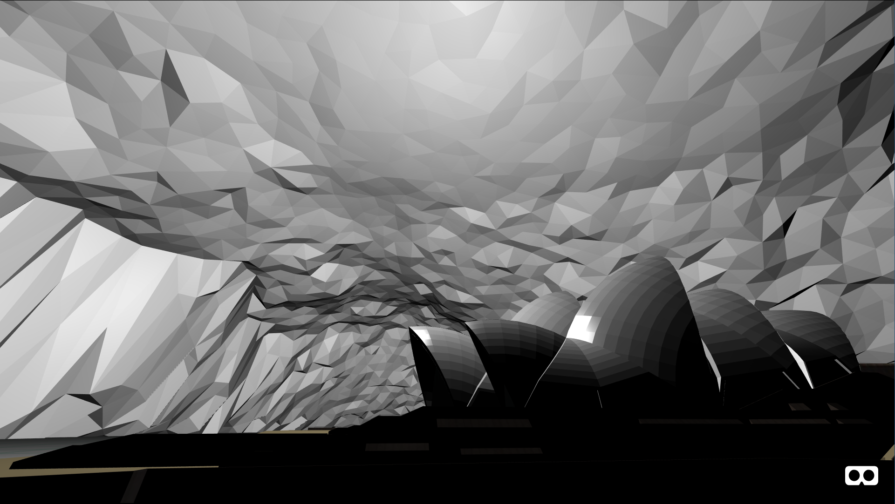
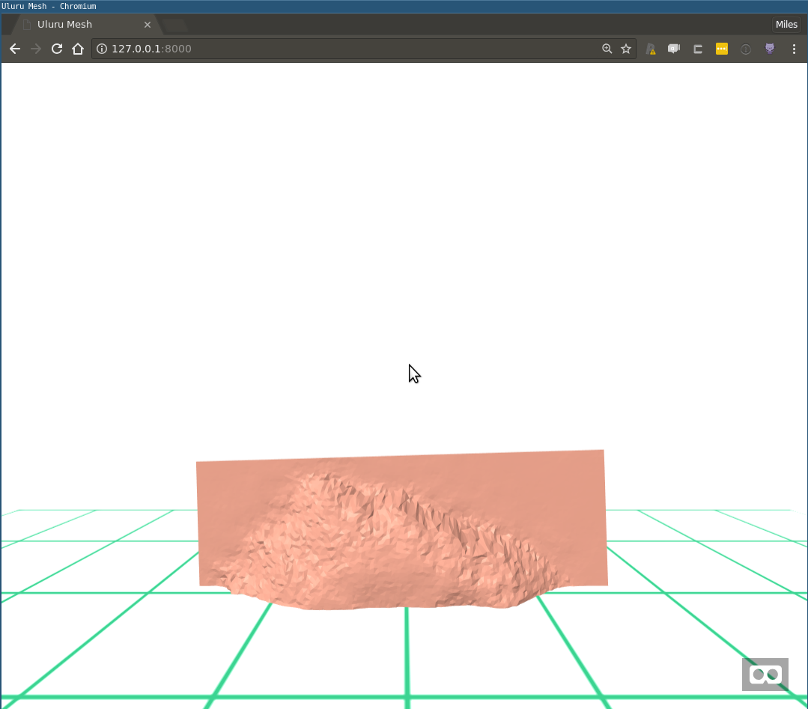
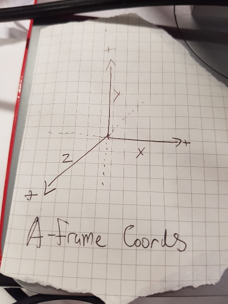
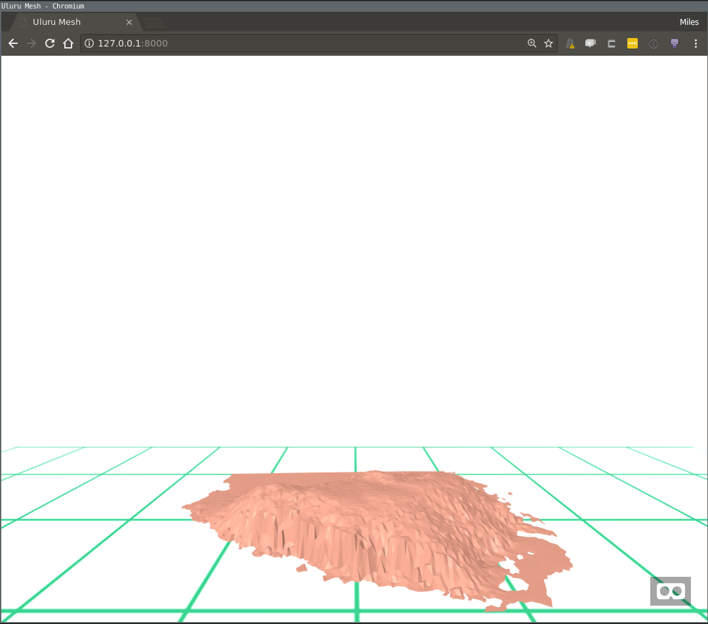
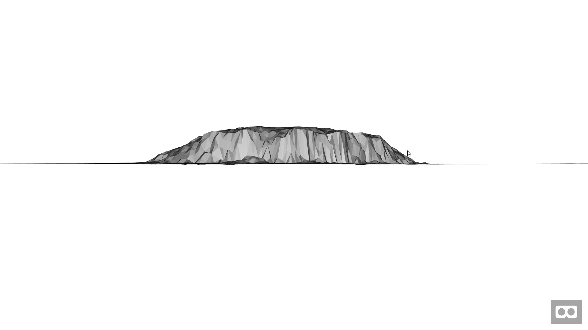

```{r setup, include=FALSE}
knitr::opts_chunk$set(echo = FALSE,
                      out.width = "100%")
```

```{r}

```

In my [previous post](https://github.com/MilesMcBain/r2vr1_uluru_mesh) in this series I showed you how to generate a 3D mesh of Uluru using R and public data. This post will discuss how that mesh can be rendered in WebVR using the [A-Frame](https://aframe.io/) framework via R. WebVR is appealing as a target platform due to its support on a [wide range of hardware](https://webvr.rocks/), including common smart phones.

# Introducing A-Frame

A-Frame is a framework from Mozilla that lets you describe a WebVR scene in HTML. Just like a regular web page, you can use the might of Javascript to manipulate the HTML elements and their properties to create a dynamic and engaging scene. The programming model uses an [entity-component-system architecture](https://aframe.io/docs/0.8.0/introduction/entity-component-system.html) ^[I'd never heard of it either, but well worth the read if you're into this thing called programming.] - if you squint it's similar to R's S3, in the sense that a single entity can be decorated with many components that add new behaviours.

To make this concrete here's a simple "Hello World" type scene:

<br>
<div class="glitch-embed-wrap" style="height: 420px; width: 100%;">
  <iframe src="https://glitch.com/embed/#!/embed/alabaster-rock?path=index.html&previewSize=0" alt="alabaster-rock on glitch" style="height: 100%; width: 100%; border: 0;"></iframe>
</div>

Be sure to check the output on the 'App' tab. You can control the view with the mouse and the WASD keys. The blue cube entity is declared by the `<a-box>` tag. You can play with its components to change its behaviour or appearance, for example:
* Changing the colour using the `color` component.
* Altering the `speed` or `axis` in in the `spin` component.
* Remove the shadow by deleting the `shadow` component.
* Scale it up or down in size using the `scale` component.

If you've done any web programming you'll notice this is just a matter of updating HTML element properties. This is extremely convenient for us, since generating and serving HTML from R is a well trodden path, with lots of helpful tooling!

I could say a lot more about A-Frame but it's not the subject of this post. Instead I'll just say two things: If you're interested in learning how to use it and have just a couple of hours, the [A-Frame School](https://aframe.io/aframe-school/#/) is great crash course. Secondly, the limits to what you can achieve with it are WAY out there. Is anybody excited about [mixed-reality multi-user](https://blog.mozvr.com/enabling-the-social-3d-web/) data visualisation? How about a [data capture environment](https://blog.mozvr.com/a-saturday-night/) that is one in the same as the data visualisation environment?

# Rendering Uluru

The companion [GitHub repo](https://github.com/MilesMcBain/r2vr2_meshes_in_webvr) to this post contains the GIS data and trimmed down R code from the last post to generate the 3D mesh similar to what we ended up with last time. After running the prerequisite section, the mesh ends up stored in a variable called `uluru_bbox_trimesh`.

The next step is to convert that mesh to a 3D model JSON format [using this specification](https://github.com/mrdoob/three.js/wiki/JSON-Model-format-3). I have written a function to do that called `trimesh_to_threejson()`^[Ideally we would write the mesh in [glTF format](https://www.khronos.org/gltf/) which A-Frame has excellent native support for. There isn't a glTF writer for R although I am aware of one in Python that is lacking documentation. Reticulate may be an option to explore. I'd love some help with this problem!]. This function makes one important change to the mesh: it centres the vertex coordinates without changing the scale. Centering is required because the WebVR scene treats the model vertices as absolute positions in space, but by convention the scene is built up near the origin. Without centering, the  projected coordinates in meters of Uluru are very farm from `0, 0, 0`!

To render Uluru in WebVR we're going to use an R package I have created called `r2vr`. This package helps you generate and serve A-Frame HTML. It's currently GitHub only, so you can install with `devtools::install_github("milesmcbain/r2vr")`. Finally, since our Uluru mesh is on a 1:1 scale, and VR meters look like real world meters, I suggest scaling it by a factor of 0.001 initially.

Putting all that together looks like this:

```r
## install r2vr using devtools
install_github('milesmcbain/r2vr')
library(r2vr)

## load JSON conversion helper function
source("./helpers/trimesh_to_threejson.R")

## After prerequisite code, our mesh is now in uluru_bbox_trimesh.

## write to JSON
mesh_json <- trimesh_to_threejson(vertices = uluru_bbox_trimesh$P, face_vertices = uluru_bbox_trimesh$T)
write_lines(mesh_json, "./data/uluru_mesh.json")

## render in A-Frame
## use a 1/1000 scale factor because Uluru is really big!
scale_factor <- 0.001

uluru <- a_asset(id = "uluru",
                 src = "./data/uluru_mesh.json")

aframe_scene <-
  a_scene(.template = "basic",
          .title = "Uluru Mesh",
          .description = "An A-Frame scene of Uluru",
          .children = list(
            a_json_model(src = uluru,
                         material = list(color = '#C88A77'),
                         scale = scale_factor*c(1,1,1),
                         position = c(0,0,-3),
                         rotation = c(0, 0, 0))))
aframe_scene$serve()

## don't forget to:
aframe_scene$stop()
```

And our reward is this:


```{r, fig.cap = "Uluru flipped and half-buried"}

```

So not quite there yet. On the bright side we just got a lesson in the A-Frame coordinate system: In A-Frame, The third spatial axis (Z) points toward/away from the viewer, while the Y-axis points "up" and "down". I keep one of these by my monitor, you may find that helpful too:

```{r, fig.cap = "The A-Frame Coordinate System"}

```

# Correcting Uluru

To get Uluru right side up we can imagine applying some kind of spatial rotation, say -90 degrees about the X-axis. That would be a good start. There's one other problem we need to correct: Since we centred all the axes, Uluru sitting right side up will also be sitting halfway into the floor. We'll apply a correction to the Y-axis height to fix this.

To correct the height of the model, we need to know what the 'ground' height was in our original raster. This is subjective and will depend on the terrain and how you want to render it. We're lucky since Uluru appears to be a bit of an island in an outback sea. I've used the maximum height of the corners of the bounding box, extracted from the raster, as the ground height. To make the correction, we add the difference of the ground height and the mean height of the mesh to the model position. The code below will make this clear. Note that we also need to multiply the height correction by the scale factor:

```r
## We need to correct the height based on ground height.
## In this case we'll find ground height from the  highest corner of the bounding box.
ground_height <-
 max(raster::extract(nt_raster, uluru_bbox_mpoly[[1]][[1]][[1]], nrow = 1))

height_correction <- -1 * (ground_height - mean(uluru_bbox_trimesh$P[,3]))
## We're reversing the correction that would have been applied to the
## ground height by centering.

## Rotated and height corrected render:

scale_factor <- 0.001

uluru <- a_asset(id = "uluru",
                 src = "./data/uluru_mesh.json")

aframe_scene2 <-
  a_scene(.template = "basic",
          .title = "Uluru Mesh",
          .description = "An A-Frame scene of Uluru",
          .children = list(
            a_json_model(src = uluru,
                         material = list(color = '#C88A77'),
                         scale = scale_factor*c(1,1,1),
                         position = c(0,0 + height_correction * scale_factor ,-3),
                         rotation = c(-90, 180, 0))))
aframe_scene2$serve()

## don't forget to:
aframe_scene2$stop()
```

And this time we get:

```{r, fig.cap = "Uluru or a Frappé accident?"}

```

If you've run this locally, take a 'walk' around using WASD and your mouse, and appreciate it from a few different angles. One thing that may interest you is that on the scale of the model, each green grid square is a 1km x 1km.

And if you have a VR capable device be sure to connect to your scene and experience it in VR-propper! The [ngrok tool](https://ngrok.com/) is very handy for exposing scenes you're serving locally over the internet.

# Discussion

In this post we took but a few baby steps toward data-driven virtual realities. Perhaps calculating the VR height correction factor using data from the scientific computing environment hints at why it bridging these things might be a good idea. If we couldn't input the calculation from R, we'd have to have cut and paste a magic number with 6 or so significant figures into a html file and that just *feels bad*.

`r2vr` is very much a work in progress, but since it is really just a HTML generator/server, it is possible to use it make all kinds of data driven scenes already. Unfortunately to get the most out of it right now, you'll need an appreciation for A-Frame. The A-Frame School I mentioned is good resource, as is the [A-Frame Documentation](http://aframe.io/docs). I do feel bad saying that, but I plan to follow this post with many more examples!

# Getting Experimental

It's quite interesting to me how using this tech brings out a playful 'arty' side I wouldn't have guessed I possessed. Rigging up a good looking scene feels like cross between painting and photography. With the basic pieces I've shown so far, there's some fun to be had looking at ways to appreciate the scale of the model.

For example, you might try rendering Uluru at full scale and placing it a known distance away. Here's a pic I made of it at full scale from a vantage 2km away (2000 VR distance units):

```{r, fig.cap = "Uluru in Architectural Grey"}

```

For this type of thing try using the `template = "basic_map"`, which has lighting that is a bit more sympathetic to large geographical scenes.

A slightly more wild idea I had was to place the viewer and a scale model of the Sydney Opera House inside Uluru to try to get a sense of its volume. I've published a [live version of this on Glitch](https://brainy-bakery.glitch.me/).

# Up Next

In my next post in this series I'll explain how to shade a mesh using GIS layers. Along the way we'll talk about making it less "jaggy" using vertex normals, the A-Frame lighting system, and the A-Frame inspector.

---------

*Work described here is part of a project funded by ACEMS in partnership with CSIRO Data 61, at Queensland University of Technology. Specialist support has been provided in-kind by the Australian Antarctic Division.*

```{r}

```

*Header image credit: By Miles McBain - Rock Opera, [CC-BY-SA 3.0](https://creativecommons.org/licenses/by-sa/3.0/au/)*
