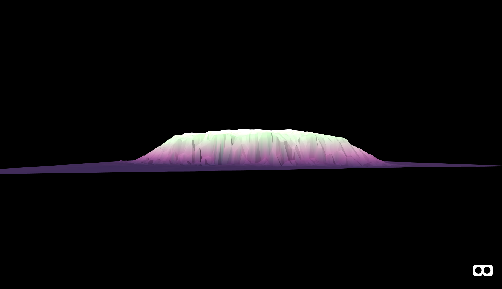
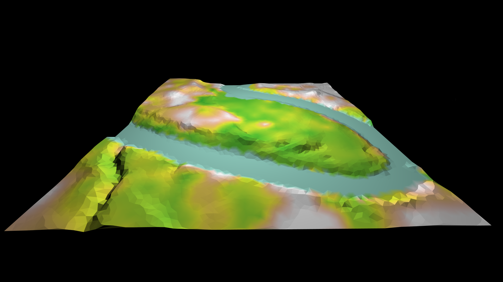
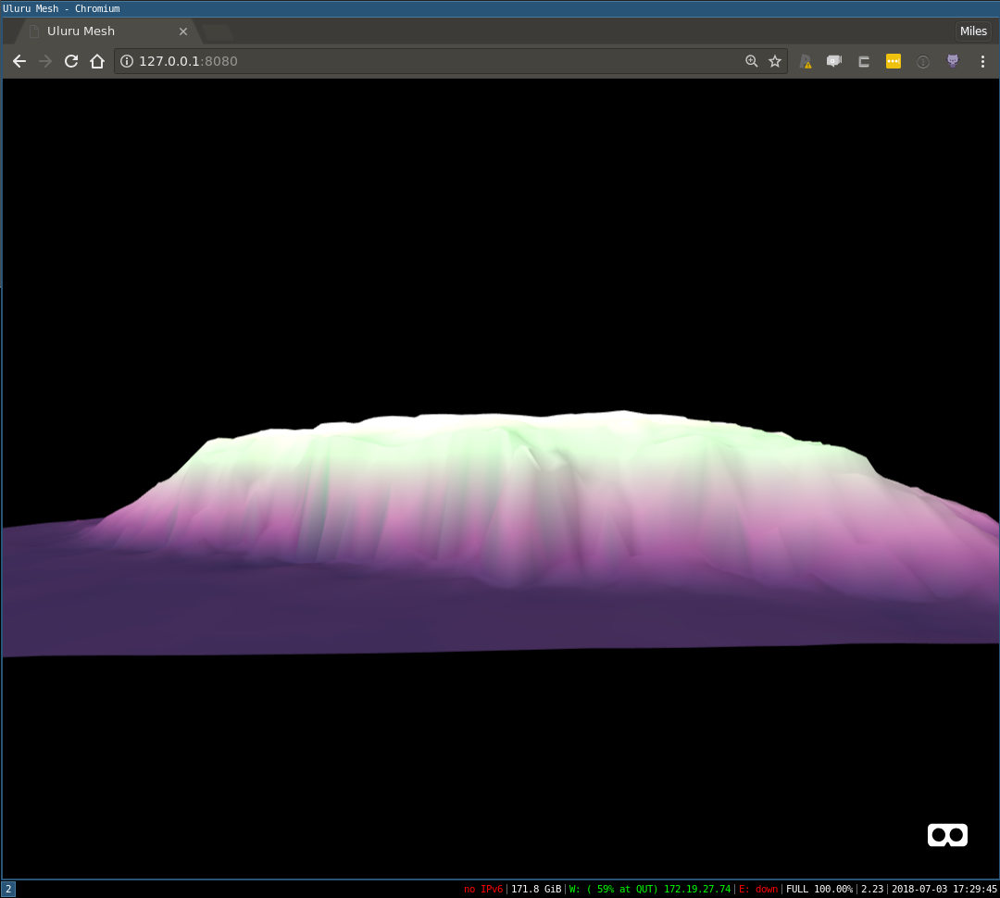
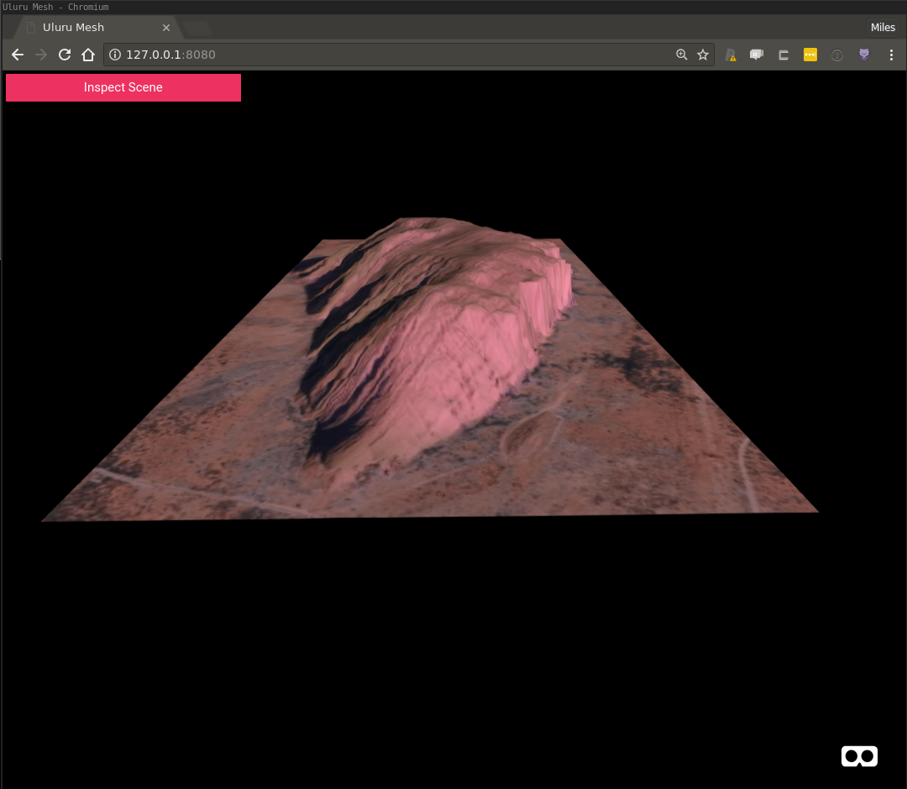
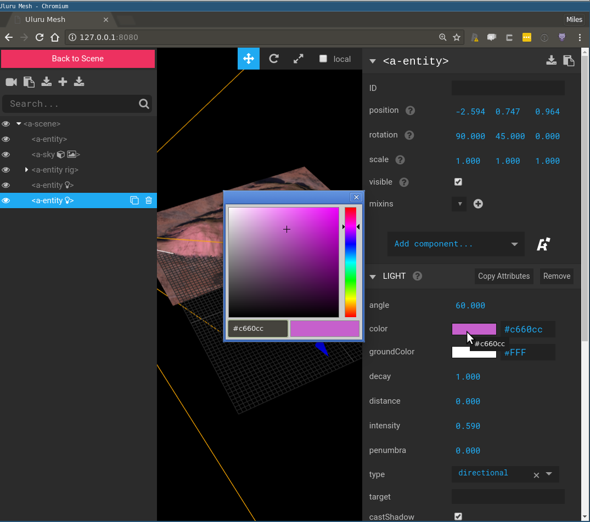

```{r setup, include=FALSE}
knitr::opts_chunk$set(echo = FALSE,
                      out.width = "100%")
```

```{r}

```


In the previous post in this series I introduced [A-Frame](https://aframe.io/), [`r2vr`](https://github.com/MilesMcBain/r2vr), and demonstrated how to render a mesh in WebVR using #rstats. In this post I'll contiue to riff on the Uluru mesh, discussing how to colour a WebVR mesh by shading using a raster layer, or applying a texture.

Along the way we'll talk about smoothing, lighting, and tweaking workflow with the A-Frame inspector.

# Shading

The last post left off at this:

```{r, fig.cap = "The 'peach puddle' example"}
knitr::include_graphics("uluru_righted.png")
```

An iconic Australian landmark looking a little off-colour. There are several ways to improve this, and the first way we will consider is shading using a raster layer. This is quite useful if you have raster layers that describe distributions of variables of interest like say, vegetation cover. Indeed this is what is happening here in this map, from the introductory post to this series:

```{r, fig.cap = "Elevation, vegetation, and water in WebVR"}

```

In this picture you can make out the triangular resolution of the underlying mesh, but notice that the colours transition smoothly, within an individual mesh face. One way to do this would be with a texture, but that would need to be quite a large high-resolution image. Instead, this has been achieved using a run-time procedure called 'vertex shading'. The idea is that instead of suppling a texture, we supply a colour value for each mesh vertex, and the user's graphics card does a smooth interpolation between them.

Since Uluru doesn't have much going on in terms of vegetation, I decided to use the original elevation raster as colour source as well. So the Uluru mesh will be coloured according to height. It sounds boring, but the results look quite arty if I do say so myself.

I'll omit the code we've discussed previously, but complete prerequisite code is present in the [companion respository](https://github.com/MilesMcBain/r2vr2_meshes_in_webvr) for this post. Here's the breakdown of how we can shade the mesh, assuming it is called `uluru_bbox_trimesh`:

### Setup

```r
## install latest r2vr using devtools
## install_github('milesmcbain/r2vr')

library(raster)
library(scico)
library(r2vr)
library(tidyverse)

## load JSON conversion helper function
source("./helpers/trimesh_to_threejson.R")

## load colour palette index helper function.
source("./helpers/colour_from_scale.R")

## load vertex to face colour conversion
source("./helpers/vertex_to_face_colours.R")
```

### Extract raster data
In this case we already have this data in `uluru_bbox_trimesh$P[,3]`, so this code is just for demonstration, to show what to do if using a new raster that isn't height.

```r
## Extract data from raster for each vertex (x,y) coord.
colouring_raster_data <-
  raster::extract(nt_raster, uluru_bbox_trimesh$P[, 1:2])
```

### Apply colour palette
We're taking a vapourwave colour scheme from the 'tokyo' palette in Thomas Lin Pedersen's [`scico`](https://github.com/thomasp85/scico) package. I've written a couple of helpers for arranging the colour data. `vec_pal_colours()` will take: 
* a numeric vector of values
* a colour palette function 
* a number of colours
and return:  
* a vector of colours as integers 
* and a vector of indexes into the colour vector for each numeric value.
 
Here we again run into the idea of using an index wherever possible to compress data structures that is common in 3D programming. Note the 'trick' of using `purrr::partial` to fill in the `palette` argument of `scico()`, so it can be blindly applied with just the number of colours argument.

A second helper, `vertex_to_face_colours()`, is used to reshape the list of colour indexes: The 3D JSON format needed for WebVR wants a colour mapping per vertex per face, `vec_pal_colours()` only created a colour mapping per vertex. The helper takes the list of vertex colour indicies and the list of face vertex indices from `uluru_bbox_trimesh$T` and returns a 3 column matrix of face colour indicies, each column representing a vertex (1, 2, and 3), and each row representing a complete triangular face.

```r
## Choose a palette function to transform to colours
n_colours <- 256
palette_function <-
  purrr::partial(scico, palette = "tokyo")
 
## Generate colours
vertex_colour_data <-
  vec_pal_colours(colouring_raster_data, palette_function,
                    n_colours, zero_index = TRUE)
                    
str(vertex_colour_data)
# List of 2
# $ colours: num [1:256] 1641779 1773107 1969716 2035765 2101303 ...
# $ indexes: num [1:8913] 9 9 5 8 246 9 7 19 8 11 ...

face_colours <-
  vertex_to_face_colours(vertex_colour_data$indexes,
                         uluru_bbox_trimesh$T)
                         
 str(face_colours)
 # num [1:17619, 1:3] 9 8 9 9 9 8 30 237 26 9 ...                      
```

### Generate Mesh JSON
To generate the JSON we supply the list of all colours we want to use, and the face-wise vertex indicies into that list, as extra arguments to the `trimesh_to_threejson()` function we used in the previous post.

```r
## Generate a shaded model JSON
mesh_json <-
  trimesh_to_threejson(vertices = uluru_bbox_trimesh$P,
                       face_vertices = uluru_bbox_trimesh$T,
                       colours = vertex_colour_data$colours,
                       face_vertex_colours = face_colours)

## write JSON
write_file(mesh_json, "./data/uluru_mesh.json")
```

### Render in WebVR

We create an asset to hold the JSON and a JSON model entity as per the previous peach puddle example. A couple of new entities are on display after that. We create a slightly more dramatic black backdrop entity in `sky`, and then add an entity that makes keyboard and mouse control slightly more convenient.

```r
## Render in VR
## Bigger than our previous 'puddle':
scale_factor <- 0.01 

uluru_json <-
  a_asset(id = "uluru",
          src = "./data/uluru_mesh.json")

uluru <-
  a_json_model(src_asset = uluru_json,
               scale = scale_factor * c(1, 1, 1),
               position = c(0, 0 + height_correction * scale_factor, -15),
               rotation = c(-90, 180, 0)
               )

sky <- a_entity(tag = "sky",
                color = "#000000")

controls <- a_pc_control_camera()

aframe_scene <-
  a_scene(template = "empty",
          title = "Uluru Mesh",
          description = "An A-Frame scene of Uluru",
          children = list(uluru, sky, controls))

aframe_scene$serve()
browseURL("http://127.0.0.1:8080")

## don't forget to:
aframe_scene$stop()
```

Resulting in:

<!-- Copy and Paste Me -->
<div class="glitch-embed-wrap" style="height: 420px; width: 100%;">
  <iframe src="https://glitch.com/embed/#!/embed/plucky-pencil?path=index.html&previewSize=100" alt="plucky-pencil on glitch" style="height: 100%; width: 100%; border: 0;"></iframe>
</div>

Fullscreen link: https://plucky-pencil.glitch.me/

## Smoothing

Our mesh looks pretty 'jaggy' but precisely this low-poly look is kind of hip right now in WebVR land. If you don't care about being hip, you can ask the user's browser to compute a set of normal vectors for each vertex that their graphics card will use to interpolate a smooth 3D surface (so called 'vertex normals'). Rendering smooth things is more computationally costly so use with caution. It is worth noting that these vectors are just estimated from the normal vectors of surrounding faces. So they can produce a result that departs from the 'true' object shape. Doing this in `r2vr` is just one extra argument to `a_json_model()`:

```r
## Smooth using vertex normals
uluru_smooth <-
  a_json_model(src_asset = uluru_json,
               mesh_smooth = TRUE,
               scale = scale_factor * c(1, 1, 1),
               position = c(0, 0 + height_correction * scale_factor, -15),
               rotation = c(-90, 180, 0))

aframe_scene2 <-
  a_scene(template = "empty",
          title = "Uluru Mesh",
          description = "An A-Frame scene of Uluru",
          children = list(uluru_smooth, sky, controls))

aframe_scene2$serve()

## don't forget to:
aframe_scene2$stop()
```

```{r, fig.cap = "Smoooooooth"}

```

# Texturing

If you're still reading, I'm guessing you're here for this. The gif I posted of this example to Twitter got some attention - Thankyou all for the encouraging words!

I'm only going to summarise this, because in truth I'm not convniced I fully appreciate it. The code to fetch the satellite tile and calculate the all important texture coordinates was gifted to me by the amazing [Michael Sumner](https://github.com/mdsumner).

It fetches a satellite tile from Mapbox using the `slippymath` package, and then does a dance of normalising our mesh vertex coordinates to range between 0 and 1, based on where they fall within the satellite image extent. In 3D graphics, texture coordinates (called UVs) always fall in the interval [0,1]. The conversion to an image pixel coordinate is made at run-time by graphics hardware. 

Once the texture coordinates are obtained, generating the JSON for the 3D model is again a straight call to `trimesh_to_threejson()`, but for one minor complication: When we pass a texture file to be referred to in a model, we have to keep in mind that its path needs to be expressed relative to the model location, not our own current working directory - If you think about this it is really the only way models + textures could be portable. Below are the two tranches of code to generate a textured mesh and render it in WebVR, making use of entities we already created.

## Build textured mesh

We're taking advantage of `slippmymath` to conveniently fetch [Mapbox](https://www.mapbox.com/) satellite imagery. If you reproduce this, be wary of terms of use.

```r
library(fs)
library(slippymath)
library(curl)
library(glue)

## Fetch a tile from mapbox calculate the tiles with slippymath
uluru_tiles <- bb_to_tg(uluru_bbox, max_tiles = 40)

mapbox_query_string <-
  paste0("https://api.mapbox.com/v4/mapbox.satellite/{zoom}/{x}/{y}.jpg90",
         "?access_token=",
         Sys.getenv("MAPBOX_API_KEY"))

images <-
  pmap(uluru_tiles$tiles,
       function(x, y, zoom){
         outfile <- glue("{x}_{y}.jpg")
         curl_download(url = glue(mapbox_query_string),
                       destfile = outfile) 
         outfile 
       },
       zoom = uluru_tiles$zoom)

## composite images with slippymath
uluru_raster <- tg_composite(uluru_tiles, images)

## Crop the image
uluru_raster <- raster_crop_bbox(uluru_raster, uluru_bbox)

## write to PNG (that's the only way we can texture map)
texfile <- "./data/uluru_satellite.png"
raster_to_png(uluru_raster, texfile)

## calculate the trimesh x and y in 0 - 1 space for texture coordinates
## using r2vr.gis::range_scale
xym <- uluru_bbox_trimesh$P[,1:2]

xyim <- apply(xym, 2, range_scale)
## This works because the image and the mesh have the same area and the area is
## relatively small, so the won't be much opportunity for the texture to be
## distorted by difference in projection.


## generate JSON containing texture
## pass just the name of the texture file so rendering process will look in the
## same directory as JSON model
uluru_tex_json <-
  trimesh_to_threejson(vertices = uluru_bbox_trimesh$P,
                       face_vertices = uluru_bbox_trimesh$T,
                       vertex_uvs = xyim,
                       texture_file = fs::path_file(texfile)
                       )

## write JSON file
readr::write_file(uluru_tex_json, "./data/uluru_tex.json")
```

## Render in WebVR

Smoothing the mesh is good idea when applying a texture. Notice how we wrap the model and associated texture up in a single asset object. 

*Note this example used Google map data, prior to them locking down their tile API*

```r
## The JSON references the satellite png file so it needs to be 
## included in 'parts' so R can serve it.
uluru_tex <- a_asset(src = "./data/uluru_tex.json",
                     id = "uluru_tex",
                     parts = "./data/uluru_satellite.png")

uluru <-
  a_json_model(src_asset = uluru_tex,
               mesh_smooth = TRUE,
               scale = scale_factor * c(1, 1, 1),
               position = c(0, 0 + height_correction * scale_factor, -15),
               rotation = c(-90, 180, 0))

aframe_scene3 <-
  a_scene(template = "empty",
          title = "Uluru Mesh",
          description = "An A-Frame scene of Uluru",
          children = list(uluru, sky, controls))

aframe_scene3$serve()

## don't forget to:
aframe_scene3$stop()
```

The result:

```{r, fig.cap = "Map texture: Google, (c) 2018, CNES / Airbus, DigitalGlobe, Landsat / Copernicus"}
knitr::include_graphics("textured_uluru.png")
```

# Lighting

One of the things you'll quickly realise when playing around in VR is that lighting can have a huge impact on the mood of your scene. For example here's an attempt at a sunrise/sunset vibe, created entirely by tweaking the colour, intensity, and position components of the two default lights:

```{r, fig.cap = "Sunrise on the rock"}

```

Longer shadows etc are needed to fully carry it off, but for something I whipped up in a few minutes of playing around it's okay. The point I wanted to make here is that this type of creative task would be an absolute chore to do by repeatedly editing code and re-serving your A-Frame scene - and the good news is you don't have to.

## Using the A-Frame Inspector

A-Frame has something called the 'A-Frame Inspector' that allows you to add, remove, and tweak entity configuration whilst viewing the results live. It really is freaking awesome for creative tweak-sessions. Once you find something that looks great, it's just a matter of translating that config back to your code, there's even a helpful facility to copy entity config as HTML, which has a close mapping to `r2vr` syntax. Access the inspector in any scene with the keys `ctrl` + `alt` + `i`.

```{r, fig.cap = "Go go gadget lights!"}

```

Note that the default lights (1 directional, 1 ambient) are injected into the scene automatically if none are configured. When you configure your own light entities, be sure to consider mixing multiple types like this for best results.

## Conclusion

We covered a lot of ground here, but hopefully you're starting to get a feel for the power placed at your finger tips by this tool. I've started little gallery of my experiments on the [`r2vr` repo page](https://github.com/milesmcbain/r2vr) that may inspire you to try something, and if you do I'd love to hear about it.

I'm under no illusions that the code presented here requires a significant degree of technical knowledge to fully appreciate. The great thing about this framework is it is highly composable, and my belief is this will mitigate this issue as the tool matures. For example, it might make sense to abstract all the helper methods floating around for generating model JSON into an `a_*` function that takes all the pieces and returns an model entity with the compiled JSON asset attached. This would be pretty simple to do, but I'm hesitant to optimise the higher level API without more dog-fooding and more feedback.

Speaking of feedback - I'll have a poster in the Wednesday session at UseR!2018 next week. Feel free to chat to me about this or anything else :)

## Next up

Next up I'll be discussing how to annotate meshes using WebVR elements. There'll be some species distrubution data I'll plot over a mesh and experiment with ways of presenting distribution model predictions made in R.

---------

*Work described here is part of a project funded by ACEMS in partnership with CSIRO Data 61, at Queensland University of Technology. Specialist support has been provided in-kind by the Australian Antarctic Division.*

```{r}

```
