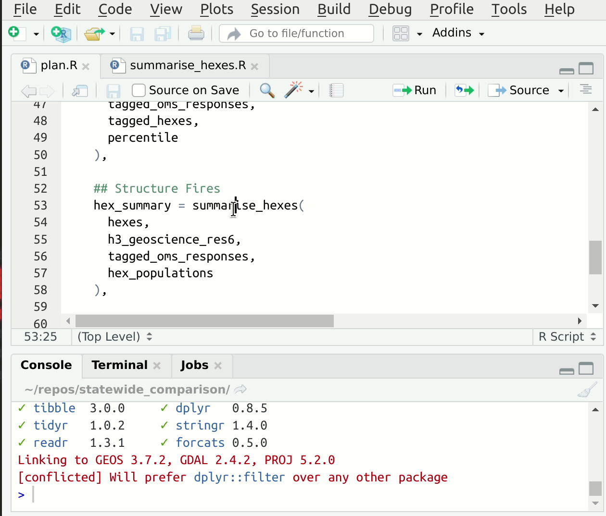
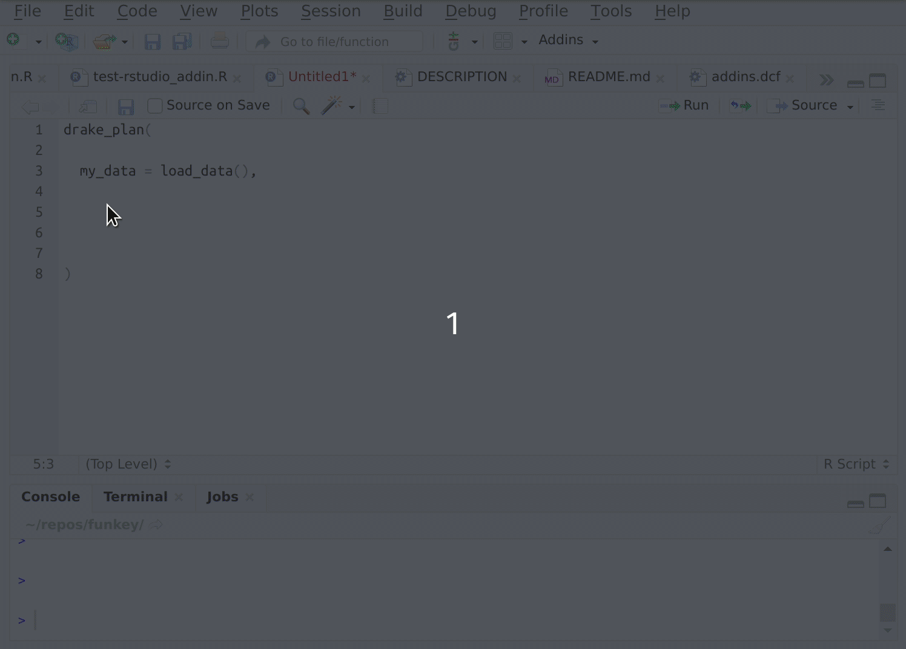

```{r setup, include=FALSE}
knitr::opts_chunk$set(echo = FALSE,
                      out.width = "100%")
```

```{r}

```


> Heads up! This post assumes elementary knowledge of what `{drake}` does. If you're at all hazy watch [this excellent short video](https://books.ropensci.org/drake/index.html#short-version) (5:48).

A benefit of joining a fledgling Data Science team is that you get to shape the team culture and workflow. So when I joined QFES Futures just over a year ago I was keen to take the opportunity to try to steer us away from some of practices that I have seen make data science collaboration difficult in the past.

One of my main early catch cries was "reproducibility!". But in this context I wanted that to mean more than just being able to blindly run eachother's code and archive the same output. I want us to be able to reproduce the understanding of how the work is answering relevant questions. Apart from affording a degree of rigour, this has the benefit of reproducing skills across the team. Skills siloing leading to role "lock-in" is a path to collective unhappiness in my experience.  ^[I think I was first exposed to these kinds of ideas when I read this _Scaling Knowledge at AirBnB_ blog post way back in 2016. Still worth a read now: https://medium.com/airbnb-engineering/scaling-knowledge-at-airbnb-875d73eff091]

So now we get to the R package `drake`. Initially I was attracted to it as an easier alternative to `make`. Why would I want `make`? There were 2 main reasons:

1. Pretty much all our projects involve hitting enterprise databases with SQL queries to pull large volumes of data. This places two things in tension: For reproducibility's sake you want to be running your data science pipeline end-to-end as often as possible. But for the sake of not being a jerk on a shared platform, you don't want to be regularly fetching the exact same data you've received prior. I wanted caching, but with minimal explicit cache management.

2. The second thing I was craving was some common scaffolding we could use to structure and orchestrate our data science pipelines. Over the years I've tried a lot of the different R project templating tools out there. I've realised I don't enjoy those that get too intricate with their folder structures. Inevitably you hit something that doesn't neatly fit the schema.

Happily I found `drake` had a lot to offer in both respects. And then some.

One type of question that emerges repeatedly in discussion with the `drake`-curious is something like "When does it become worth it to use drake?" or "I only do X type of work, will drake help me?"

My take is this:

Approaches to data science pipelines using `drake` are valuable on projects large and small because they help you move faster by:

  * avoiding unnecessary computation time
  * eliminating common classes of bugs associated with interactive development

  * providing easy-to-use debugging access-panels
  * facilitating comprehensible project and code structure

BUT. It's not like you get all this for free just by using `drake`. You get nudges in the right direction. It is still up to you to establish a workflow that will fully convey these benefits. And I think this is where people are getting stuck - taking the first steps.

So with the rest of this post I'm trying to offer you an on-ramp by outlining my team's current `drake` workflow. It is the result of many iterations over a year of `#rstats` data science project work and I hope it serves you well.


# Fundamental Principles

A problem my team has is that our workload can get choppy on short notice. Working for emergency services is by definition working through extreme and hence potentially unforeseen events. The media and politicians add their own spice to this mix lest thing get boring.

Complexity does not survive in this environment. People need to be able to context switch between different analysis projects quickly, and workflow artifacts need to be zero-overhead to create, otherwise there simply 'won't be time' to do the things that save us time.

The underlying principles of our workflow are a response to this environment:

1. We automate workflow tasks behind one line function calls. Very much inspired by `{devtools}` and `{usethis}`.
2. We use active countermeasures to ward off common bugs that can derail something due on short notice.
3. We try to write 'self-documenting' code in our `drake` plans, with an emphasis object/function names that articulate their role in the pipeline.

I've put as much of this as possible in a package called [`{dflow}`](https://github.com/milesmcbain/dflow) that helps create projects that follow our workflow.

# Initial Project Structure

We call `dflow::use_dflow()` to create starter projects that have this structure:

```
.
├── .env
├── R
│   └── plan.R
├── _drake.R
└── packages.R

```

It's a simple flat structure that sets up the machinery for `drake::r_make()`.  `r_make()` is a variant of `make()` that runs your pipeline described in `plan.R` within it's own self contained R session. This is important because you want to avoid running your pipeline in an environment that contains things that have accumulated there during interactive development. Some of these objects might be stale - old function definitions for example - and this can lead to bugs or failure to reproduce results on a teammate's computer.

`r_make()` looks for a file called `_drake.R` which has the role of sourcing all your functions, making all the `library()` calls, and otherwise setting up any objects the pipeline needs to run. The final thing it does is return your plan and associated config to be run by the `drake` machinery.

The other files `packages.R`, and `.env` are about declaring dependencies and setting useful environment variables. They come populated with some stuff in them that I will return to later.


# Mature Project Structure

Below is a more mature example that shows how things can evolve. Apart from `R`, `doc` is effectively the only standard one of these, since we use a function called `dflow::use_rmd()` that creates RMarkdown files in it. The other folders may not appear, or may appear under different names, depending on what the project is trying to do, and lead author's taste.

```
.
├── .env
├── .gitignore
├── R
│   ├── assign_crew.R
│   ├── assign_stations_to_hexes.R
│   ├── fetch_geoscience_data.R
│   ├── get_block_data.R
│   ├── get_crewnum_19.R
│   ├── get_hexes.R
│   ├── get_oms_responses.R
│   ├── get_population_data.R
│   ├── get_qld_sa1s.R
│   ├── get_stations.R
│   ├── intersect_population_hexes.R
│   ├── knn_prediction.R
│   ├── knn_prediction_future.R
│   ├── plan.R
│   ├── read_geoscience_data.R
│   ├── summarise_hex_response_times.R
│   ├── summarise_hex_structure_fires_future.R
│   ├── summarise_hexes.R
│   ├── tag_hexes.R
│   └── tag_responses.R
├── README.md
├── _drake.R
├── doc
│   └── analysis.Rmd
├── input
│   └── qgso_sa1_pop.rds
├── packages.R
└── sql
    ├── get_h3_remoteness_areas.sql
    ├── get_hexes.sql
    └── get_oms_responses.sql
```

Notice how all the R files seem to be about doing one specific thing, and they're all lumped in together under the `R` folder. This might feel weird if you're used to a more traditional folder-based approach e.g. `./00_load/`, `./01_wrangle/`, `./02_model/`. The difference is that the bulk of the project structure is provided by the `plan.R` file. To make that structure coherent it is useful to have functions named after specific steps. We have a convention one of these functions per file. This has advantages I will discuss very soon.

# Plan conventions

Here is a slightly stripped back^[full plan [here](https://gist.github.com/MilesMcBain/0a834f54320dd7e6e4a558589bd920d4)] version of the plan.R file that corresponds to that project structure:

```r
the_plan <-
  drake_plan(
    start_date = as_datetime("2018-01-01"),
    end_date = as_datetime("2020-01-01") - seconds(1),

    # spatial block is H3
    h3_resolution = 6,
    hexes = get_hexes(h3_resolution),

    stations = get_stations(),

    crews = get_crewnum_19(),

    h3_geoscience_res6_source = fetch_geoscience_data(),

    h3_geoscience_res6 = read_geoscience_data(h3_geoscience_res6_source),

    qld_sa1s = get_qld_sa1s(),

    future_pop = get_population_data(),

    hex_populations = intersect_population_hexes(future_pop,
                                                 qld_sa1s,
                                                 hexes),

    oms_responses = get_oms_responses(start_date, end_date),

    tagged_oms_responses = tag_responses(oms_responses, hexes),

    ## Structure Fires
    hex_summary = summarise_hexes(
      hexes,
      h3_geoscience_res6,
      tagged_oms_responses,
      hex_populations
    ),

    hex_predictions = knn_prediction(hex_summary),

    report = target(
      command = {
        rmarkdown::render(knitr_in("doc/analysis.Rmd"))
        file_out("doc/analysis.html")
      }
    )
  )
```

It's all function calls. There is no explicit code for data wrangling, modelling, or plotting present in the plan. We try to keep the plan as close as possible to a high level description of what is happening. I wouldn't expect you to fully follow what is going on, there's a lot of assumed team context, but hopefully you can make out:

* data acquisition steps with function names like `get_*`, `fetch_*`, `read_*`
* data wrangling steps: `intersect_population_hexes`, `tag_responses`
* a modelling step: `knn_prediction`
* a report built from `analysis.Rmd`

The long and specific function names contextualise the processes they contain.

Would you have guessed this project has had 3 people contributing code to it? That explains the slightly different choices of verbage in function names etc. Despite this it has maintained coherency.

The plan also induces structure that can help navigate and understand it. Let's say we're interested in what this `hexes` target is about and we want to see how it is defined. Our convention all but guarantees there will be a file, `./R/get_hexes.R`, that corresponds to the `get_hexes(h3_resolution)` function call.

We could navigate to that file in our file browser. Or we could use the 'jump to definition' shortcut available in most IDEs/editors^[F2 or Control + Mouse1 in RStudio].

# Function Conventions

Our convention is to match function argument names in the definition to the names of dependent plan targets where possible^[This may be not possible when using the more fancy dynamic target mechanisms, but we rarely use these.]. For example the definition of `summarise_hexes` looks like this:

```r
#' summarise_hexes
#'
#' @param hexes
#' @param h3_geoscience_res6
#' @param tagged_oms_responses
#' @param hex_populations
#'
#' @return hex_summary
#' @export
#'
#' @author Miles McBain
summarise_hexes <- function(hexes,
                            h3_geoscience_res6,
                            tagged_oms_responses,
                            hex_populations) {
...
# convert all to tibbles and select columns
# cascading left_join() calls
...

}
```

with all the argument names mirroring targets in the plan.

This convention speeds up the process of setting up suitable input values for interactive development of the function code, since we can read them directly out of drake's cache! If you're using RStudio, you have an addin provided by `drake` called "loadd target at cursor" which will load the target under the cursor into your global environment ^[I've bound 'loadd target at cursor' to a keyboard shortcut here. It's a simple matter to do this for VSCode or Emacs, ping me if you want an example.]. This makes starting from a fresh session, jumping to some code, and getting set up to edit quite fast. Here's a gif^[Okay some sleight of hand here. You'd need to have loaded the library calls first. I have a shortcut setup to do `source("./packages.R")`]:

```{r, fig.cap = "Jump to source, loadd targets at cursor, run code."}

```

Functions are usually short, not much more than a screenfull of code. This maximises the effectiveness of the cache as a development accelerator. For example: if you combine a database query followed by some hectic wrangling into one target, you'll be re-running the query every time you fine tune your wrangling. You're better off splitting them into two functions so that the query only gets run once and cached.

## Automated function templating

Writing lots of these functions in individual files can get tedious, so I've automated this process. The [`{fnmate}`](https://github.com/milesmcbain/fnmate) package allows you to call functions into existence in a conventionally named file, just by writing a call to that hypothetical function:

```{r, fig.cap = "{fnmate} in use in RStudio"}

```


Beware. This gets addictive and there's no way back. I use it many times daily.


# RMarkdown Conventions

We'll often have multiple outputs knitted from RMarkdown files. A report and a companion slide deck has been a favourite combo, or perhaps reports for peers vs reports for stakeholders.

In this scenario it made sense to promote objects like maps and plots that are shared across documents to plan targets. So it's common to see stuff like this in our plans:

```r
the_plan <-
  drake_plan(
    ...

    coverage_map = create_coverage_map(isochrones, escad_incidents),

    daily_work_series_plot = create_daily_work_series_plot(escad_incidents,   incident_categories)

    ...

    report = target(
      command = {
        rmarkdown::render(knitr_in("doc/analysis.Rmd"))
        file_out("doc/analysis.html")
      }
    )

  )
```

Where these targets are `{mapdeck}` and `{ggplot}` objects respectively. The RMarkdown then becomes extremely simple:

```
...

## 14 minute travel isochrone

\```{r, echo = FALSE, out.width = 100%}
readd(coverage_map)
\```

...
```

Where `drake::readd` pulls `coverage_map` from the cache into the rendering environment. It also signifies to `drake` that `report` has a dependency on `coverage_map`.^[Yes. Incredibly `drake` parses the code inside your RMarkdown and registers them as dependencies of the plan.]

And as a general consequence our RMarkdown documents have far less R code in them than I had become used to. Rendering completes in seconds and rarely errors.

When we do include R code beyond reading targets from the cache, our principle is to keep it directly related to the presentation rather than computation of results.

It's been interesting to see how niggles I have with Rmd and notebooks in general have evaporated under these conventions. Do you ever feel when looking at the source of an Rmd that the narrative of the text and the narrative of the code are out of sync somehow? This approach may release that tension for you.


# Debugging the pipeline

When something goes badly wrong and errors, `drake` will give you the stack trace and the name the target on which the error occurred. From that you know which function to jump into so debugging from there becomes:

1. load and inspect targets the function takes as inputs from the cache e.g. using `loadd(target_name)` or the 'loadd target at cursor' addin.

2. Play debug detective, e.g. :

    - Check the input conforms to your assumptions
      - jump to THAT target's function if no
    - Inspect intermediate results
    - Explain the problem to a duck

After a fair bit of this I've come to appreciate how having these tightly focused functional units of pipeline logic that interface with eachother in regular ways helps you narrow in on a problem quickly.

`drake` provides some tools that can help with debugging but they're not compatible with `r_make()`, since you need your REPL R session and the plan evaluation session to be one and the same. You can still use them though, just make sure you do so in a fresh R session. The workflow would be:

1. `source("_drake.R")`
2. `drake_debug(target = target_that_failed, plan = the_plan)`

And you'll be immediately dropped into an interactive debugging session of the target function as if you had called `debugOnce` on it^[Since your target functions are just regular R functions you can already use `debugOnce` on them.]. I rarely do this though, most of the time the first approach gets me there.

# Active Countermeasures
Here's where we return to the `packages.R` and `.env`:

`packages.R` ships with:

```r
library(conflicted)
library(dotenv)
library(drake)
```

and here's `.env`:

```
_R_CHECK_LENGTH_1_LOGIC2_=verbose
_R_CHECK_LENGTH_1_CONDITION_=true
```

Now let's talk about what's driving this.

## Avoiding conflicts with {conflicted}

[`{conflicted}`](https://github.com/r-lib/conflicted) makes sure you avoid the particularly insidious class of R bugs that arise from function masking in packages. That is: when two or more packages provide functions of the same name, the package you call `library()` on last has its function end up in your namespace. Change the order of your library calls, change the way your code functions. Yikes.^[As people seem to enjoy pointing out, [this functionality was added to base R since 3.6](https://developer.r-project.org/Blog/public/2019/03/19/managing-search-path-conflicts/). Conflicted is still the superior choice in my opinion. It's documentation is more coherent, and it let's you take a lazy, function by function approach, addressing conflicts only if they actually arise in your code.]

My team tend to pull many different kinds of data together in our analyses.  20 or so library calls is in `packages.R` is not that uncommon. So there's been plenty of scope for this issue to arise and hours have been lost. One of the things I despise about this bug is that the error messages you get are dumbfounding. Things you're sure should work just suddenly don't. It's the kind of thing that makes you get all superstitious and fall back to turning it on and off again.

`conflicted` will mean a few extra lines in the packages.R file of the form:

```
conflicted::conflict_prefer("filter", "dplyr")
```

And yes doing that for `filter` every time you use it for the first time does get old. But it's a tiny price to pay for never losing hours to this issue again.


## Making R stricter with env vars

The only thing the `{dotenv}` package does is load the environment variables specified in the `.env` file. We prefer this to way to using an `.Renviron` file in the project root, since that would mask the user's local `.Revniron` in their profile. `.env` is also a cross language standard for doing this.

The payload of the `.env` file are two R options that we're turning on - this is what they do:

`_R_CHECK_LENGTH_1_LOGIC2=verbose` makes the usage of 'scalar' logic operators like `&&` and `||` with vectors longer than 1 element an error and includes tracing information. Why? Compare these expressions and their output:

```r
library(tibble)
library(dplyr)
mtcars <- as_tibble(mtcars)
nrow(mtcars)

# [1] 32

mtcars %>%
filter(gear >= 4 || am == 1) %>%
nrow()

# [1] 32

mtcars %>%
filter(gear >= 4 | am == 1) %>%
nrow()

# [1] 17

Sys.setenv(`_R_CHECK_LENGTH_1_LOGIC2_`="verbose")
mtcars %>%
filter(gear > 4 && am == 1)

# ----------- FAILURE REPORT --------------
# --- failure: length > 1 in coercion to logical ---
# --- srcref ---
# :
# --- package (from environment) ---
# package:dplyr
# --- call from context ---
# NULL
# --- call from argument ---
# gear > 4 && am == 1
# --- R stacktrace ---
# ...
```

See [this issue](https://github.com/HenrikBengtsson/Wishlist-for-R/issues/48) for some exposition on what is happening.

So the variations read very similarly. They probably sound the same in your head, and yet the results! You may be confident you'll never make this mistake. But how confident are you in spotting it in someone else's code as a deadline looms?

`_R_CHECK_LENGTH_1_CONDITION_=true` changes a warning that would normally be thrown by trying to use an `if` statement with length > 1 vector into an error. E.g.

```
if(c(TRUE, FALSE)) print("Doin' stuff")

# [1] "Doin' stuff"
# Warning message:
# In if (c(TRUE, FALSE)) print("Doin' stuff") :
#   the condition has length > 1 and only the first element will be used

Sys.setenv(`_R_CHECK_LENGTH_1_CONDITION_`="true")
if(c(TRUE, FALSE)) print("Doin' stuff")

## Error in if (c(TRUE, FALSE)) print("Doin' stuff") :
##  the condition has length > 1
```

The rationale here is that upgrading the warning to an error forces us to fail early and hard. We don't want to spot something like this after we've let the pipeline run for an hour, cache or no cache.

As a general principle, failing early and hard plays really nicely with `drake` since the processing up to the point of failure is not wasted. This idea can be extended from warnings to coding in assertions about input targets where appropriate.

# Complementary tools for reproducibility

Just briefly I want to discuss managing versions of R package dependencies. We have two approaches that are employed depending on the durability of the project. Spoiler: neither of them involve Docker - we haven't had the need yet.

## For long lived projects

For things we want to be able to return to in months and years from now we use a kind of lighter-weight wrapper for RStudio's `{renv}` called [`{capsule}`](https://www.github.com/milesmcbain/capsule). The idea behind `capsule` is that since we execute our pipeline in an isolated environment, it is that package environment and that environment only that needs to be clearly specified. A user's interactive development environment does not need to be described and locked down in the same way.

In practice this side-steps a lot of awkwardness under `renv` that comes with  trialling packages in development you quickly decide not to use, and accessing packages that are convenient for development but not required for the pipeline to run.^[`{mapview}, {datapasta}, {styler}, {lintr}, {languageserver}, {fnmate}` are all examples.]

Using `capusle` we can:

* capture a description of the package environment set up by `packages.R` with `capsule::create()`
* run a pipeline inside an environment that matches the description with `capsule::run_callr(function() drake::r_make())`

## For short lived projects

Recently we've evolved a different approach for things that are perhaps more time sensitive and at the same time more disposable. Think maps to respond to queries from ranking officials etc.

We use a packaged called [`{using}`](https://github.com/anthonynorth/using) to map out any critical version dependencies in the `packages.R`. Instead of yelling to someone "This'll only work with the dev version of mapdeck" as you email them a link to a gist or repo, you can write:

```r
using(mapdeck, min_version = "0.3.2003", repo = "https://github.com/SymbolixAU/mapdeck")
```

And as a nicety the user is prompted to install if the dependency is not satisfied.

A driver for this is long compilation times for development versions of various packages that make building a complete environment using `capsule` a bit annoying for time sensitive things that will only be thrown away. ^[One could argue that in a time sensitive situation we need the protection of the `capsule` approach more than ever. I have a lot of sympathy for that argument.]

# "But will it scale?"

We've had as many as four data scientists contributing simultaneously to projects in this style. My sense from hanging out with you all online is that this is actually above average. One unexpected benefit of the one-function-per-file convention is that space is created for collaborators to make contributions without tripping over eachother.

I can count the git merge conflicts we've had on one hand. They all happened in the plan file as that's now the one place you can really step on someone. Conflicts in this file are not too bad to resolve since the code is so high level - just a list of targets and function calls.

Scaling to a large code base is not something I can comment on. We've probably done a few thousand lines of code at peak. I've heard that lots of code can challenge `drake` as it parses all it all to detect dependencies. This feels like a surmountable problem. Don't let it hold you back.

On the other end of things I don't think there actually is a project size too small. Many of the discussed benefits still apply and overhead is low thanks to automations. I've used this workflow a few times to create [pipelines that output a single plot image](https://github.com/milesmcbain/covid19). Even on a tiny project there's something to be said for sticking to conventions to avoid bogging down in new decisions.

# Conclusion

If you've had some programming education you may recognise a key philosophy of this approach as _encapsulation_. That's the breaking of machinery into pieces, hiding it away behind descriptive labels, and clear interfaces. Encapsulation done well allows us to reason about a complex data science pipeline on different abstraction levels as necessary without getting overloaded.

When you combine that encapsulation with a `drake`'s cache and dependency sniffing smarts, you get the ability to hone in on bugs extremely quickly. You also minimise the cost of having had them, since you reuse as much prior processing as possible in a principled way that guarantees reproducibility.

Using functions for the structure they can provide is different to the dominant way they are pitched in our community, as tools to avoid "repeating yourself". In this context, I would change a popular maxim slightly to say:

> If there's a piece of code you've had to **comprehend** three or more times, consider writing a function (and choosing a good descriptive name).

Doing this well still involves much art. Don't worry if you're not ready for the rest of the fucking owl yet. Building comfort with writing functions by forcing yourself to do it more often would be a great stepping stone to a workflow like this.

# The end

Thanks for reading. My objective here hasn't been to sell you on my tools and my workflow. Although they are there to be used and I welcome your feedback.

I'm offering what I have for you to reflect on, adapt, and remix in the context of your own working styles, team dynamics, and coding preferences. I think workflows that _work_ can't be established any other way.

# With thanks to

[Nick Tierney](https://twitter.com/nj_tierney) for a thoughtful draft review of this post.

My colleagues, who have been on this journey with me for the last year, and among them especially [Anthony North](https://github.com/anthonynorth).

[rOpensci](https://ropensci.org/), and all `drake`'s contributors but especially [Will Landau](https://github.com/wlandau) who is without a doubt the most responsive R package maintainer on the internet.

-----