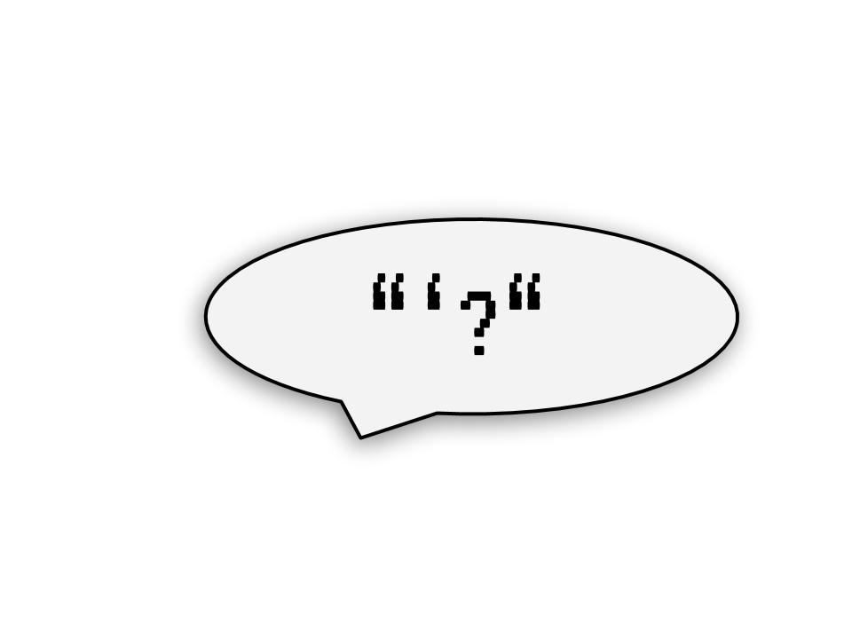

```{r setup, include=FALSE}
knitr::opts_chunk$set(echo = FALSE,
                      out.width = "100%")
```

```{r}

```
Recently I've been trying to learn more about Non-standard evaluation and specifically *quoting* in R. It's been a pretty frustrating time. The best way I can describe it is a constant maddening feeling like I am coming in halfway through a conversation. 

One thing I kept noticing again and again is R documentation that references quoting often references Lisp, as if deferring explicit definition of some concepts to your knowledge of Lisp. For example, `?bquote`^[Examples: [bquote (*base R*)](https://www.rdocumentation.org/packages/base/versions/3.5.1/topics/bquote), [quasiquotation (*rlang*)](https://www.rdocumentation.org/packages/rlang/versions/0.2.1/topics/quasiquotation), [quasiquotation (*Advanced R*)](https://adv-r.hadley.nz/quasiquotation.html)] :

> An analogue of the LISP backquote macro. bquote quotes its argument except that terms wrapped in .() are evaluated in the specified where environment.

You *do* know Lisp right? Yeah nah, me either. But I have been taking some baby steps in that direction with Peter Seibel's excellent (free online) book [Practical Common Lisp](http://www.gigamonkeys.com/book/).

In this post I'm going to use Lisp as a prop to have the quoting conversation from the start. From there I'll build up to 'quasiquotation' and 'unquoting', and finally distill the jargon into some short take-aways. It's not an overview. It's a deep dive that will hopefully arrive at a deep understanding. Let me know if you found the read worth it.

# In the beginning there were seven functions

It seems that when people talk about the birth of Lisp, they frequently cite a paper by John McCarthy called *Recursive Functions of Symbolic Expressions and Their Computation by Machine Part 1*. I found the human-readable tribute version, [The Roots of Lisp](http://languagelog.ldc.upenn.edu/myl/llog/jmc.pdf) by Paul Graham, to be a bit more digestible. 

As told by Graham, In McCathy's original paper in 1960, he laid out 7 primitive operators and then proved those 7 could be combined into a recursive evaluation system for arbitrary expressions of a list-based form. That system became Lisp, but more importantly for this discussion, one of those 7 infinity stones, that have shaped modern computation ever after, was called `quote`.

Discovering this was extremely exciting to me. In `quote` we have something analogous to the Higgs Boson of Non-Standard and Tidy Evaluation! Genealogy, etymology, and heritage - all subsequent quoting functions and evaluation systems flow from `quote`. More exciting still is that `quote` can be described and understood in quite simple terms, owing to the simplicity and elegance of McCarthy's evaluation system.

# A Study of Lisp's Quote

As a primer, here's a great quote about `quote`:

> Quote may seem a bit of a foreign concept, because few other languages have anything like it. It's closely tied to one of the most distinctive features of Lisp: code and data are made out of the same data structures, and the quote operator is the way we distinguish between them.
> Paul Graham

Now I'm going to present a scenario that will give you some insight into the importance of `quote` in making evaluation work, but before I can do that I'll need to give you a brief primer of Lisp functions and evaluation rules.

## Lisp in a paragraph

In Lisp everything is either an atom or a list. atoms are literals like `3.14`, `"Hello"`, or names of variables or functions like: `myvar`, `list`, `quote`. Lists are denoted with `()` and contain atoms and or other lists. When writing Lisp programs you write lists, each of which is interpreted as a function call unless otherwise instructed^[In truth there are other types of calls, and the ones Lisp nuts really bang on about are macro calls]. In a function call the first list element is a name identifying the function and the following elements become its arguments. To make that concrete, this R expression:
```r
list(1, 2, list(3, 4) )

#> [[1]]
# [1] 1
#
# [[2]]
# [1] 2
#
# [[3]]
# [[3]][[1]]
# [1] 3
#
# [[3]][[2]]
# [1] 4

```
has this lisp equivalent:

```lisp
(list 1 2 (list 3 4))

; => (1 2 (3 4))
```

## The set up

Let me now introduce you to a Lisp function called `set`. It has a role as an assignment function. Given that, you might try something like:

```lisp
(set myvar "myvalue")
```

But that'll get you an error: `The variable MYVAR is unbound`. So the program tried to evaluate `myvar` and found it was not defined - we knew that - we were just trying to define it!

So okay let's go out on a limb:

```lisp
(set "myvar" "myvalue")
```
Error again: `The value "myvar" is not of type SYMBOL when binding SYMBOL`

Yikes. So it won't take a string as a variable name because that's not a 'symbol', but if we give it plain text it will try to evaluate it and find it unbound. You may have guessed where this is going. We need to tell the program: Don't evaluate `myvar`, it's not code, it's data for the `set` operation. We need to use `quote`:

```lisp
(set (quote myvar) "myvalue")
```

There are several shorthands available to make this less cumbersome. In Lisp `(quote myvar)` can also be written as `'myvar`, and furthermore, these are all equivalent:

* `(set (quote myvar) "myvalue")`
* `(set 'myvar "myvalue")`
* `(setq myvar "myvalue")` 

It may not surprise you to learn `setq` (a quoting set) is a standard way to perform assignment in Lisp. In fact it's verging on impossible to do something resembling traditional assignment in Lisp without a quoting function being involved somehow.^[Thought experiment for the reader: Does this hold for R?]


## Getting us on a technicality

An interesting discussion point arises from the previous example: `quote` seems to return the text we supply as a 'symbol' since that is the input expected by `set`. How can we reconcile that with [descriptions of `quote`](https://www.rdocumentation.org/packages/base/versions/3.5.1/topics/substitute) that say it 'simply' returns its argument unevaluated? Consider these R and Lisp expressions:

```r
## R
x <- quote(y)
class(x)
# [1] "name"

;; Lisp
(setq x (quote y))
(type-of x)
; => SYMBOL
```

Come on R, the thing I passed you didn't have a class. You definitely evaluated *something*, and Lisp you're no better... can unevaluated text have a data type?

It turns out that these type of definitions of `quote` are correct only if we apply a narrow and technical definition of *evaluate*. The relevant background to comprehend this definition is well articulated by Peter Seibel in [Chapter 4 of Practical Common Lisp](http://www.gigamonkeys.com/book/syntax-and-semantics.html). Here's a crude summary: 

Compilers and interpreters are most often opaque to programmers. It is usual though that they are made up of subprograms. There is usually a distinct program with the responsibility of parsing the text we type and creating a structure of machine-readable of tokens or symbols. Then there is usually a distinct program responsible for mapping parts of this structure to low level code to be executed on the processor. This last program - the one in control of execution - is considered to be the 'evaluator' of the code.

So what this means is that code can be transformed and structured by sub-programs^[Called names like 'lexical analyser' and 'parser'] without technically being evaluated until it is processed by the 'evaluator'. ==In the Lisp family of programming languages it is possible to instruct the evaluator to leave off, and instead of an evaluation result, the machine-readable symbolic structure that would have been 'evaluated' is returned. *This* is what `quote` does.==

## Code as Data

If you have investigated much of the tidy eval documentation you may know the machine-readable symbolic structure returned by `quote` as an *Abstract Syntax Tree*. In Lisp it's just regular nested lists. In the previous section, the R class `"name"` and Lisp type `SYMBOL` are atomic elements of these structures respectively. Quoting more complex code will yield different structures. Since Lisp uses plain lists for data and code, it is intuitive that syntactical structures can be manipulated using regular list mechanisms - somewhat surprisingly this holds for R as well:

```r
## R
y <- quote(abs(x - 1))
class(y)
# [1] "call"

y[1]
# abs()

y[2]
#(x - 1)()

y[[1]] <- quote(sin)
y
# sin(x - 1)

;; Lisp
(setq y (quote (abs (- x 1))))
(type-of y)
; => CONS

(car y)
; => ABS

(cdr y)
; => ((- X 1))

(setf (car y) (quote sin))

(print y)
; => (sin (- x 1))
```

Lisp notes: `car` can be thought of as `y[[1]]` and `cdr` can be thought of as `y[-1]`. `setf` is a general version of `setq` that can handle the equivalent of `[<-` in R. 

## Data to Code

The last piece of the puzzle is taking the data that we have manipulated and evaluating it as code once again. Then we're metaprogramming. Continuing from above, we do this in both Lisp and R with `eval`, after setting a value for `x`.

```r
## R
x <- 1
eval(y)
# [1] 0

;; Lisp
(setq x 1)
(eval y)
; => 0.0
```

## Quote derivatives

With our understanding of `quote` firming up it is natural to see if we can use it to understand other related concepts like *unquoting* and *quasiquotation*. Applying the natural interpretation of the prefixes 'un' and 'quasi' we might guess:
* unquoting is the reverse of quoting? Machine-readable back to human readable? Can it be be 'evaluation'? We already have a word for that.
* quasiquotation is something that is almost but not quite quotation?

And we'd be wrong on two counts. But it's not our fault - these are terms are straight up jargon. The concepts they describe are simple to explain and motivate though. A last Lisp example should do the trick:

Let's say we are operating in a scenario where we are trying to compose a list to eventually become function call that takes a function as an argument. We have to build two lists, quoting most of the arguments, except the last one where we want the result of the code in that position, `(+ 1 1)`, as the argument.

We are actually quoting more often than we are evaluating, e.g:

```lisp
(list 'myfun 'arg1 (list 'myfun2 'arg2 (+ 1 1)))
; => (MYFUN ARG1 (MYFUN2 ARG2 2))
```

Ugh, very noisy. It would be convenient syntactically if we could switch into a complimentary mode where instead of telling Lisp what we want to quote, we just tell it what needs to be evaluated. Quoting becomes the standard procedure. 

==This anti-quoting mode is what was named 'quasiquotation'==. In Lisp you switch it on using the '`' operator, and you signal things needing evaluation using a ','. So when 'quasiquoting' the above function would be:

```lisp
`(myfun arg1 (myfun2 arg2 ,(+ 1 1)))
; => (MYFUN ARG1 (MYFUN2 ARG2 2))
```

Signaling things need evaluating in the midst of quasiquotation is what has been called unquoting. Notice the effect of unquoting is that the result of the evaluation, `'2'`, becomes data in the list that is returned. 

In simple cases like above unquote is effectively saying 'evaluate'. But it does make sense to have a different term, since it is possible to have nested quasiquotation and unquote is not equivalent to evaluate in that context - it's an evaluation somewhere down the line.

FYI you've now seen the Lisp 'backquote macro' referred to by R's `bquote` that I showed the help for in the introduction. 

# A Distillation

Now let me try and distill the concepts we have covered into a few memorable one-liners:
* `quote` transforms code into data.
    * That data being the machine-readable symbolic structure needed to **formally** evaluate it.
* `quasiquotation` is a mode that assumes we want all code transformed to data.
* `unquote` flags code that we wish to have the result of transformed to data.
    * In the context of quasiquotation.

# Conclusion

The big light bulb arising from this for me was when I gained appreciation for `quote` as a code -> data transformation. I think the main reason I found studying quoting in Lisp revelatory in this regard is that the mechanics are **a)** simple and **b)** predictable. Code and data [are both plain lists](https://twitter.com/_lionelhenry/status/1020224078592999424). These properties make Lisp a useful sandbox for building confidence with metraprogramming ideas. 

In R you can really only have **a)** OR **b)** but not both. Base R quoting and Non-Standard evaluation functions are few and seem simple on the surface but are dogged by behaviour that changes with context (e.g. `substitute`) or are less general/robust than we might like (e.g. `bquote`).

Tidy eval deserves our appreciation for doing something similar to what `purrr` did for functional programming: it's rounding off the jagged edges in the API and making metaprogramming in R much more stable and predictable. The trouble, as [I have discussed previously](https://milesmcbain.xyz/solving-the-challenge-of-tidyeval/), is this has come at the cost of simplicity. There's much work to be done to break that down and this post has just focused on one foundational aspect.
