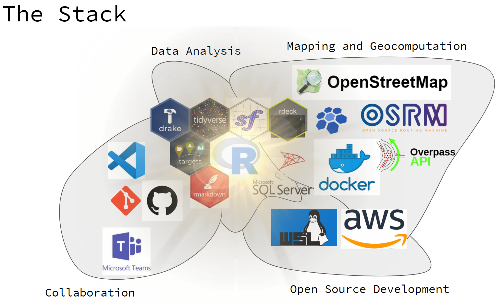
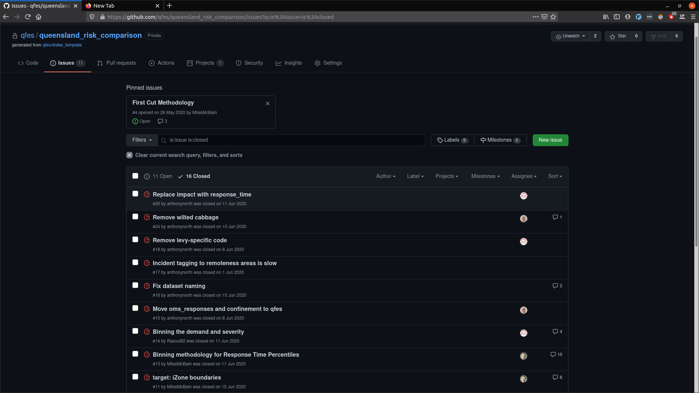
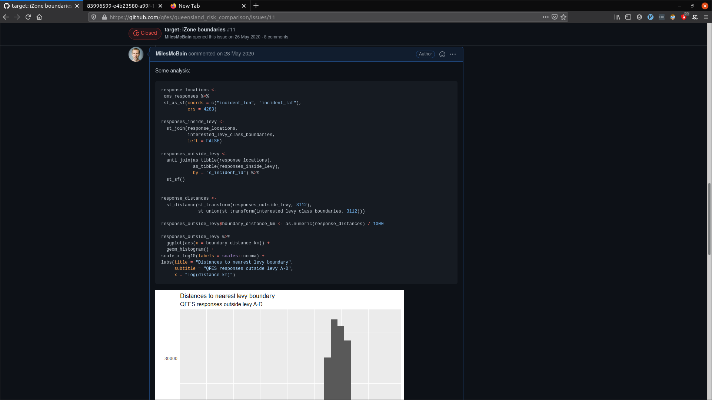
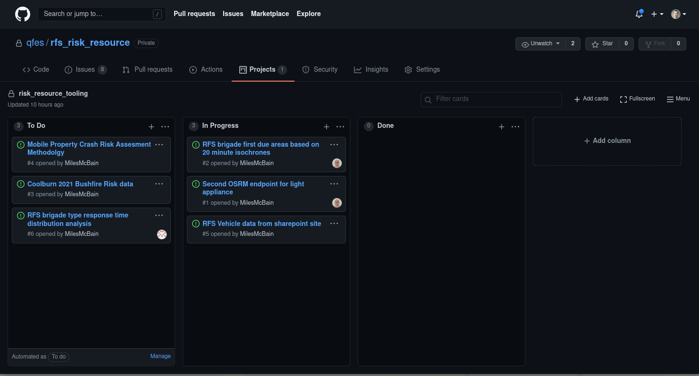
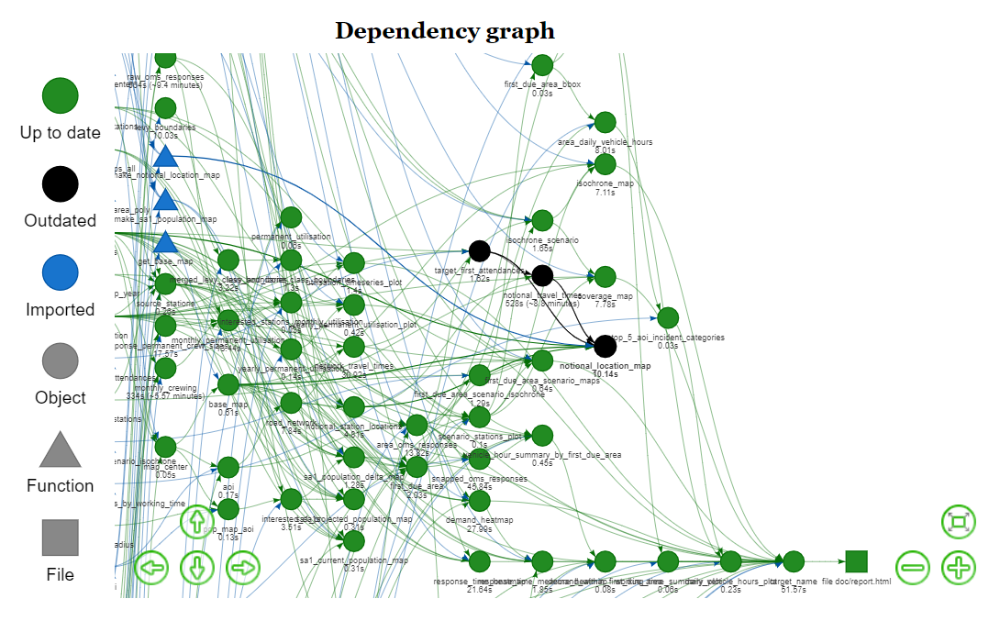
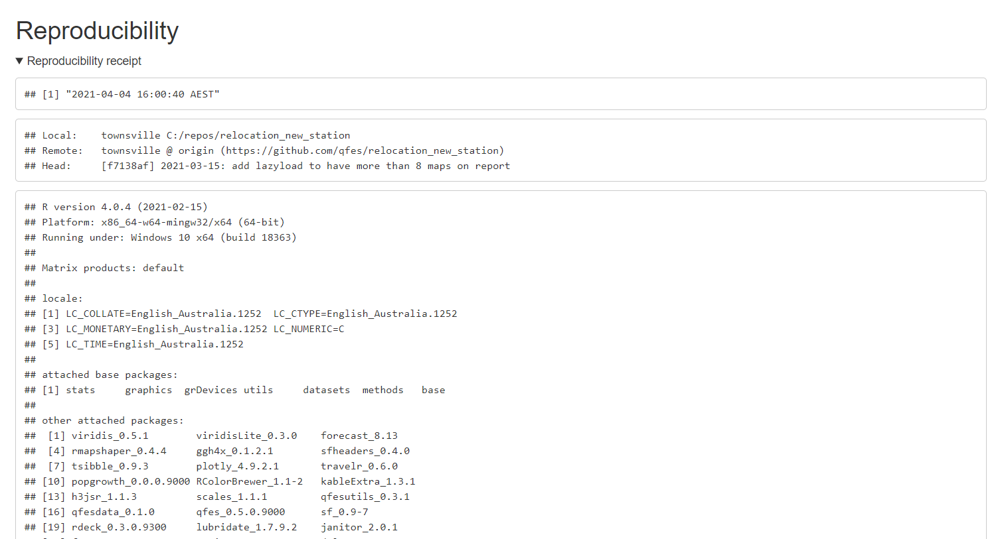
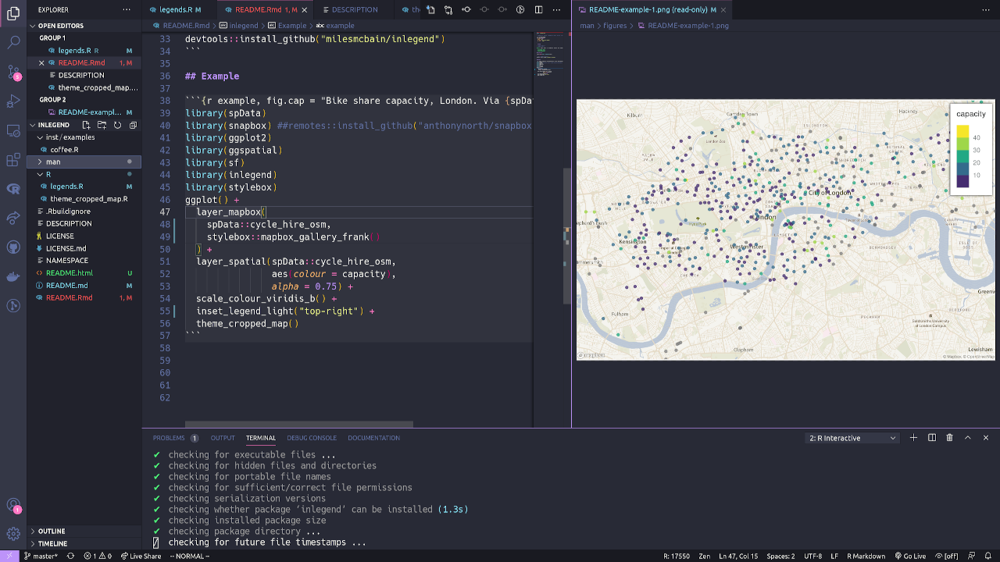

```{r setup, include=FALSE}
knitr::opts_chunk$set(echo = FALSE)
```

I recently gave a talk for the [R User's Network: Australian Public Policy (Runapp)](https://runapp-aus.github.io/runapp_website/)
about the kinds of data science products we make at my work, and
the stack of tools behind them. I was left with a bit to say on the tools
side of things, so I decided to follow up here, also for the benefit of
people outside the group.

# Introducing The Stack

After probably too much context setting, this was the map I presented of our
tool stack:

```{r, fig.cap = "A map of the tools we use for collaboration, data analysis, open source development, and mapping / geocomputation"}

```

I've grouped things into 4 blobs. Imagine these blobs pushing up against
eachother and kind of undulating organically. Things overlap and shift from
project to project.

My estimation is that probably the most novel / useful things I can share are in the
*Collaboration* and *Mapping and geocomputation* blobs, so I am committing to
write a blog post examining each of these. Maybe the others too if I really
get fired up.

For rest of this post I'll be talking about our *Collaboration* stack, which
has strong links to things I've written about before.

# Collaboration

The bedrock of our collaboration is git and GitHub. We have a GitHub
organisation our team works within - they're free! Every data science project
is a git project. We use the GitHub project management tools to organise. The
main reason this works for us is because our projects are quite code heavy.

## Git

We use R to build pipelines that suck in data from a variety of sources and
transform it into analytical reports designed to address specific questions.
These reports and all our internal communications that involve data analysis
are written with `{rmarkdown}` so they too can easily be source controlled
with git.

There are many benefits to this kind of 'from code' approach. I suspect
anyone who reads this blog will be on board with many of them, so I am just
going to mention two:

* reproducibility: not just of results, but understanding. If we are having difficulty
  understanding the detail of a teammate's approach - as invariably happens -
  we can go read their code.
* reuse: as we find ourselves wanting to reuse code from previous projects, we
  can easily lay hands on it, and refactor it out into functions in team
  packages. This ensures people are computing the same things the same way,
  and everyone's work benefits from enhancements discovered over time.

When taking the *from code* approach for a team, I can't imagine not using
git. How can you expect to reproduce something if there is any uncertainty as
to the final source version that produced the output? The same uncertainty
undermines reuse. If I can't be sure how something was done, the safest option
is to redo it from scratch.

I'd be interest to hear actually from teams that don't use git (or subversion
etc.): How you do you manage multiple analysts contributing to the same projects?

Git facilitates continuous integration of project work so that you can always
be working on a project that contains up to date input from colleagues.
Without git in the mix this becomes a delicate dance. I bet collaborating in
in a more manual way tends toward certain pathologies like:

  * Team members working mainly in isolation for most of the project, followed
    by a painful *integration phase* where they try to make eachother's work fit
    together in a rush at the end. Mistakes are made.
  * Divergent coding styles and dependency usage due to above. The effect of which is people have
    trouble following eachother's work. Reproducibility is challenged, and
    people tend want to rewrite the work of others in their style rather than bothering to understand it.

These are real things I have seen in teams that are not collaborating well.
To inoculate against these pathologies, I think it's obvious you need to have
people seeing and using eachother's work as it is developed, so there's ample
opportunity for questions to be asked and approaches to be harmonised. 

This can invite some micro-conflicts, but I think these are a healthy part of
establishing the team's norms - and preferable to the larger scale
conflicts that ensue when things don't fit together well
in a final crunch.

Git does not magically guarantee the this kind of collaboration for data
science projects, but it makes
it easier and thus more likely. 

## GitHub

Initially my team was using hosted git repos on [Azure Dev Ops](https://azure.microsoft.com/en-au/services/devops/), 
because at that time GitHub organisations were not free, and we had access
to Dev Ops via existing organisational licensing arrangements. 

We found Dev Ops generally buried information we wanted to see under
too many clicks. Its project management tools are geared towards
enterprise workflows. Complex workflows are
made possible at the cost of making simple workflows complex ^[This is also a problem with Jira + Confluence.]. 
So instead of the built-in stuff we were using Microsoft Planner for
project management and hating it. Things had to be manually kept in sync
since there was no integration with our repositories.

GitHub by contrast doesn't give you highly configurable project management
tools, however it feels like they hit a sweet spot for us where there is
just enough flexibility to accommodate our needs. We switched to GitHub pretty
much as soon as organisations became free.

We've used [GitHub issues](https://docs.github.com/en/github/managing-your-work-on-github/about-issues)
as general vehicles for project related stuff like:

* Describing requirements for tasks that need to be done
* Deciding on methodology
* Sharing observations arising from data analysis (complete with plots etc)
* Review comments
* Bug reports and feature requests for internal packages

Of course a lot of this happens informally via face to
face conversations or instant messenger, but we very much prefer issues to email.
They keep project information centralised with the project code where it can
add context, rather dispersed into inboxes where it can be lost.

```{r, fig.cap = "Some of our GitHub issues"}

```

```{r, fig.cap = "Code and analysis in an issue"}

```

For larger projects we use the [GitHub project boards](https://docs.github.com/en/github/managing-your-work-on-github/about-project-boards) 
feature to organise issues. So far we've kept this to a simple 'To do',
'Doing', 'Done' type setup. With sparing use of issue tags for certain
important tasks. There's some basic automation options available - for
example closing issues that are moved to 'Done'.

Project boards can operate at the organisational level, potentially pulling
in issues from multiple repositories, or at the repository level. We use both
types, but not as a rule. We scale the level of project management to match
the project.

```{r, fig.cap = "A repo project board"}

```
 
## {targets} / {drake}

I've written [at some length about our `{drake}`/`{targets}` workflow](https://milesmcbain.com/the-drake-post), 
so I won't rehash that here. I'll make three extra observations:

There are some nice interactions between git and pipeline tools that offer
cache management like `{drake}/{targets}`. These tools take away the question
of what code needs to be re-run when pulling or merging the work of others,
and guarantees it will be as little as possible.

I've seen this work to reduce 'pull-hesitancy' - where collaborators avoid
pulling updated work from the main repository in order to avoid re-running
long-running computations they feel they don't have time for.

Observation two is the the utility of the pipeline plan a high level map of
the project. It allows team members to easily see where their work fits,
and how it interacts with the work of others. I think this can
help build shared understanding, and thus shared ownership of the project.
Also helps with getting up to speed after a context switch.
 
The final observation is how the dependency graph creates confidence when
it comes to changing or fixing code written by collaborators. I can remember
some bad old projects, where the global environment was used a little too
recklessly, and the only way to truly know what changes were safe to make was
to do a close reading of the entire source of the project. Either that or
just make the change and hope you could find all the broken things.

Those days feel forever behind us now. Both `{drake}` and `{targets}` can
provide you with beautiful graphical representations of exactly what targets
will be affected by a change, and that lets you know the precise list of
places you need to check for unintended consequences, after which you're D-O-N-E.

```{r, fig.cap = "A {drake} dependency graph with targets outdated by an earlier code change."}

```
## {rmarkdown}

As I touched on before, `{rmarkdown}`'s value as a collaborative tool comes
from the way it keeps analysis output in sync with the source code that
generates it. This helps avoid inaccuracies creeping in due to rework, and
means when ambiguity is discovered it can be resolved by consulting the
source code that generated the document.

To make the source-output link easy to follow we've adopted the practice of
including a ['reproducibility receipt' at the foot of our report source.](https://github.com/MilesMcBain/dflow/blob/master/inst/templates/blank.Rmd#L14) 

It looks like this in a report:

```{r, fig.cap = "A knitted reproducibility receipt, showing date, repo, and R environment."}

```

With the receipt in place, you can always have a reference to the location
and version of the report source.

The classic scenario where this has proven very satisfying to have is when a
document boomerangs on the team, usually with changes required on short
notice for an important engagement. This has happened multiple times when the
primary author of the report has been unavailable ^[And will to you too via
Murphy's Law]. 

The fact that, under duress, you can quickly pinpoint the exact source code
that produced the document, which will be organised in clearly laid out
pipeline plan, really takes the heat out of a potentially a stressful
situation.

## Visual Studio Code

```{r, fig.cap = "VSCode being used for R development"}

```

VSCode has [pretty great support for R](https://github.com/Ikuyadeu/vscode-R), it's the most popular choice of daily driver in my team ^[That's not due to me, I was actually late to the party!].
It has one incredible draw-card feature for collaboration, and that is: [Live Share](https://visualstudio.microsoft.com/services/live-share/).

This is collaborative Google-Docs-style editing. Everyone can see what
everyone else is typing or highlighting in real time. Participants can chat
via text or voice. The R session is run by the host who can allow guests to
send commands to the host's R terminal and view results.

There are some rough edges, since the VSCode-R extension wasn't built with
this mode in mind, however at time of writing there is a very promising [body of work underway to improve this that is nearing completion](https://github.com/Ikuyadeu/vscode-R/pull/598).
This will make shared views of things like plots and help 'just work'.

Even in its' current state it's very usable for pair programming. I spent 90
minutes or so just last week pairing with a colleague via Live Share to solve
some data processing scaling issues. It was actually just heaps of fun.
Possibly even superior to us both standing in front of a computer together,
since there's no awkwardness due to switching who's driving or not being able
to type for shit on someone else's fancy keyboard. The session felt very
fluid and productive.

## Microsoft Teams

Teams cops a lot of flack for being either a shoddy Slack or a poor Zoom. I
think to appreciate it at all, it has to be thought of as kind of a mash up of
both of these tools that is better than neither in their niche, but excels at
providing a blended medium that simplifies switching between text and video.

I've come to appreciate this low effort video option to give head room to an
instant message conversation that is being limited by text. The team really
got into the groove of using it during 100% work from home periods of 2020.
We started doing frequent unscheduled small group video chats for quick
discussions, rather than scheduled fixtures. I do think this helped us stay
productive.

The screen sharing is solid so it's good for demonstrating. You can grant
teammates remote control of your screen too, but it's a bit laggy and janky
for pair programming - it's completely inferior to VSCode Live Share for this
purpose.

# Wrapping up 

So that was the main pieces in the collaboration stack. Underpinning the
choice of tools is a team focus on reproducibility and visibility in the
context of code-centric workflows. There's also a distinct bias toward open
source and free tools - we're quite proud to be able to achieve what we do
without charging exorbitant licenses to the public purse.

In a this new work-from-home friendly world we've also found ourselves
attracted to tools that allow voice, video, screen-share, pair programming
etc to happen in adhoc ways, simulating interactions that would take place
in the office.

As always I am not trying to put us on a pedestal or suggesting that we have
made the best choices in every regard. What we have seems to be working well,
but I am very keen to hear tips from other people doing similar kinds of work
for similarly constrained organisations. Please share in the comments below or tag
me in the Runapp Slack channel.

See you in the next post where I'll unpack our mapping stack! 
