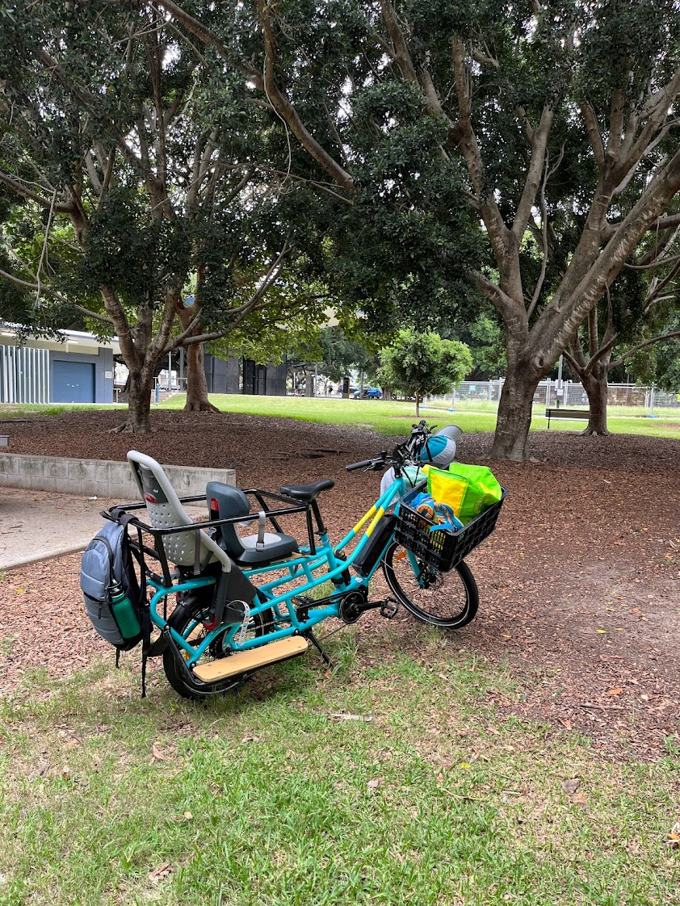

```{r setup, include=FALSE}
knitr::opts_chunk$set(echo = FALSE)
```

```{r, fig.alt = "Two children seated on the Tribe Evamos in the foreground facing away from camera. In the background is sand, water, and city buildings (Streets Beach Brisbane)."}
knitr::include_graphics("evamos_city.jpg")
```

Last week marked the one year anniversary of the purchase of our Tribe Evamos
longtail cargo ebike. During this time we've racked up a whopping 2700
kilometres of trips to kindy, school, supermarkets, pool, gymnastics, library,
parks, doctors, cafes, cinemas, and this list goes on. Should you buy this bike?
Yes (probably). Is it perfect? No. It has some flaws. Read on for my analysis.

# Background

My family was not new to getting around by bike. For a couple of years, we had
been getting around locally using an ebike to tow 2 kids in a Thule bike
trailer. We started looking into cargo bikes around September 2022, since our
boys were getting too large for the trailer, and the
new school run seemed to demand something a bit more nimble.

I'd been a commuter cyclist for 8 years, and my partner had been an on / off ebike
commuter for the last couple of years. It was important that the cargo bike
could suit us both.

# Comparing the Market

The frustrating thing about searching for an electric cargo bike capable of replacing a car in Australia is the market is essentially a binary choice between:

  - Cheap sketchy drop-shipped-from-China brands with flimsy looking attachments in the $2K-$3K bracket.
  - Hideously expensive overseas imports with sticker prices upward from $8K before you even start to accessorise.

An Australian company called *Tribe* have made a sharp play for the middle, pitching a complete *[Evamos](https://www.tribebikes.com.au/product/tribe-evamos-longtail/)* rig for around $5K on top of which you'll probably pay another $400 for decent kids seats.

In my opinion we can judge this play as a success if:

  1. The Evamos is good enough quality to function as a daily family "driver". I.e. it maintains decent battery range, and doesn't fall to bits in the face of abuse from two rambunctious kids, or occasionally the adult pilot.
  2. The Evamos is just comfortable and ergonomic enough, that the design and concessions made to drive down cost don't grate on you over time, and push you to the point where you wish you'd 'just paid the extra' to get the swish Euro ride with the telescopic dual-latching seat post.

# As a Daily Driver

Most of the time our Evamos is configured as a people mover. We have it kitted out with the front basket, the running boards, the Crew Cab safety enclosure, a Polisport Guppy seat for the older child, and a Thule Yepp Maxi for the younger.

```{r, fig.alt = "The Tribe Evamos in profile. It has a front basket and two kid seats in the rear."}
knitr::include_graphics("evamos_rig.jpg")
```

Over the course of a typical week, it's in service every single day. The staple
rides are to the school^[Fuck yeah no school car park hell], to the shops, or
into the city for some entertainment. I'll usually charge the bike's battery
twice over the week, for which I'll pay the princely sum of about 18 cents. I am
completely satisfied with the battery life we get.

My partner and I have been caught out one time each needing to haul kids with no
battery. There is a bit of a trick with the battery indicator, in that it is
non-linear^[This is pretty common]. What this means is that the first 3 bars of
battery will last you 2x or 3x as long as the last 3 bars. And when you're on
your last bars, the power from the pedal assist drops off - It's still helping
but not as much.

```{r, fig.alt = "The Tribe Evamos computer display. Showing full battery, speed 0, and trip 2725.4km"}

```

Luckily the 'granny' gears (1 and 2) on the bike mean you can get going, and even tackle moderate hills hauling kids or cargo with no electronic assist at all. It's just going to take you a while, and you're going to sweat.

Over the year we've had it I've seen a bike mechanic twice. The first time was to replace the brake pads, and check if the gears needed indexing - they didn't, the chain just needed a clean and lube. The second time was to bleed the brake lines which had air built up in them. This is minor stuff, and I think I paid around $120 each time.

Both times the mechanic has made a comment about a lot of bolts on the bike being looser than they should be. For stuff like the running boards, and the crew cab it's not a big deal, but he reckons the handle bar bolts really shouldn't get loose, although it is a thing he sees with manufacturers that use a certain kind of cheap bolt. I'm checking all these more regularly now.

So my conclusion, based on 1 year of daily use, is that Tribe have built a machine that functionally stands up to the everyday tasks you'll likely want to throw at it, and they have succeed in achieving criteria 1. from above.

```{r, fig.alt = "The tribe evamos in a leafy green park. A backpack is attached to the rear of the crew cab. The basket is full of gear."}

```

# Comfort, ergonomics, and power

One of the things that is limited on the Evamos compared to the higher end bikes
is degree of adjustment. You have a small amount of play in the handlebar height
and angle. You have the seat height. That's it. And to me it feels like maybe
the configurable range of the seat and handlebars caters better to taller riders
than shorter.

We have our handlebars as high, and as swept back as they can go. But at my
preferred seat height, I'm hunched just a little more over than I would like. My
partner is short, and she uses the seat as far down as it can go, bottoming out
the post, so possibly she could go a little lower. So neither of us can quite
dial in our 'ideal' position.

I'll also point out that although the stem is billed as adjustable, you need an
allen key to do it, and you want to make sure it's done up really tight for
safety, so it just doesn't feel practical to tune that every time you swap
riders, which for us is basically every day.

At this point though it hasn't been a big issue. The 'good enough' position we
can both get by setting the seat height is just that. We're not touring on this
thing, it's a daily run about. The longest trip we do regularly is to the city
library which is probably about 30 minutes in the saddle each way. Neither of us
are getting any aches or pains from that.

Speaking of saddle, the seat was one thing I expected to be rubbish, and that
we'd need to swap, but somehow the stock seat that comes with the Evamos is
actually a pretty nice one. Neither of us has had any trouble with it, unlike
previous bikes we've purchased.

The kids are happy with their setups too. They prefer getting around by bike to
the car. They often insist on riding, and oddly, even more firmly when it's
raining! There's not a lot of space once we're all lined up, but somehow it's
enough. No one whinges. My eldest son will occasionally jab me in the back with
the peak of his hat, but he's mostly too busy checking things out to be looking
at my boring back. As the kids get larger we'll be able to change the seating to
open up more space.^[Word of warning: If you give the kids ice-creams or cream
bun-type things you need to go really easy on the brakes or you're going to wear
it on your back.]

But how does it *feel*? When you're riding unencumbered it feels surprisingly
like a normal bike. It's a little on the heavy side, but not unbearably so. And
it's a very smooth ride. More so than something like a Tern with small wheels
front and back. To me, these feel more twitchy and 'scooterish'.

When you add kids or cargo, it takes on a more 'planted' feel. Kind of like
you're on some kind of watercraft. At very low speeds, or when stationary,
wriggling kids can make the balance feel precarious. As soon as you're moving
with any speed the Evamos is a stable, smooth, and confident ride.

As for power, I do live in a pretty hilly area so I feel qualified to comment.
For reference, I'd estimate our load with 2 kids and some gear to be ~145kg. So,
fully loaded, the Evamos has enough power on the max assist level to get us
comfortably up the kinds of hills that would leave me a little bit hot and
bothered on a regular bike by myself. What I have found by experimentation is
that if I take on a hill that looks like it would be seriously hard work on a
regular bike, it's still seriously hard work with 2 kids on the Evamos.

So for my partner who is smaller, and less cycling fit than I am, this means
there is one hill in particular on our markets route that I feel is within range
on the Evamos, but she feels is best avoided if she's riding. Something to
consider if you've hills between you and key destinations.

It's worth noting that the 250W Bafang M400 motor on our Evamos has the maximum
power rating allowed for street-legal ebikes in Australia and Europe. So it's
not really fair to say the bike could have been made more powerful. But I do
hope that one day there is a legal class of higher-powered motors permitted for
ebikes designed to carry multiple passengers (especially in hot places like
Brisbane!). The speed limiter can stay at 25km/h.

```{r, fig.align="center", fig.alt = "My partner riding, with our two kids aboard. On a bike path in parkland. Rear view."}

```

# Flaws

Some of the things I will discuss here only apply to the first-generation model
we bought, and have since been addressed. But I figure these are handy to know
about in case you're looking at buying an Evamos secondhand.

## Double top tube clearance

It's easy to miss in the photos of the bike online, but the Evamos' frame actually has two top tubes that branch off the head tube forming a kind of triangle that joins the rear 'rack'.

```{r, fig.alt = "The Tribe Evamos top tubes. Top view. My left calf rests against the left-top tube."}
knitr::include_graphics("evamos_calf.jpg")
```

This creates an issue for me, but not my partner, whereby if I jump on and adopt
my natural riding posture, my calf muscles will rub on the
two-top-tube-triangular arrangement. I have to widen my riding stance a little,
placing the pedal more toward the front of my foot, and shaping my leg outward a
little to avoid this. These days I hardly ever notice it happening, but it was
definitely something that had me taken aback when we first got the bike.

Whether this affects you is probably very dependent on your body geometry, and
your sensitivity to the rubbing sensation. But it's definitely something to
check out in a test ride.

## High step-thu

The Evamos' frame has a 'step-thu' look about it, but the sweep of the top tubes comes quite high. So much so that my shorter partner still has a bit of difficulty getting her leg over when the kids are on the bike.

## Fork mounted front rack (now fixed)

Our Evamos shipped with a front rack that was mounted on the front fork close to
the wheel axel. This meant that adding anything more than a small amount of
weight to the front basket made the steering feel awful, heavy, and prone to
'flopping'. To the point where I would say it was genuinely dangerous to fill
the front basket. We've since replaced the original front rack with the
frame-mounted version that now ships as stock configuration. It completely
mitigates this issue. So I'd advise you to make sure the Evamos you are thinking
of buying has the frame-mounted rack or factor getting it into what you pay.

## Chain bounce damping wheel (now fixed)

Since the Evamos has such a long chain it is prone to bouncing around, perhaps
even out of position, when going over big bumps. The original solution to this
was a small rubber wheel mounted on an arm. But the wheel was set too high, which
caused the chain to rapidly eat into it, and eventually saw it in half.
This happened to us after only 20 or so kilometres.

We ended up having a fair bit of correspondence with Steve at Tribe over this issue. Multiple replacement
wheels and arms were sent, until one day a new design arrived out of the blue,
and the issue was solved. The chain now sits over a lower wheel, within an
enclosure, that keeps the chain from bouncing around too much. Make sure the
Evamos you are buying has a black metal enclosure that holds the wheel, and the
chain, not just a wheel on an arm. Get the enclosure from Tribe if not.

```{r, fig.alt = "The final version of the damping wheel situated on the frame with the chain running through it."}

```

## Chain clearance in first gear

In first gear, the chain makes light contact with the rear tyre. It could be
that this is a setup issue, but it's been like this since the bike was shipped
to use with the rear wheel on. This is not really a practical problem since you
will almost never have cause to use the first gear, and if you do, you're
probably in a state where you couldn't care less about the rubbing noise. But it
is a rough edge that probably shouldn't exist on a $5K bike.

```{r, fig.alt = "The chain of the Evamos foreground running up against the tyre. In the background, the chain is on the largest cog on the cassette."}
knitr::include_graphics("evamos_chain_clearance.jpg")
```

## MIK stability (?)

The Evamos is compatible with an accessory attachment system called MIK. I have
noticed that there is perhaps more wobble than you might expect in our front
basket when attached using this system, on both racks we have used. This
wouldn't have rated a mention, except for the fact that a lady in my
neighbourhood also bought an Evamos, but she went the route of using the MIK
adaptor on the tail to attach a child seat. She wasn't really comfortable with
how much the seat wobbled around, and was impressed with how firmly seated our Yep
Maxi is, which does not use the MIK system. I never saw her setup so this is
second-hand information, but it was corroborated by the wobble in our basket, so
I thought it worth a mention. See if you can check out child seat mounted using
MIK before you buy.

# Good stuff

Alright, onward now to some things I really appreciate about the bike.

## Rear cassette and derailleur

Many of the expensive cargo ebikes are using internally geared hubs. I actually
love internally geared hubs, and have used a three-speed on my commuter bike for
many years now. However you need to treat these hubs well or they can fail, and
then things get very expensive.

I had a Shimano Nexus fail due to moisture ingress, and replacing it nearly cost
me the price of the whole bike again. I also have a friend in the area with an
Urban Arrow who has gone through two Enviolo hubs, and is now contemplating
purchasing a Rholoff ($$$). He reckons hauling his kids up hills is just too much
for the stock internal gears.

The use of a simple 1 x 8 speed single cassette and derailleur on the Evamos is
a choice I respect. If any of the non-electric bits fail the replacement will be
a readily available commodity part, not something that needs to be specially
ordered in from far away.

## Small rear wheel

Tribe didn't invent this idea, but the slightly odd-ball looking combination of
a 20" rear wheel and a 24" in the front is a very practical compromise,
especially if you plan to cart children.

Unlike static loads, children wriggle, rubberneck, fight, fall asleep and flop
etc. You'll feel those movements actually change the bike's direction a little
bit, sometimes requiring rider compensation. The more leverage you give the
kids, by placing them higher, the more they'll be able to shift the bike off
course by throwing their weight around. A lower wheel reduces the kids sitting
height, and also their leverage.

The front of the bike has some different trade-offs though. If you make the
front wheel smaller it will be knocked around by bumps (or sticks!) more, and
the steering will feel more dynamic ('scooterish'). On the Tern bikes with 20"
front wheels, shock absorbers are added to try to mitigate the bump factor, but
the handling still feels twitchy. I have ridden a Tern with a child on the rear,
and the kid wriggles combine with the twitchy handling to create a completely
different ride. It doesn't exactly feel unsafe because the Tern has such a low
centre of gravity - But it's a much more dynamic ride than the Evamos which, as
I have said, is smooth, and somewhat boring by comparison.

## Aesthetics

For certain this is down to personal taste, but I appreciate curves. There's a
retro vibe about the curves within the Evamos' frame, that makes it somehow a
bit of a throwback to bikes of times past. Bikes that were more celebratory of
the basic human fun, and empowerment to be found in cruising around by bike.
Bikes from before cycling became fully sportified, and the design language
shifted to communicating performance.

It's not a bike that says "I'm for going fast", "I'm for going off-road", or
even "I'm for carrying lots of heavy shit". It's more like "I'm for having fun",
and yeah if you get one of the bright colours there's a bit of "Check out much
I'm having fun" in there too.

It turns out the design is a bit of a beacon. Definitely do not buy this bike if
you don't enjoy random strangers striking up conversations about ebikes, cargo
bikes, riding with kids, replacing cars, urbanism etc. Because this quite
literally happens to me on a weekly basis. It's getting funny now because often
the kids will take the lead evangelising `#bikelife`, and I'll be left trying to
get a word in edgewise.

## Customer Support

I don't think this is featured enough in reviews of products. When
you buy a product you're buying into someone's idea of customer support, and
that can either be an absolute drain that sucks your time, or a delight that
completely reverses any bad feelings about the product you were having due to
some kind of problem.

As it happens we had two significant issues that started on day 1 when the bike
was delivered in a torn box, with a small scratch on the frame, but more
importantly it was missing the battery. I believe that the package was
tampered with by someone who had access to it during shipping, and the battery
was stolen to make a few hundred bucks.

Steve from Tribe was great to deal with, and in short order, we had a new battery
on the way, and some credit toward accessories for our trouble.

The second issue we had I've discussed already: the rubber chain bounce damper
gizmo wheel. This was a bit interesting because I would say at first Steve was a
little sceptical there was a design flaw, and he asked me to check a few things,
but later he called me back and admitted that there was indeed evidence of the
problem on other test bikes, it just hadn't been noticed before. Steve argued
this kind of thing was to be expected on a first-generation product, and seemed
relieved, when I, a software developer, agreed.

He sent me some newly designed parts, and when they led to the rubber wheels
lasting longer but still failing in an unreasonable amount of time, he sent us a
whole bag of rubber wheels to use as a stop-gap until the ultimate design they had
in the works could be shipped. As I said, that came unprompted, as promised,
complete with detailed installation instructions. And there's been not a hiccup
since.

I'm giving Tribe top marks for customer support. Well done Steve.

# Versus Alternatives

I've already strewn a bit of 'versus Tern' throughout this review. These are some more general thoughts about styles.

In Australia you have three main choices of style for a car-replacement cargo ebike:

  - Longtail, like our Evamos
  - 'Bakfiets' or a two-wheeled bike with a bucket in the front like the [Urban Arrow](https://urbanarrow.com/)
  - A three-wheeled bike with a large box in the front. Tribe's [frist bike](https://www.tribebikes.com.au/product/tribe-original) was one of these.

I haven't ridden a trike, so I can't comment much on that. It seems like it
would be a bit of a hassle weaving through the crowds at school pickup / dropoff
etc. And you'd be a bit more limited in places you can park it.

For me the bakfiets is the main contender against the longtail. I've ridden
bakfiets', I think they're very cool, but as far as I am concerned this is a
design conceived by a person from a cool climate.

I live in a hot climate. When kids heat up they get shitty, and what you don't
do is cram multiple hot shitty kids together in a small box, where they will
begin to sweat, fidget, and whinge about their brother touching them. All of the
bakfiets I've seen have this problem. Unless the kids are both under about 5,
the fit in the bucket is too tight for comfort in the heat.

In my humble opinion, the Longtail is the hot weather solution. It maximises
airflow over everyone's bodies. The kids can stretch out and wave their limbs
around. I have seen sunshade-type accessories for Longtails as well as Bakfiets.
Although none are offered by Tribe. Honestly, we haven't needed it. We use
sunscreen, long-sleeve shirts, and helmet covers with peaks and neck flaps, and
we're doing okay.

```{r, fig.alt = "The Tribe Evamos pictured side by side with an Urban Arrow bafiets. In a school car park, front view."}
knitr::include_graphics("evamos_vs_urban_arrow.jpg")
```

# Conclusion

I've already said that I think Tribe has nailed a level of quality that permits
this bike to become a family's reliable daily ride. I've discussed what I
believe are some of its limitations and flaws, and so the questions that remains
is:

Now that I know for sure how well my family takes to the cargo `#bikelife`, do I regret not finding the extra cash for a more expensive bike?

And the answer is: I do not!

For bikes that are very similar to the Evamos, I don't see how the extra expense
could be justified. The Evamos is good enough but far cheaper. For bikes that
are a little different, but with tons of nice features etc like the Terns, it's
not a clear cut. I'd still be losing features I think are valuable, and paying
crazy high prices for the privilege.

So yes, I can recommend the Tribe Evamos to anyone looking for a car-replacing
cargo ebike for local family transport. But do try to ride before you buy to
make sure its limitations work for you.

The way I pitch this bike to car people is like this: It's probably destined to
be an Australian classic in the same way a car like the Hyundai i30 is. It's
reliable, and economical transport that has just enough features, and wins
because of what you get for the price.


```{r, fig.alt = "Me, with brimmed helmet and sunglasses, and my two kids sitting on the Tribe Evamos, wearing legionaires style helmet covers."}
knitr::include_graphics("evamos_me.jpg")
```

```{r, fig.alt = "An esky mounted on the the tail of the Evamos."}
knitr::include_graphics("evamos_esky.jpg")
```

```{r, fig.alt = "My youngest son poses happily in front of the Evamos in the morning sunshine, in a green field"}

```

```{r, fig.alt = "The evamos with a plastic tub mounted on the tail, full of groceries."}
knitr::include_graphics("evamos_loaded.jpg")
```

```{r, fig.alt = "My youngest son, asleep in the rear seat of the evamos. Parked in the city."}
knitr::include_graphics("evamos_eddie_sleeping.jpg")
```

```{r, fig.alt = "The Evamos, parked, carrying 4 large re-usable insulated shopping bags. They are distributed: two in the basket, and one in each child seat."}
knitr::include_graphics("evamos_shopping.jpg")
```
