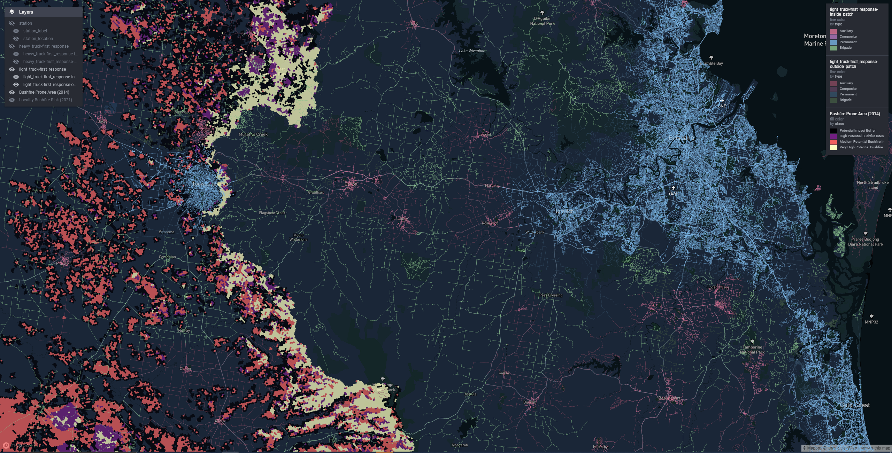
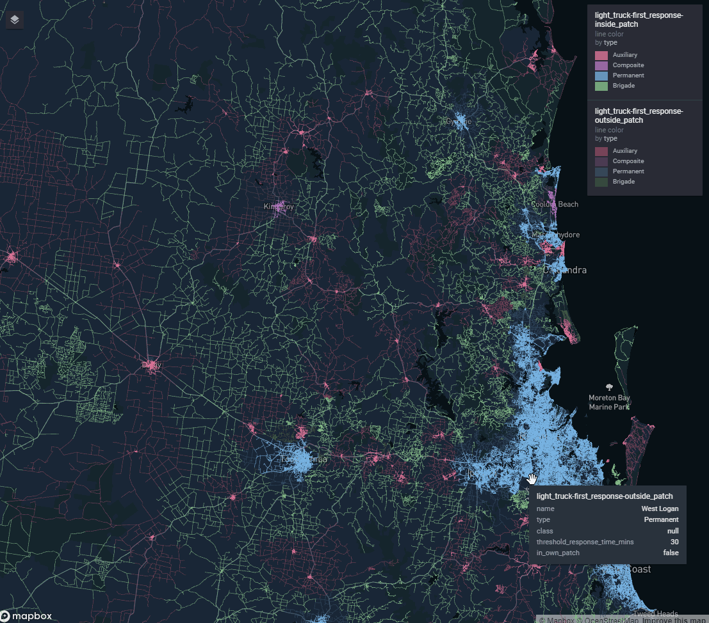
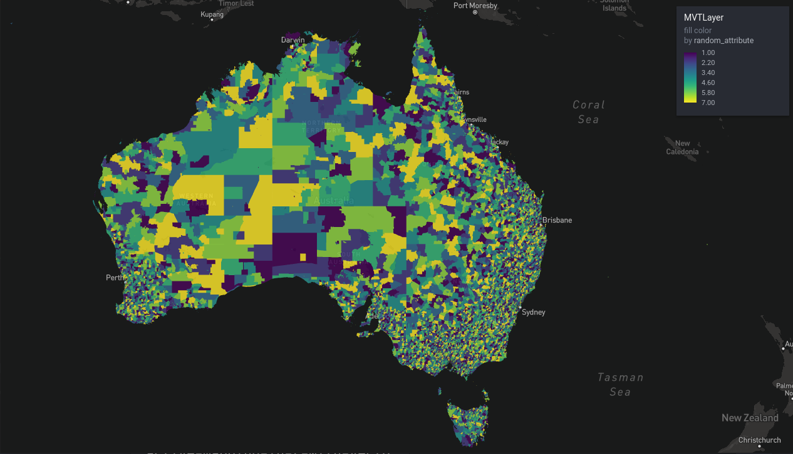
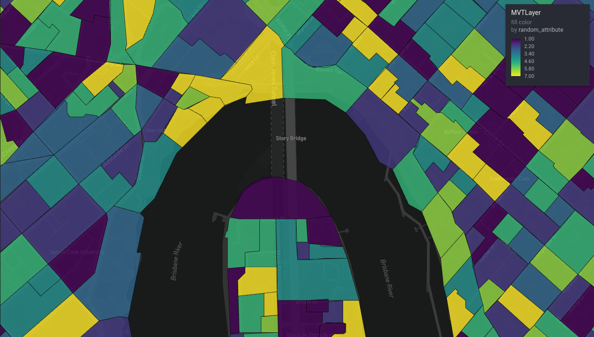

```{r setup, include=FALSE}
knitr::opts_chunk$set(echo = FALSE, eval = FALSE)
```

```{r, eval = TRUE}

```

I can recall being giddy with power when I discovered how easy it was to make those fancy interactive web widgety map whatsits with `leaflet` and R.

They neatly solve the 'spatial boundary problem': exactly how much map to show to give enough context for the data, without the data appearing so small as to be unintelligible. With interactive there is no boundary! Users set their own context. Zoom in, zoom out, discover, and have a ball! Static maps feel like ancient cave paintings in comparison.

But there are boundaries still. If you use interactive maps enough - and we're making them daily to hourly at my work - you'll find yourself up against all sorts of limits that stop you from presenting your data as you wish.

There's a limit to how many features `leaflet` maps can handle, because at some point the DOM gets too full and your browser stops being able to parse it.

Once you start rendering spatial data on WebGL canvasses instead of the DOM you'll find there is a low number of WebGL contexts that can co-exist on any one web page, typically limiting you to only around 8 maps.

Then you'll try to reuse WebGL maps by toggling on and off different layers of data for the user at opportune times. This is an improvement, but data for all those layers piles up, and your toolchain wants to embed this in your page as reams of base64 encoded text. Page file sizes are completely blowing out.

People can no longer email your fancy pants map reports around. They are not below the limit set by the email administrators. Your users are upset. Barbarians are at the gates. What to do?

Make vector tiles.

The rest of this blog post is all about them, specifically:

  * what they are 
  * what my team use them for 
  * how to make them
  * how to map them

# What are Vector Tiles?

Let's start with tiles: If you've used interactive maps or 'slippy maps' as they are sometimes known, you're probably aware of tiles. A slippy map (E.g. Google Maps) is comprised of thousands to millions of little images, a selection of which are served to you depending on the spatial viewport you have established on the map as you slip-slide around.

These solve the problem of how to serve a high resolution map image to the user. High resolution images of the Earth use a ton of data and bandwidth to transfer, but the typical user is only chasing an image of a very small section that contains whatever they are interested in.

So some clever person came up with the idea of cutting up the images of the earth into three dimensional dataset of x, y, and zoom. A tileset, as they are called, contains the whole Earth projected onto an x/y plane, rendered at progressively higher resolution or higher detail, with increasing zoom.

As we 'zoom-in', or increase our position on the zoom dimension, we are sent only the tile images for our new viewport of the Earth, which contains roughly the same amount of tiles, but those tiles represent increasingly less area of the Earth's surface. It follows that the number of tile images associated with each zoom level increases geometrically with increasing zoom (by a factor of 4).

If you remember the dial-up internet era, you will recall waiting for these little rectangular sections of your maps to 'pop-in' over a grey placeholder as they were painstakingly downloaded. Back in the early days of slippy maps all the tileset images were raster images. That is they were actually just small rectangular pngs or jpegs.

Now we get to the 'vector' part: As personal computing devices became more powerful, it was realised that it could be more efficient to transmit tiles in 'vector' form, and have the user's browser process them into the final tile image. Vector tiles contain arrays of annotated spatial coordinate data: The edges of the roads, the boundaries of buildings etc. Not an image, but the building blocks for one. 

This information is combined with a separately transmitted stylesheet to produce the tile image. Different stylesheets can use the same vector data to produce radically different looking maps that either highlight or omit data with certain attributes.

As mappers of data we can use the same trick of streaming tiled sections of our data in vector form to drastically boost the amount of information we can make available on interactive maps. 

## Mapbox Vector Tiles

A [vector tile specfication created by the Mapbox company](https://docs.mapbox.com/data/tilesets/guides/vector-tiles-standards/) is currently the de-facto standard for vector tile files. Mabbox Vector Tiles, or 'MVT' as they are often abbreviated, are stored as a Google protocol buffer - a tightly packed binary format.

## MBTiles Databases

[MBTiles](https://github.com/mapbox/mbtiles-spec) is a second specification created by Mapbox that describes a method of storing an entire MVT tileset inside a single file. Internally `.mtbtiles` files are SQLlite databases containg two tables: `metadata` and `tiles`. 

The `tiles` table is indexed by z,x,y and contains a `tile_data` column for the vector tile protocol buffers, which are stored compressed using gzip^[Compression is normally assumed to be used. It is possible to avoid it though.].

This single-file tileset is much easier to ship around than millions of tiny files, and the SQLite format and gzip compression help with efficient retrieval and transmission.

The guide later in this blog post will focus on generating, serving, and viewing MVT tilesets in `.mbtiles` format.

# How my team use vector tiles

An important challenge that was solved with vector tiles was plotting attributes associated with the entire road network of our Australian State of Queensland.

In this case we could not apply the default strategy of simplifying the geometry, since when zoomed in the road network we were plotting had to align with the road network on the basemap, so that viewers could see features that lie along sections of road they were interested in.

```{r, eval = TRUE, fig.cap = "A travel time isochrone spanning the entire Queensland road network"}

```
	
Another problem was how to introduce a selection of toggleable 'reference layers' our stakeholders wanted without completely blowing out report file size. My team delivers a lot of our work in html format (built in RMarkdown). The default for slippy map widgets is to embed all the data for all the layers into the html document itself.

Even simplified, together these added up to hundreds of MB of geojson that tanked the page performance. 
	
Using vector tiles we can have unlimited reference layers. Each one contributes nothing to the report file size since it is only streamed on demand when required.
	
```{r, eval = TRUE, fig.cap = "A state-wide bushfire risk reference layer"}
knitr::include_graphics("./qld_polys.gif")
```

Of course that data needs to be streamed from somewhere. A server needs to be involved. We'll discuss strategies for serving your own MVT tilesets later.

In summary you might look at using vector tiles for mapping your data when:
	
  - Simplification is not desirable, e.g. because of alignment issues
  - Simplification doesn't really help, you still have too many features
  - You're suffering death by a thousand cuts, and cumulatively your datasets are too much to handle.


# How to make Vector Tiles

There are a variety of tools that you use to can do this. Possibly some exorbitantly priced graphical GIS tools have simple MVT export features, and it would be worth investigating that if you have these in your stack.
	
In my team we use [Tippecanoe](https://github.com/mapbox/tippecanoe) - a command line tool purpose built by Mapbox. I need to give you two warnings about Tippecanoe: 

One: Tippecanoe is officially unsupported at present, although it does have commits as recently as 2021. There is a [community fork that is being actively maintained](https://github.com/protomaps/tippecanoe) at the time of writing. I cannot vouch for the community fork, we've never had cause to try it. We have been using the main repository version without any issues for the last couple of years.

Two: To use Tippecanoe you're likely going to have to build it from source yourself. The instructions for this are short, and the process is completely automated, but I appreciate this may create headaches if you don't have access to a Linux or MacOS system where acquiring the dependencies is made simple.

Now onward to usage: The Mapbox version of Tippecanoe takes geojson as input and can output a `.mbtiles` database or a folder structure full of protocol buffer files. We're shooting for the `.mbtiles` file.

So a rough R workflow looks like:

  1. In R, read source data as an `sf`, and wrangle
  2. Write data out to geojson
  3. On the command line, convert geojson to .mbtiles using the `tippecanoe` command line utility.

## Tutorial
We're going to use R and Tippecanoe to turn the [Australian Bureau of Statistics 2021 Mesh Block](https://www.abs.gov.au/statistics/standards/australian-statistical-geography-standard-asgs-edition-3/jul2021-jun2026/main-structure-and-greater-capital-city-statistical-areas/mesh-blocks) dataset into vector tiles.

For the outlanders, we're looking at the smallest published statistical areas that cover Australia. In the big cities they get quite tight, covering maybe a single city block or building.

This dataset is roughly 370 000 polygons of varying detail.

Not the heftyest, but too complex for `leaflet`, and good enough for illustrative purposes.

### Getting the data

```r
library(sf)
library(curl)
library(dplyr)
library(magrittr)

mesh_block_url <-
  "https://www.abs.gov.au/statistics/standards/australian-statistical-geography-standard-asgs-edition-3/jul2021-jun2026/access-and-downloads/digital-boundary-files/MB_2021_AUST_SHP_GDA2020.zip"
download_folder <- file.path(tempdir(), "mesh_blocks")
dir.create(download_folder)
download_path <- file.path(download_folder, "mb.zip")

curl_download(
  mesh_block_url,
  download_path
)

unzip(
  download_path,
  exdir = download_folder
)

mb_shapes <- read_sf(download_folder)

mb_shapes %>%
  st_transform(4326) %>% # standard lon lat 
  mutate(
    random_attribute = sample(
      1:7,
      nrow(cur_data()),
      replace = TRUE
    )
  ) %>%
  select(
    geometry,
    random_attribute,
    MB_CODE21,
    MB_CAT21,
    SA2_NAME21
  ) %>%
  st_write(
    "mb_shapes.geojson"
  )

unlink(download_folder, recursive = TRUE)
```

I am going to assume the workflow here is mostly rice and beans for anyone interested enough in R and spatial data to read this post. We have:

  - curl a url
  - unzip it
  - read as `sf` and mutate the data
  - write it to geojson

Two noteworthy moves:
  
  - transform to '4326' aka 'WGS84' aka "standard lon lat". This is the input projection that Tippecanoe expects by default.^[The mesh blocks are projected in GDA2020, how modern!]
  - Thin out the data columns using `select()` to choose the minimal set of metadata that is going to be written to JSON and then into tiles. When you're dealing with big datasets trimming the fat helps speed the pipeline up a lot.

### Generating the tiles

So now the fun part! Here's the command I ran in the terminal to generate the tiles from the geojson we wrote:

```{bash}
tippecanoe -zg \
           -o abs_mesh_blocks.mbtiles \
           --coalesce-densest-as-needed \
           --extend-zooms-if-still-dropping \
           mb_shapes.geojson
```


And here is a sample of the output:

```
For layer 0, using name "mb_shapes"
368255 features, 110834523 bytes of geometry, 6144695 bytes of separate metadata, 4830542 bytes of string pool
Choosing a maxzoom of -z8 for features about 1094 feet (334 meters) apart
Choosing a maxzoom of -z11 for resolution of about 179 feet (54 meters) within features
tile 3/7/4 size is 649415 with detail 12, >500000    
Going to try keeping the sparsest 69.29% of the features to make it fit
tile 3/7/4 size is 649787 with detail 12, >500000    
Going to try keeping the sparsest 47.99% of the features to make it fit
tile 3/7/4 size is 649835 with detail 12, >500000    
Going to try keeping the sparsest 33.23% of the features to make it fit  ... 
```

After completion we should have an `.mbtiles` available, let's check how big it is in the terminal:

```bash
>$du -h abs_mesh_blocks.mbtiles
83M     abs_mesh_blocks.mbtiles
```

Not too shabby compared with:

```bash
>$du -h mb_shapes.geojson
932M    mb_shapes.geojson
```

You're probably wondering where I pulled the command from. The `tippecanoe` README has a helpful 'cookbook' section which contains example invocations for common tasks. I copied that command from a section titled [Continuous polygon features (states and provinces), visible at all zoom levels](https://github.com/mapbox/tippecanoe#continuous-polygon-features-states-and-provinces-visible-at-all-zoom-levels). All I changed were the input and output file names.

To understand the options you need to understand what `tippecanoe` is trying achieve. It's all about trying to factor the geometry into tiles such that the tiles remain under size limits that are designed to maintain map performance. For example:

  - The default tile size limit is 500Kb
  - The default tile feature limit is 200 000 features
 
One thing `tippecanoe` does toward this end that you cant turn off is simplification. However it's much smarter than simplifying the whole dataset by some arbitrary fraction. `tippecanoe` simplifies each zoom level according to the scale of the tiles. For example, at zoom 10, each pixel is roughly 10 meters apart, so `tippecanoe` uses a 10 metre 'tolerance' type parameter to simplify your geometry at that zoom.

This kind of simplification is often not sufficient alone to respect the tile size limits, so there are a plethora of options concerning strategies to use to reduce either the number of features, or amount of data associated with those features. Different strategies are better suited to different types of geometry.

Something that's worth noting here is that the 500kb size limit includes any attributes associated with the geometry data. So the `select()` call in our R code to 'trim the fat' has an impact here, allowing us to fit more geometry on each tile. It's also possible to increase the size limits, though my team has never done so.

Another notion that's useful to understand is 'overzooming'. Overzooming is browser-side scaling applied to your rendered geometry, such that as you 'zoom in' or increase zoom, it is automatically scaled to match the zoom of more detailed tilesets, e.g. the base map.

Practically speaking this means that if your visualisation tool supports overzooming^[which {rdeck} does], you don't need to create a tileset for your data for every possible zoom, or every possible zoom of your base map. Ideally you create tiles up to the zoom level where there is no need to reduce features - everything is rendered in sufficient detail.

As an example, the difference between a tileset that goes up to zoom 12 and one that goes up to zoom 13 could be up to 50 million vector tiles so it pays to choose the minimum acceptable zoom. In the command we ran we offloaded that choice to `tippecanoe` with the `-zg` or "zoom guess" option.

Returning to the idea of reducing features and data: `coalesce-densest-as-needed` is an option that tells `tippecanoe` to combine the densest, i.e. smallest and most tightly packed, features into larger features (polygons for us). 

Corrupting the data can sound scary for us data analyst types, but the result looks quite natural. Tightly packed small polygons are impossible to derive meaning from at low zooms anyway, so they appear as part of other larger polygons, resolving as separate polygons at increased zoom. 

If you increase the zoom very rapidly you may be able to catch the tileset with its pants down, and see the crudely formed combined polygons. But most of the time the increasingly detailed tiles are downloaded so fast you don't really notice the corrupted versions of your geometry.

The only option used we haven't discussed is `extend-zooms-if-still-dropping`, which means: If you are having to drop features to respect size limits at the nominated maximum zoom level for the tileset, extend the tileset to increased zoom levels until that no longer happens. In our case we let `tippecanoe` choose the maximum zoom level anyway, so this is really just a fallback in case the heuristics applied to do that failed to work well.

The last thing we need to cover is this type of output

```
tile 3/7/4 size is 649415 with detail 12, >500000    
Going to try keeping the sparsest 69.29% of the features to make it fit
```

Here `tippecanoe` is letting us know that even with simplification and the reduction strategies we asked it to apply, a tile turned out bigger than 500Kb. As a last ditch effort its going to keep a selection of features and drop others. Some of this is to be expected, particularly at high zooms like 3. Consider the tiles that contain capital cities at zoom 3, they're going to have a ton of data, most of which won't be visible, so the dropping has little observable effect. However, these reattempts slow up the processing, and if you're getting too many, it might be worth researching some of the other options `tippecanoe` makes available[In particular `--hilbert` seems to make coalescing much better].

So that's `tippecanoe`. Don't worry if some (or a lot) of that went over your head. It's taken me a few passes at the README and bunch of playing around to get what feels like a tenuous handle on how this tool works.
  
### Mapping the data

To stream vector tiles on demand to maps two thing are needed:

  - A map widget that supports making http requests for vector tiles (front end)
  - A vector tile server that can processes the http requests and serve the requested tiles (back end)

At present, as I am aware, there is only one package in the R ecosystem which has a map widget that can render Mapbox vector tiles: [{rdeck}](https://github.com/anthonynorth/rdeck). {rdeck} is a [deck.gl](https://deck.gl) wrapper created by my colleague [Anthony North](https://anthonynorth.r-universe.dev), and has been my team's main interactive mapping workhorse for the last couple of years.

For this example we'll serve the tiles with [{mvtview}](https://github.com/milesmcbain/mvtview), a package I put together that provides a basic MVT server and viewer powered by {plumber} and {rdeck} respectively. It's meant as a development tool, to help you iterate on `tippecanoe` parameters, not as a production solution.

We'll discuss production options for serving vector tiles in the next section.

To map the tiles we created earlier:

```r
library(mvtview)
library(rdeck)

# Fire up the server
serve_mvt("abs_mesh_blocks.mbtiles", port = 8765)
# Serving your tile data from http://0.0.0.0:8765/abs_mesh_blocks.json.
# Run clean_mvt() to remove all server sessions.

# Map the data
rdeck() |>
  add_mvt_layer(
    data = tile_json("http://0.0.0.0:8765/abs_mesh_blocks.json"),
    get_fill_color = scale_color_linear(
      random_attribute
    ),
    opacity = 0.6
  )
```

And you should get:

```{r, eval = TRUE, fig.cap = "ABS mesh blocks, continental view"}

```

```{r, eval = TRUE, fig.cap = "ABS mesh blocks, local view"}

```

You might be wondering where this file came from: `abs_mesh_blocks.json`. Recall that a component of a .mbtiles database is a `metadata` table. `{mvtview}` provides a way to fetch this metadata as json by querying a json file with the same name as the `.mbitles` file. The structure of ['tilejson' is yet another specification](https://github.com/mapbox/tilejson-spec) created by Mapbox, and is supported in `deck.gl` (and therefore `{rdeck}`) to describe tile endpoints.

The tilejson can also be useful for an end user, for example to set the map limits:

```r
# Use the tile json
library(jsonlite)
tile_json <- fromJSON("http://0.0.0.0:8765/abs_mesh_blocks.json")

rdeck(
  initial_bounds = structure(tile_json$bounds, crs = 4326, class = "bbox") # using the tilejson
) |>
  add_mvt_layer(
    data = tile_json("http://0.0.0.0:8765/abs_mesh_blocks.json"),
    get_fill_color = scale_color_linear(
      random_attribute
    ),
    opacity = 0.6
  )

```


## Serving vector tiles in production

### Mapbox

Mapbox offers a vector tile hosting as a service, and we trialled this and it seemed fine, however I cannot recommend it because the pricing model was unworkable for us. Mapbox bill per square kilometre of tiles 'processed', and then per square kilometre hosted per day. The processing fee for the tileset we just created would probably be around $40 AUD - insanely steep considering all the work already done to convert the data to .mbtiles, and the amount of cloud compute that could be purchased for that price.

The per square kilometre idea is completely broken for a jurisdiction like Queensland, which is quite large but also very sparsely populated. For example a tileset that has the entire Queensland road network could cost hundreds of dollars a month to host, ridiculous considering many many of those square kilometres of tiles have hardly any data. So if you do want try Mapbox, be sure to read the pricing pages closely!

### AWS Lambda

We rolled our own Amazon Web Services solution that serves tilesets upload to an S3 bucket via an API gateway that handles requests with AWS lambda functions that run a Node.js environment. So this is a serverless solution where we only pay for the storage and compute we actually use, and the solution will scale to huge numbers of requests that we'll never see. Our maps only have users in order of dozens, so this works out to be so cheap as to make the Mapbox option look absurd. 

The AWS solution is built with [AWS SAM](https://aws.amazon.com/serverless/sam/), meaning it is all infrastructure as code / config, and so should be deployable with minor config changes by other teams who would like to try it out. Check it out [here](https://github.com/qfes/mapbox-tile-server). 

### Other options

The ['Awesome Vector Tiles'](https://github.com/mapbox/awesome-vector-tiles) repository has a number of open source tile servers linked.

You could also roll your own. Tile servers are fairly simple programs. They only have to handle two types of requests. If you take a look around the `{plumber}` implementation in `{mvtview}` for inspiration, you'll see we're talking less than 300 lines of code. Our AWS solution is a similarly small amount of Typescript.

Falling back to more traditional methods or serving tiles is possible if you are willing to deal in thousands to millions of tiny vector tile files in a directory structure, rather than an `.mbtiles` database. A directory structure can be served with an ordinary vanilla webserver program. `tippicanoe` can output such a directory structure with the `--output-to-directory` option. Instead of a tile json URL you can give `{rdeck}` template URL like:

```r
rdeck() |>
  add_mvt_layer(
    data = "http://0.0.0.0:8765/abs_mesh_blocks/{z}/{x}/{y}.vector.pbf",
    get_fill_color = scale_color_linear(
      random_attribute,
      limits = c(1,7) # without the tilejson metadata we have no defaults available for the attribute range
    ),
    opacity = 0.6
  )
```


# Conclusion

That's it for this crash course on vector tiles. Hopefully it's enough to get you exploring the space and reaping some benefits. Converting data to vector tiles feels a bit like an art at times, so don't worry if you struggle to get a feel for the right options at first. That's something we had to go through as well.

I would advise packaging up `tippecanoe` recipes that work well for the kinds of datasets you have as you discover them. This will save you effort remembering them in the future, and make life easier for your teammates.

We barely scratched the surface of what `{rdeck}` can do, but rest assured its capabilities extend well beyond vector tiles. It is an excellent choice for a general purpose web mapping widget for products created with ``{rmarkdown}``^[and yes, Quarto] and `{shiny}`.

Please feel free to leave a comment! Especially if something is still mysterious, or you have your own completely different vector tiles workflow.

All the code used in this blog post is in [this repository](https://github.com/MilesMcBain/mbtiles_example).