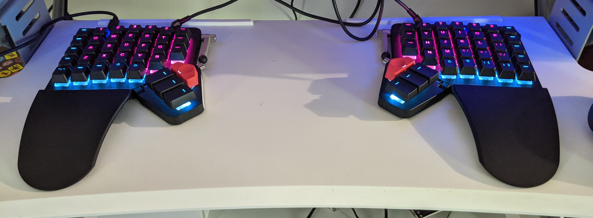
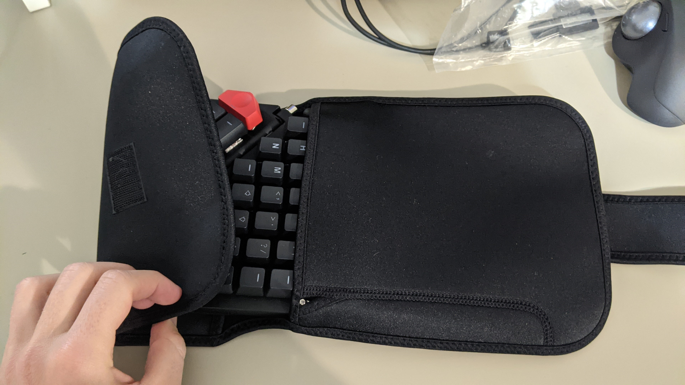
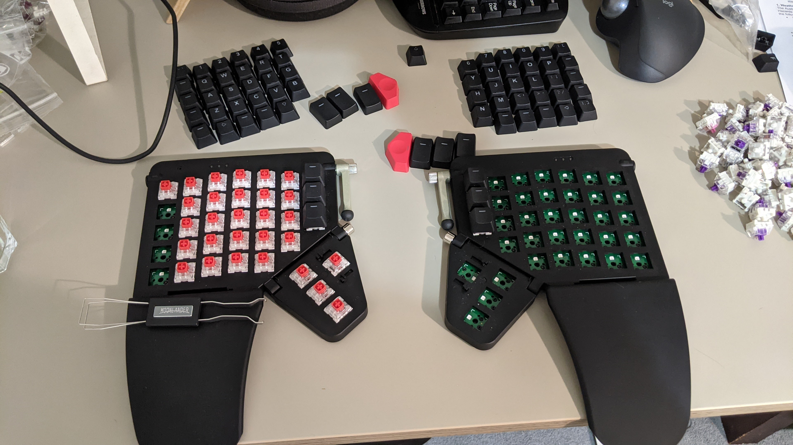
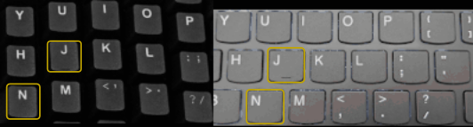
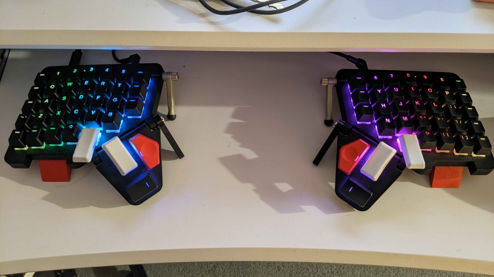
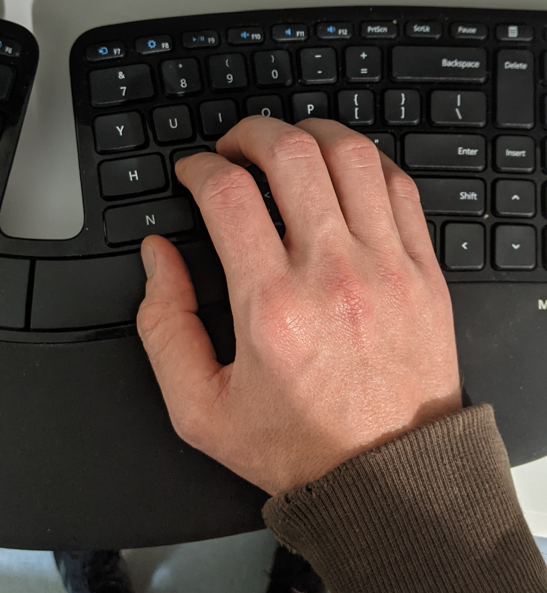
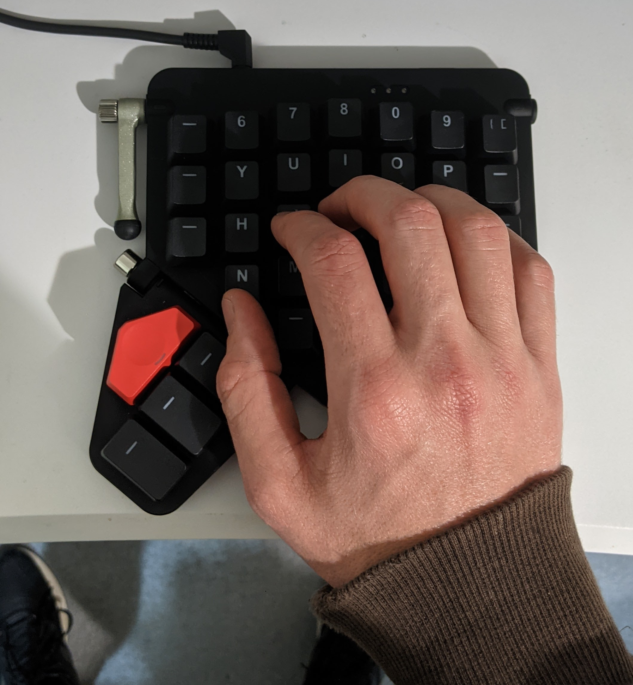

```{r setup, include=FALSE}
knitr::opts_chunk$set(echo = FALSE)
options(tidyverse.quiet = TRUE)
```
```{r}

```

Even if you're not a massive input nerd, there's a pretty good chance you've heard about the [ZSA Moonlander Ergonomic Keyboard](https://www.zsa.io/moonlander/). It's quite an aesthetically pleasing device, and It's billed as the next generation of the much vaunted [ErgodoxEZ](https://ergodox-ez.com/) lineage. Like its predecessor it carries an eye-watering price tag: USD $365.

This post is my review of this apex ergonomic device. I spent 60 days with it before giving up on it due to steadily worsening strain injuries in my hands. Despite the ergonomics being something of a critical failure for me, I did find a lot to like about it, especially on the configuration and customisation side of things. It came frustratingly close to a device I could really get excited about. 

The rest of this review is going to examine the these aspects of the board:

1. Quality
2. Portability
2. Tweakability
3. Ergonomics
4. Support Experience

From my perspective these represent the main selling points.

Some context about me: I spend most of my job writing code to do data science
work in R, during which I use a keyboard-driven workflow. I work standing 100%
of the time, and I avoid using a mouse wherever possible. For text editing I
favour either [Spacemacs](https://www.spacemacs.org/) or
[VSpaceCode](https://vspacecode.github.io/). My daily-driver keyboard for the
last 4 or so years has been the Microsoft Sculpt.

# Quality

For the most part the Moonlander felt like a premium device. Its surfaces felt
good under my hands. The key caps are subtly textured and ever so slightly
grippy. They felt weighty and durable. The typing sounds were thick and
substantial, without being excessively loud ^[although a lot of this is due to my initial choice of a linear switch.]. It gave a very tidy first impression.

I do have one nitpick: The mechanism in the tenting legs felt flimsy. When rotating them I could feel a
gear clicking though a discrete set of positions, but the sound and feel of this
gave the impression that the gear was plastic. Unsettling metallic groans were
emitted from the springs on the allen screws when tightening them that made me
feel caution was required.


# Portability

This is an important one for me. I can't afford two Moonlanders, so I needed it
to be able accompany me in a bicycle pannier bag on my daily commute. Also
setting and tearing down had to be reasonably low effort.

A big strike against the Moonlander in this regard is the lack of rigid case.
For a device in this price range it was a let down. What was provided wasn't
really a case so much as a thin neoprene slip that keeps the two halves, allen
key, and cables bundled together. It didn't seem like it would offer any
protection whatsoever from bumps during transit. By contrast, I have a set of
headphones which cost in the same ballpark as the Moonlander that shipped with a
rigid zip-up case.

```{r, fig.cap ="The Moonlander's case is very lightweight."}

```

After some careful measuring I was able to find exactly one reasonably priced rigid case for DJ headphones that would accept it, for which I paid AUD $40.

In its stock neoprene travel bundle, the board, cables, and allen key weighed in
at around a kilo. I didn't notice the weight on the bike, but you would in a
backpack, particularly since it is dense weight. Heavy enough to notice, not
heavy enough to be an issue I think.

The setup and tear down process does feel a bit cumbersome at first. The fit of
the allen key in the tenting screws was quite tight, so I found myself always
having to concentrate to slot it in. Perhaps the most difficult thing to get
down was that the left thumb cluster screw is reverse threaded. "Lift-to-loosen"
I found myself muttering under my breath. It's the kind of thing you forget in
hurry, which I frequently am when trying to depart.

When packing up, the cables don't have a dedicated place to live in the neoprene
slip which meant pack up always felt a bit haphazard. A couple of times I
accidentally popped off a key cap trying to squeeze the cables into the slip
along side one of the halves.

On the plus side, the wrist wrest folding mechanism is quite slick with a
magnetic clasp that keeps them in travel mode. The wrist wrest hinge also gave a
robust impression.

After I got the rigid case packing was greatly simplified. I started using the
slip as padding only, and the case was sufficiently large that I could keep the
tenting legs in my favoured position while stowing it.

So while I agree the Moonlander is portable, I don't think it's appreciably more
portable than a small keyboard (e.g. 60% form factor). Compared with other
ergonomic boards, it probably would be at the portable end, definitely more
portable than traditional offerings from Microsoft, Kinesis, et. al.

# Tweakability

## Software 

This is where the Moonlander shone for me. The software side of things is
incredibly well executed. There are two main ways you can customise the
Moonlander's functionality:

* You can use [online GUI editor called 'Oryx'](https://configure.zsa.io/moonlander/layouts/default/latest/0) which seems to be backed by `git`.
  Changes are incrementally tracked and you can fork a configuration at any
  point. Oryx is focused on the key map, but it does expose a subset of deeper
  stuff that is possible in the firmware.
* You can edit the Moonlander firmware directly in C code. It uses a framework
  called 'QMK'. ZSA provide instructions on how to get going with this, and QMK
  itself has [some of the nicest documentation](https://docs.qmk.fm/) of any open source project that I
  have ever seen.

I didn't do anything too radical but the possibilities are expansive. To give a taste for what's possible:

I swapped out my shift keys for layer toggles. This meant I could directly
control the 'shifted' version of each key. With this concept I:

* Made underscore, `_`, the shift of space.
* Swapped the locations of angle brackets `<>` and parentheses `()`
* Made Lshift + Rshift `{` with `}` on hold
* Made Rshift + Lshift `[` with `]` on hold

The idea I was working on was to move symbols that I use regularly while working
to more convenient locations - and the results felt pretty damn good!^[The last layout I made in Oryx is here if you're curious: https://configure.zsa.io/moonlander/layouts/L4P6y/latest/0] 

This experience has cemented for me that deep programmability is an important facet
of truly ergonomic hardware. All of us have different preferences and physical
limitations, too many and varied to design for in hardware!

A bonus in the Moonlander's favour is that QMK is an open source firmware that
is used by a variety of exotic keyboards including kit-builds. So experience
with QMK is likely to be portable to other boards, rather than being one
manufacturer's way of doing things.

I didn't get deep into QMK but I did work with it to set faster macros for
commonly used symbol combinations like `%>%` and `<-`, as well as playing with
the acceleration parameters of mouse control mode. This was all much easier than
I expected, thanks to the excellent docs. I found a Docker config for the QMK build environment that made building my changes a breeze.

One nitpick I'd make about tweaking that the iteration loop is quite slow for
continuous parameters. These underpin some important features, for example: How
long does a key need to be held down to register as a hold? How quick does a
double tap need to be? How fast should the mouse accelerate in mouse control
mode? 

The only way to set these is according to personal taste, but to change a
value means recompiling the firmware and re-flashing the board. It would be cool
if the board could provide some kind of shell that would accept commands
to alter these parameters live and feel the effects ^[This nitpick is minor since, I think within QMK it would definitely be possible to assign keys to increment and decrement these parameters live - it just would be nice to have a workflow for this out of the box.].

Nitpicks aside, the Moonlander was a software tweaker's dream. I definitely want my next board to be running QMK.

## Hardware

On the hardware side there are a few avenues for tweaking. The thumb clusters
seem to have been designed to be swappable, although no other alternatives exist
at this time. I could easily imagine ZSA is planning a cluster with a pointing
device. There's also some mysterious sets of screw holes in the base of the
board, maybe for extreme tenting mode? Again there's nothing out at the moment. 

So the hardware tweaking angle I had open to me was the key switches. They're
'hot-swappable', which to my surprise meant I could literally swap them out
while the board was hot (powered). The swapping process was repetitive but not
otherwise challenging. There was a switch puller tool included for this
purpose. It felt kind of like what imagine medieval dentistry was.

I tried 3 sets of switches all up, including the Kailh Box Red switches I
ordered the board with. The Box Reds were definitely a mistake for me. I found
the travel too deep, like typing on a pillow. This lead to a lot of
fumbling with missed presses or double-presses as I struggled to get a feel for
the actuation point. I tried pushing the switches all the way down to the bottom-out point, but that felt fatiguing.

I had a much better time with some Kailh Speed Copper switches which have lower
travel and a higher actuation point. But even these felt like work compared to
what I was used to on the Microsoft Sculpt.

The hot-swap design worked really well for me since I didn't really know what I
wanted in a switch. I ordered a sampler batch and had a fun time trying them all
in different positions to get a feel for what I liked. The Moonlander taught me a lot about the influence of switches, and the hot-swap ability is a convenient feature that I would regard highly when choosing my next keyboard, although it may not be essential, having some concept of what I like now.

```{r, fig.cap = "A switch swap in progress on the Moonlander"}

```

# Ergonomics

ZSA's marketing bills the Moonlanader as a "Next-generation ergonomic keyboard".
Apart from the customisable key layouts, the main ergonomic features of the
Moonlander that it makes this claim based on seem to be:

* Split halves for typing at more comfortable width and angle
* Staggered 'Columnar' or 'Ortholinear' key arrangement which changes home position reach angles reach distances
* Wrist rests (removable)
* Tiltable thumb cluster
* Ability to tent the board using a tenting leg and thumb cluster.

Some of these things worked for me, others did not. I expect this is a highly personal thing. 

## Split Halves

A thing that worked was typing with a much wider posture encouraged by having
the halves set around shoulder width. I have a sense that standing to type with
my wrists close together exacerbates a tendency for me to round my shoulders
forward - since it concentrates weight in front of me. With the Moonlander I
felt like I could more easily maintain a healthier posture.

## Staggered Columns

The staggered columnar arrangement presented a bit of a stumbling block
initially. It took me 7 days to get back to my previous typing speeds ^[Perhaps
I had some advantage coming from a board that was already split.]. I have mixed
feelings about the arrangement. I can get on board with the idea it makes hand
movements symmetrical, and I did find it easy to visualise the 'grid' in my
head, but I didn't find it universally better as the hype would have had me
believe.

The columnar arrangement makes different tradeoffs. Some keys are easier to
reach while some get harder. For example: The middle columns are offset slightly
downward from the index finger columns ^[Why is this is case when these columns
use the same finger?]. The effect of this is that (in QWERTY) `Y` and `T` become
easier to reach while `N`, a frequent key in programming, becomes a much further reach than on a staggered board.

```{r, fig.cap = "The diference in spacing between J and N on the Moonlander (left) and my laptop (right).", out.width = "200%", fig.align = "center"}

```

I did notice some fatigue and pain in my right index finger and I believe the
`N` position contributed. This isn't an insurmountable problem, it could be
fixed by swapping `N` for a less common key - but [as was noted by the creator of the Workman keyboard layout](https://workmanlayout.org/), swapping keys without consideration for the interaction effects can produce poor results. Probably a better option is swapping to a new layout that has been holistically designed.

Following that line of thinking I experimented with learning DVORAK, where I
noticed another issue introduced by the staggered columns: In DVORAK the outside
keys above home are `'` and `L`. It seems that the `L` position upsets a lot of
programmers and terminal users, in part due to proximity to `S` which is
immediately below it. I.e. `ls -l` uses the pinky for all the characters other
than space. So what is recommended is that the ring finger is used
when reaching upward for `L` and `-`. This is unconventional but perfectly
viable on a staggered board, but felt super awkward to me with the Moonlander's
columns.

What these examples made clear to me is that layouts designed for staggered key
arrangements do not necessarily perform as well with the offset columnar
arrangement. Which seems kind of obvious now, but was not something I
considered when purchasing the Moonlander. `N` was a significant niggle for me
in QWERTY as I suspect it may be for other programmers.

## Wrist rests

Moving along to other ergonomic features brings us to the wrist rests. They're
premium feeling plastic, but I found them too hard. I couldn't use them for much
more than about 45 minutes at a stretch before my wrists and palms started going
numb and tingly. There's a chance I might have been using them wrong, but I am
able to use the slightly softer wrist rest on my Microsoft Sculpt all day
without consciously thinking about it. I removed the wrist rests and went with
hover typing after the first few days. Thankfully this was easy to do.

## Tenting and Thumb Cluster

So now finally we arrive at the cluster that was tenting and the thumb cluster. This is a challenging part to write since I still have a lot of really raw frustration and anger attached to my experience with this part of the keyboard. 

I'll start by pointing you to how the thumb cluster is marketed by ZSA:

> The thumb module tilts up and down. Use it to find the perfect typing angle, and the wrist support module will automatically follow.

> For small hands, tilt the thumb module up. For bigger hands, tilt it down.

> A custom fit for your hand size.

Next I should tell you my hand size. A common way to measure this seems to be hand length and breadth. So here are these dimensions for me against the [2012 US Army Anthropometric Survey](http://mreed.umtri.umich.edu/mreed/downloads.html#ansur) for males and females^[Initially when I made this plot I made it for males only. The data sets are separated by gender. Against males I am in the 60th percentile for length and the 6th for breadth. So I definitely have a more unusual shape compared with men only. Later I realised this was a mistake since ergonomic keyboards shouldn't be designed for men only.]:

```{r, echo = TRUE, fig.cap = "Compared with the 4082 servicemen and 1986 servicewomen in the sample I am at the 71st percentile for length but only the 30th for breadth."}
library(tidyverse)
ansur_2 <- bind_rows(
  read_csv("./ANSUR II MALE Public.csv"),
  read_csv("./ANSUR II FEMALE Public.csv")
)
my_hand <- tibble(handlength = 195, handbreadth = 81, label = "Me")

ggplot(data = ansur_2, aes(x = handbreadth, y = handlength)) +
  geom_point(colour = "grey") +
  geom_density_2d() +
  geom_point(data = my_hand, colour = "red") +
  theme_minimal() +
  geom_text(
    data = my_hand,
    aes(label = "Me"),
    colour = "red",
    nudge_x = 0,
    nudge_y = 4,
    size = 4
  ) +
  labs(
    title = "My hand size vs service people in the ANSUR II 2012 sample",
    subtitle = "Contours depict observation density",
    x = "Hand breadth (mm)",
    y = "Hand length (mm)"
  )
```

So I guess there's some evidence to suggest my hand shape is a little uncommon. I
certainly don't have 'large' hands, but to call them 'small' could be misleading
depending on what dimensions are important. I have 'skinny' hands may be better
^[For someone in the US Army. Compared with warriors of the keyboard kind I expect I'd be a bit more normal.].

What I do know for sure is that with these hands I couldn't find a way to use
the thumb cluster without pain. Inflammation in my thumbs and wrists slowly
accumulated during my time with the Moonlander, and really started to worry me
around week 3 - 4 when I noticed pain away from the keyboard when I was doing
things like gripping a steering wheel or holding a cup of coffee. The locus of
pain was centred at the base of both thumbs running up to my second knuckle and
back toward my wrists.

I tried all sorts of things to get relief. Using the thumb cluster tilted up
felt horrible, inducing sharp pain quite quickly, so I started looking at
modifications including: 

* purchasing [aftermarket 3d printed legs](https://www.thingiverse.com/thing:4688862) to
allow the Moonlander to tent with the thumb cluster up
* over-size key caps to move the pressable area of the key closer to my natural position
* wooden blocks to allow the board to have a degree of negative tilt.

Here's a picture with those mods:

```{r, fig.cap = "My modified Moonalander hardware configuration"}

```
The only thing I found that reliably gave me a break from the pain was switching
back to my Microsoft Sculpt. This made it abundantly clear that the Moonlander was
the root cause of my problems. 

What's got me a bit annoyed about this experience is that ZSA's marketing made
me feel like the board has been designed to cater to all hands. They tout a
next-generation ergonomic keyboard that can provide "A custom fit for your hand
size". I think I probably bought into this a bit too much, and was convinced that
the flexibility of the design would allow it to work for me if I could just find
the right combination of parameters.

In retrospect it's a fairly significant oversight by ZSA to talk about the
Moonlander working in different ways for people with 'large' and 'small' hands
whilst providing no guidance as to the definitions of large and small. Ideally I
would have got clarification from them before purchase, but my degree of trust
in them was high due to the experiences of other people I know who have purchased
their hardware.

ZSA can and absolutely should provide potential customers with sizing aids. I
have suggested to them that they should make printable paper templates available
like Apple do for their watches, so people can get a feel for how their hands
will fall on the board^[To ZSA's credit they actually sent me some of these for feedback, so this may be a work in progress. In the meantime if anyone would like a paper template for the Moonlander or Ergodox, let me know.].

Beyond my personal woes I see a larger issue with the Moonlander's ergonomics:
Out of the box tenting is only supported for people with large hands. This is because
tilting the thumb cluster down to use as a stababliser moves the thumb's keys quite
some distance from the bottom row of letters. Also the angle of tenting is quite limited. Notably there is no ability to tilt forward which is recommended by most ergonomics guides.

Rather than being next-generation, this strikes me as something of a regression.
The ErgodoxEZ could tent in more directions, for all users, while the Moonlander can only tent one way for a
small proportion. People who are interested in tenting should be aware that the
Moonlander may not work for them. Ideally ZSA would provide guidance in the form
of hand measurements that tenting will work for, or even better: include some kind
of kit in the box that makes tenting accessible to all.

# Support experience

Around day 60 I got fed up. I'd tried so much and was still experiencing pain. I
was considering even wilder solutions, like swapping the left and right halves,
when I had a moment of clarity: My experience was far from what would
reasonably expected with a top tier ergonomic keyboard. So I wrote an email to
ZSA support. It was a simple email that outlined the trouble I was having, the
things I had tried, and asked them if they had any advice they could offer
before I gave up on it completely.

The response was very impressive. In short order I received an email from ZSA
CEO Erez Zuckerman who offered to work with me personally to try to find a setup
that would work. One of the things he requested from me were some photos of my
hands on the board lying flat in its stock configuration. These are some of the
photos I responded with:

```{r, fig.cap = "My hand in my natural typing position on the Microsoft Sculpt"}

```

```{r, fig.cap = "My hand trying to reproduce my natural typing position on the Moonlander"}

```

Erez's response again impressed me, because on seeing the photos he quickly
responded with a note to say that in his opinion the thumb cluster shape was not
compatible with my hand shape. He also offered to accept a return and make a
refund even though I was well outside the window in ZSA's official returns
policy.

The direct approach was a real relief. I was gearing myself up for the kind of
painful support experience you get from many companies where they walk you
through a script and make you try all the things you've already said you've
tried. This was very different. My time and efforts prior to contacting support
were being respected. This is quite a rare thing!

It was also nice to have confirmation that I wasn't missing something. I had
failed to find a good solution most likely because one did not exist. I accepted
the refund offer and mailed my Moonlander for return a few days later ^[Returns are made to Taiwan. From Australia this is quite cheap. I think I paid AUD $24. Elsewhere in the world it is much more cost prohibitive.]. 

Throughout the support process we discussed some potential improvements to the
customer experience, and Erez gave the impression he was giving consideration to
my suggestions. He sent me example paper templates for feedback. He also
recommended a couple of other boards I should check out made by competitors! As
far as I am concerned this was a support experience befitting a top tier
product.

# Conclusion

My experience with the Moonlander was frustrating and painful. Yet at times it was also
exhilarating, and in the end it was satisfactory. ZSA lost my money but kept
my trust, and I give them full credit for their degree of customer care. 

In writing this review I have aimed to give an account of my experiences with
the Moonlander that might help others avoid wasting time and money as I did. But I
have also tried to be fair to the parts of the product that are genuinely well
done, and could be appreciated by those with the right size hands.

The Moonlander is not a keyboard for everyone, although I think many of it's
ideas could have wide appeal. I am now definitely in the market for a
split ortholinear/columnar keyboard running QMK. I'll be pleased to take recommendations!^[For now I have an eye on the Corne and the Gergo keyboards. The low profile idea appeals to me as a smaller step from what I am comfortable with on the Sculpt.]. 

